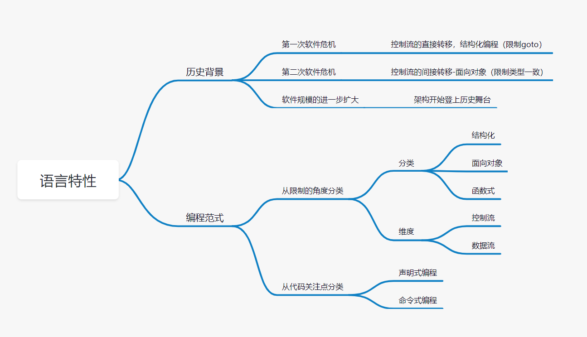
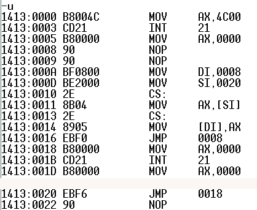

# 走近Java


> 作者: 潘深练
>
> 更新: 2022-03-06

## Java的技术体系

## 发展历程

## JDK版本

## Java语言特性

[潘深练——关于Java语言特性](https://www.panshenlian.com/2020/02/22/java-language/)



#### 汇编语言的世界



汇编语言的地址与指令，自由流转逻辑会引起整体程序的复杂性增大，容易失控。

#### 第一次软件危机与结构化程序设计

高级语言的出现，解放了程序员，但好景不长，随着软件的规模和复杂度的大大增加，软件质量低下，质量把控难度高，项目无法如期完成，严重超支等现象。例如，1963年美国的水手一号火箭发射失败事故，就是因为一行 FORTRAN 代码错误导致的。

所以，为了解决上面的问题，针对性的提出了解决方法 “软件工程” ，虽然 “软件工程” 提出之后也曾经被视为软件领域的银弹，但后来事实证明，软件工程同样无法根除软件危机，只能在一定程度上缓解软件危机。

差不多同一时间，“结构化程序设计”作为另外一种解决软件危机的方案被提了出来。结构化程序设计的主要特点是抛弃 goto 语句，采取 “自顶向下、逐步细化、模块化” 的指导思想。

```text
结构化程序设计本质上还是一种面向过程的设计思想，
但通过 “自顶向下、逐步细化、模块化” 的方法，
将软件的复杂度控制在一定范围内，从而从整体上
减低了软件开发的复杂度。
```

> 控制流的直接转移，结构化编程（限制goto）

结构化编程证明了人们可以用顺序结构、分支结构、循环结构这三种结构构造出任何程序，并限制了 goto 的使用。遵守结构化编程，工程师就可以像数学家一样对自己的程序进行推理证明，用代码将一些已证明可用的结构串起来，只要自行证明这些额外代码是确定的，就可以推导出整个程序的正确性。

前面提到结构化编程对控制权的直接转移进行了限制，其实就是限制了 goto 语句。什么叫做控制权的直接转移？就是函数调用或者 goto 语句，代码在原来的流程里不继续执行了，转而去执行别的代码，并且你指明了执行什么代码，为什么要限制 goto 语句呢？因为 goto 语句的一些用法会导致某个模块无法被递归拆分成更小的、可证明的单元。而采用分解法将大型问题拆分正是结构化编程的核心价值。

其实遵守结构化编程，工程师们也无法像数学家那样证明自己的程序是正确的，只能像物理学家一样，说自己的程序暂时没被证伪（没被找到 bug）。数据公式和物理公式的最大区别，就是数学公式可被证明，而物理公式无法被证明，只要目前的试验数据没把它证伪，我们就认为它是正确的。程序也是一样，所有的 test case 都通过了，没发现问题，我们就认为这段程序是正确的。

#### 第二次软件危机与面向对象

结构化编程的风靡在一定程度上缓解了软件危机，然而随着硬件的快速发展，业务需求越来越复杂，以及编程应用领域越来越广泛，第二次软件危机很快就来了。

第二次软件危机的根本原因还是 **在于软件生产力远远跟不上硬件和业务的发展**。

```text
第一次软件危机的根源在于：软件的“逻辑”变得非常复杂；
第二次软件危机的根源在于：软件的“扩展”变得非常复杂。
```

结构化程序设计虽然能够缓解软件逻辑的复杂性，但是对于业务变化带来的软件扩展却无能为力，软件领域迫切希望找到新的银弹来解决软件危机，在这种环境下，面向对象的思想开始流行起来。

虽然面向对象开始也被当做解决软件危机的银弹，在一定程序上解决了软件“扩展”带来的复杂性，和软件工程、结构化程序设计一样，面向对象也不是银弹，而只是一种新的软件方法而已。

> 控制流的间接转移，面向对象编程（限制类型一致）

面向对象编程包括：封装、继承和多态，从架构的角度，这里只关注多态。多态让我们更方便、安全地通过函数调用的方式进行组件间通信，它也是以来反转（让依赖于控制流方向相反）的基础。

在非面向对象的编程语言中，我们如何在互相解耦的组件间实现函数调用呢？答案是函数指针。比如采用 C 语言编写的操作系统中，定义了如下的结构体来解耦具体的IO设备，IO设备的驱动程序只需要把函数指针指到自己的实现就可以了。

```c
struct FILE{
    void (*open)(char* name, int mode);
    void (*close)();
    int (*read)();
    void (*write)(char);
    void (*seek)(long index,int mode);
}
```

这种通过函数指针进行组件间的通信方式非常脆弱，工程师必须严格按照约定初始化函数指针，并严格地按照约定来调用这些指针，只要一个人没有遵守约定，整个程序都会产生极其难以跟踪和消除的 bug。所以面向对象编程限制了函数指针的使用，通过接口-实现、抽象类-继承等多态的方式来替换。

前面提到面向对象编程对控制权的间接转移进行了限制，其实就是限制了函数指针的使用。什么叫做控制权的间接转移？就是代码在原来的流程里不继续执行了，转而去执行别的代码，但具体执行了什么代码你也不知道，你只调了个函数指针或者接口。

> 函数式

函数式编程有很多种定义很多种特性，这里从架构的角度，只关注它的没有副作用和不修改状态。函数式编程中，函数要保持独立，所有功能就是返回一个新的值，没有其他行为，尤其是不得修改外部变量的值。前面提到函数式编程对赋值进行了限制，指的就是这个特性。

在 **架构领域** 所有的 `竞争问题`、`死锁问题`、`并发问题` 都是由 **可变变量** 导致的。如果有足够大的存储量和计算量，应用程序可以用事件溯源的方式，用完全不可变的函数式编程，只通过事务记录从头计算状态，就避免了前面提到的几个问题。目前要让一个软件系统完全没有可变变量是不现实的，但是我们可以通过将需要修改状态的部分和不需要修改的部分分隔成单独的组件，在不需要修改状态的组件中使用函数式编程，提高系统的稳定性和效率。

#### 软件规模的进一步扩大
> 架构开始登上历史舞台


### 编程范式
#### 分类
- 结构化
- 面向对象
- 函数式


#### 维度
- 控制流
- 数据流

#### 代码关注点 

## QA

### 1、Java基础数据类型

| 基础类型         | 位      | 默认值   | 取值范围 |
| --------------- | ------- | -------- | ------- |
| byte（位）       |  8      | 0        | -2^7 ~ 2^7-1 |
| short（短整数）  | 16      | 0        | -2^15 ~ 2^15-1 |
| int（整数）      | 32      | 0        | -2^31 ~ 2^31-1 |
| long（长整数）   | 64      | 0L       | -2^63 ~ 2^63-1 |
| float（单精度）  | 32      | 0.0f     | -2^31 ~ 2^31-1 |
| double（双精度） | 64      | 0.0      | -2^15 ~ 2^15-1 |
| char（字符）     | 16      | ‘\u0000’ | 0 ~ 2^16-1   |
| boolean（布尔值）|  8      | false    | false,true   |

> 1 Byte （字节）= 8 bit（比特/位）


### 2、Integer的自动拆箱和装箱是什么意思？

在Java中，自动拆箱（autoboxing）和自动装箱（autounboxing）是Java编译器自动将基本数据类型和对应的包装类对象之间进行转换的特性。

自动装箱指的是将一个基本数据类型转换为其对应的包装类对象。例如，将int类型的值赋给Integer类型的变量，Java编译器会自动将int类型的值转换为对应的Integer对象，这样就可以使用Integer对象提供的方法来操作该值。

```java
int num = 10;
Integer numObj = num; // 自动装箱，将int类型的值转换为Integer对象
```

自动拆箱指的是将一个包装类对象转换为对应的基本数据类型。例如，将Integer类型的对象赋给int类型的变量，Java编译器会自动将Integer对象中的值提取出来，转换为int类型的值，这样就可以直接使用int类型的值。

```java
Integer numObj = 10;
int num = numObj; // 自动拆箱，将Integer对象中的值转换为int类型的值
```
需要注意的是，在自动拆箱和装箱操作时，有可能会出现NullPointerException异常。例如，当一个null值的包装类对象被自动拆箱时，就会抛出NullPointerException异常。因此，在使用自动拆箱和装箱操作时，需要格外小心，避免出现这种异常。

### 3、equals重写还需要做什么？

当我们在一个类中定义一个自定义类型时，它会继承Object类中的equals方法。Object类中的equals方法默认是使用“==”运算符来比较两个对象的引用地址是否相等。

如果我们希望自定义类中的对象在逻辑上相等，即它们的属性值相等，则我们需要重写equals方法，以便在逻辑上比较对象而不是比较引用地址。

当我们重写equals方法时，应该注意以下几点：

1、重写equals方法时应该同时重写hashCode方法，因为这两个方法通常一起使用。

2、equals方法应该比较所有的属性，而不仅仅是某些属性，以确保对象的逻辑相等。

3、在比较属性时，应该使用相应类型的“equals”方法来确保正确的比较。例如，对于字符串属性，应该使用“equals”方法而不是“==”运算符来比较它们的值。

4、equals方法应该是对称的、传递的和一致的，这意味着如果a.equals(b)返回true，则b.equals(a)也应该返回true，如果a.equals(b)和b.equals(c)都返回true，则a.equals(c)也应该返回true，同时在对象属性未发生变化时，重复调用equals方法应该始终返回相同的结果。

5、如果我们的类是可变的（即可以更改其属性），则equals方法应该考虑对象属性的当前状态，而不仅仅是在创建对象时的状态。

最后，如果我们重写了equals方法，则应该始终重写toString方法，以便在需要打印或显示对象时，可以打印出有意义的信息。

[《掘金 | 为什么重写equals方法时一定要重写hashCode方法》](https://juejin.cn/post/6844904030867554317)

### 4、==和equals的区别

在 Java 中，"==" 和 "equals" 都可以用于比较对象，但它们有着不同的比较方式：

- "==" 操作符用于比较两个对象的引用是否相等，也就是比较两个对象是否指向同一个内存地址。如果两个对象的引用地址相等，则返回 true，否则返回 false。例如：

```java
String str1 = "hello";
String str2 = "hello";
System.out.println(str1 == str2); // 输出 true
```

在上面的代码中，因为 str1 和 str2 都是指向字符串 "hello" 的引用，所以它们的引用地址是相等的，所以使用 "==" 进行比较返回 true。

- "equals" 方法是一个在 Object 类中定义的方法，它用于比较两个对象的内容是否相等。在默认情况下，"equals" 方法会调用对象的 "==" 方法来判断两个对象的引用是否相等，但是你可以在自定义类中重写 "equals" 方法来实现自己的比较方式。例如：

```java
public class Person {
    private String name;
    private int age;

    public Person(String name, int age) {
        this.name = name;
        this.age = age;
    }

    @Override
    public boolean equals(Object obj) {
        if (obj == null) {
            return false;
        }

        if (this == obj) {
            return true;
        }

        if (!(obj instanceof Person)) {
            return false;
        }

        Person other = (Person) obj;
        return this.name.equals(other.name) && this.age == other.age;
    }
}
```

在上面的代码中，我们重写了 Person 类的 "equals" 方法，来实现按照姓名和年龄进行比较的功能。在比较时，我们先判断传入的对象是否为 null，再判断两个对象的引用是否相等，最后判断两个对象的属性是否相等。

需要注意的是，如果你在自定义类中重写了 "equals" 方法，通常也需要重写 "hashCode" 方法，以保证两个相等的对象拥有相同的哈希值。


[CSDN | 优美的讲解equals和==的区别](https://blog.csdn.net/qq_36522306/article/details/80550210)