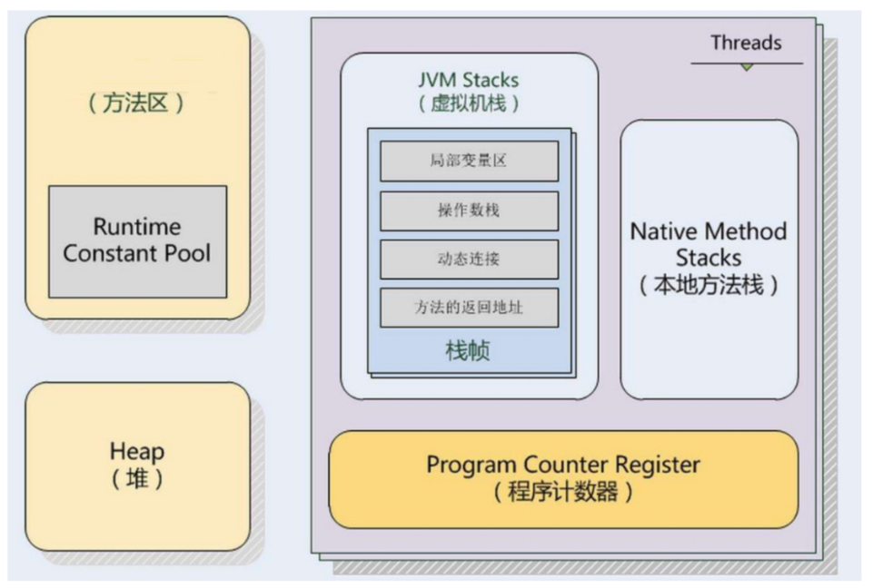
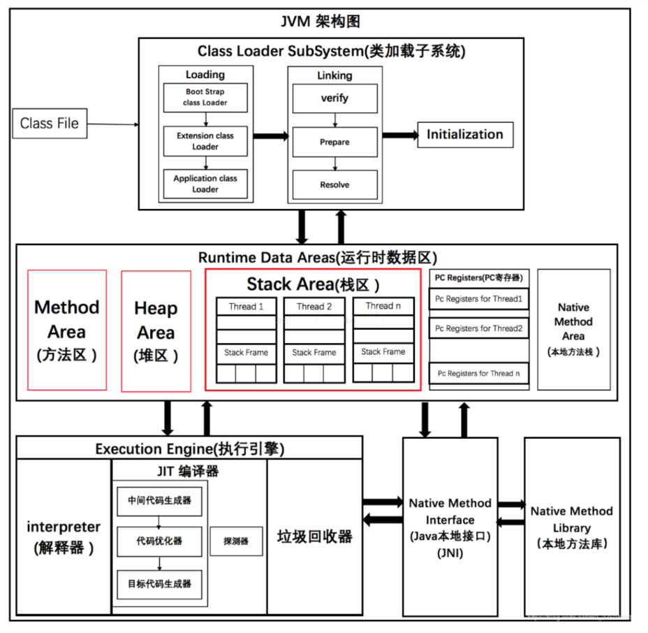

# JVM整体架构

> 作者: 潘深练
>
> 更新: 2022-03-03

> 根据 JVM 规范，JVM 内存共分为虚拟机栈、堆、方法区、程序计数器、本地方法栈五个部分。

| 名称 |特征|作用|配置参数|异常|
|----|----|----|----|----|
| 程序计数器 | 占用内存小，线程私有，生命周期与线程相同 | 大致为字节码行号指示器 | 无 | 无 |
| 虚拟机栈 | 线程私有，生命周期与线程相同，使用连续的内存空间 | Java 方法执行的内存模型，存储局部变量表、操作栈、动态链接、方法出口等信息 | -Xss | StackOverflowError / OutOfMemoryError |
| 堆 | 线程共享，生命周期与虚拟机相同，可以不使用连续的内存地址 | 保存对象实例，所有对象实例（包括数组）都要在堆上分配 | -Xms -Xsx -Xmn | OutOfMemoryError |
| 方法区 | 线程共享，生命周期与虚拟机相同，可以不使用连续的内存地址 | 存储已被虚拟机加载的类信息、常量、静态变量、即时编译器编译后的代码等数据 | -XX:PermSize:16M- XX:MaxPermSize64M/-XX:MetaspaceSize=16M- XX:MaxMetaspaceSize=64M | OutOfMemoryError |
| 本地方法栈 | 线程私有 | 为虚拟机使用到的Native 方法服务 | 无 | StackOverflowError / OutOfMemoryError |

- [脉脉 - JVM 配置参数 -D，-X，-XX 的区别](https://maimai.cn/article/detail?fid=1746100451&efid=GV6IPqNP4bUVyx7e05TVsA)

- [oracle - 官网配置说明](https://docs.oracle.com/javase/8/docs/technotes/tools/windows/java.html)

> JVM分为五大模块： 类装载器子系统 、 运行时数据区 、 执行引擎 、 本地方法接口 和 垃圾收集模块 。

（本篇完）

?> ❤️ 您也可以参与梳理，快来提交 [issue](https://github.com/senlypan/jvm-docs/issues) 或投稿参与吧~