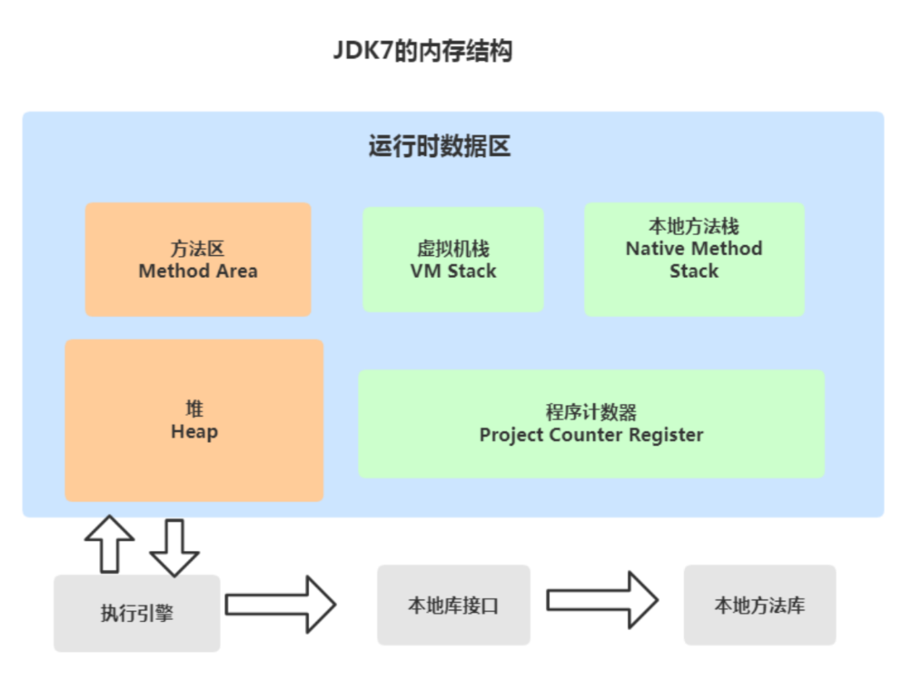

# JVM运行时内存

> 作者: 潘深练
>
> 更新: 2022-03-03

## JVM运行时内存

Java 虚拟机有 **自动内存管理** 机制，如果出现面的问题，排查错误就必须要了解虚拟机是怎样使用内存的。


**Java7和Java8内存结构的不同主要体现在方法区的实现**

方法区是java虚拟机规范中定义的一种概念上的区域，不同的厂商可以对虚拟机进行不同的实现。

我们通常使用的Java SE都是由Sun JDK和OpenJDK所提供，这也是应用最广泛的版本。而该版本使用的VM就是 HotSpot VM。通常情况下，我们所讲的java虚拟机指的就是HotSpot的版本。

> JDK7 内存结构



> JDK8 的内存结构


### 针对JDK8虚拟机内存详解


> JDK7和JDK8变化小结


```text

线程私有的： 
    ①程序计数器 
    ②虚拟机栈 
    ③本地方法栈 
    
线程共享的： 
    ①堆
    ②方法区 
    直接内存(非运行时数据区的一部分)

```

> 对于Java8，HotSpots取消了永久代，那么是不是就没有方法区了呢？

当然不是，方法区只是一个规范，只不过它的实现变了。

在Java8中，元空间(Metaspace)登上舞台，方法区存在于元空间(Metaspace)。同时，元空间不再与堆连续，而且是存在于本地内存（Native memory）。

> 方法区Java8之后的变化

- 移除了永久代（PermGen），替换为元空间（Metaspace）
- 永久代中的class metadata（类元信息）转移到了native memory（本地内存，而不是虚拟机）
- 永久代中的interned Strings（字符串常量池） 和 class static variables（类静态变量）转移到了Java heap
- 永久代参数（PermSize MaxPermSize）-> 元空间参数（MetaspaceSize MaxMetaspaceSize）

> Java8为什么要将永久代替换成Metaspace？

- 字符串存在永久代中，容易出现性能问题和内存溢出。
- 类及方法的信息等比较难确定其大小，因此对于永久代的大小指定比较困难，太小容易出现永久代溢出，太大则容易导致老年代溢出。
- 永久代会为 GC 带来不必要的复杂度，并且回收效率偏低。
- Oracle 可能会将HotSpot 与 JRockit 合二为一，JRockit没有所谓的永久代。


## PC程序计数器

> 什么是程序计数器

**程序计数器（Program Counter Register）** :也叫PC寄存器，是一块较小的内存空间，它可以看做是当前线程所执行
的字节码的行号指示器。在虚拟机的概念模型里，字节码解释器工作时就是通过改变这个计数器的值来选取下一条
需要执行的字节码指令、分支、循环、跳转、异常处理、线程恢复等基础功能都需要依赖这个计数器来完成。

> PC寄存器的特点

1. 区别于计算机硬件的pc寄存器，两者不略有不同。计算机用pc寄存器来存放“伪指令”或地址，而相对于虚拟机，pc寄存器它表现为一块内存，虚拟机的pc寄存器的功能也是存放伪指令，更确切的说存放的是将要执行指令的地址。
2. 当虚拟机正在执行的方法是一个本地（native）方法的时候，jvm的pc寄存器存储的值是undefined。 
3. 程序计数器是线程私有的，它的生命周期与线程相同，每个线程都有一个。
4. 此内存区域是唯一一个在Java虚拟机规范中没有规定任何OutOfMemoryError情况的区域。


例如

```java
public class HelloWorld { 
    public static void main(String[] args) { 
        System.out.println("Hello World"); 
    } 
}
```

字节码为：


```.class

 指令地址   操作指令
 
 0          getstatic #2 <java/lang/System.out> // getstatic 获取静态字段的值 

 3          ldc #3 <Hello World> // ldc 常量池中的常量值入栈 

 5          invokevirtual #4 <java/io/PrintStream.println> // invokevirtual 运行时方法绑定调用方法 

 8          return //void 函数返回

```


> 字节码内容包含 **指令地址** 和 **操作指令** 。解释器根据PC寄存器的 **指令地址**，找到字节码对应的 **操作指令** ，最终解释成为机器指令，供 CPU 识别并执行。

Java虚拟机的多线程是通过线程轮流切换并分配处理器执行时间的方式来实现的，在任何一个确定的时刻，一个处理器只会执行一条线程中的指令。

因此，为了线程切换后能恢复到正确的执行位置，每条线程都需要有一个独立的程序计数器，各条线程之间的计数器互不影响，独立存储，我们称这类内存区域为“线程私有”的内存。

## 虚拟机栈

> 什么是虚拟机栈

**Java虚拟机栈(Java Virtual Machine Stacks)也是线程私有的** ，即生命周期和线程相同。Java虚拟机栈和线程同时创建，用于存储栈帧。每个方法在执行时都会创建一个栈帧(Stack Frame)，用于存储 **局部变量表、操作数栈、动态链接、方法出口** 等信息。每一个方法从调用直到执行完成的过程就对应着一个栈帧在虚拟机栈中从入栈到出栈的过程。

```java
    public static void main(String[] args) { 
       A(); 
    } 
    public static void A() { 
       B(); 
    } 
    public static void B() { 
       C(); 
    } 
    public static void C() { 
       // TODO
    } 
```


> 什么是栈帧

栈帧(Stack Frame)是用于支持虚拟机进行方法调用和方法执行的数据结构。栈帧存储了方法的局部变量表、操作数栈、动态连接和方法返回地址等信息。每一个方法从调用至执行完成的过程，都对应着一个栈帧在虚拟机栈里从入栈到出栈的过程。


> 设置虚拟机栈的大小

-Xss 为jvm启动的每个线程分配的内存大小，默认JDK1.4中是256K，JDK1.5+中是1M

- Linux/x64 (64-bit): 1024 KB 
- macOS (64-bit): 1024 KB 
- Oracle Solaris/x64 (64-bit): 1024 KB 
- Windows: The default value depends on virtual memory

```text
-Xss1m
-Xss1024k
-Xss1048576
```

例如使用main函数进行递归，模拟压栈：

```java
public class StackTest { 
    static long count = 0 ; 
    public static void main(String[] args) { 
        count++; 
        System.out.println(count); //1900+ 
        main(args); 
    } 
}
```

以上程序大致会在1900次左右栈溢出，具体看每个系统的内存环境略有差异，一般在 Idea 开发工具中我们可以设置虚拟机栈大小：

```text
 VM options : -Xss256k
```

> 局部变量表

局部变量表(Local Variable Table)是一组变量值存储空间，用于存放方法参数和方法内定义的局部变量。包括8种基本数据类型、对象引用（reference类型）和returnAddress类型（指向一条字节码指令的地址）。

其中64位长度的long和double类型的数据会占用2个局部变量空间（Slot），其余的数据类型只占用1个。

> 操作数栈

操作数栈(Operand Stack)也称作操作栈，是一个后入先出栈(LIFO)。随着方法执行和字节码指令的执行，会从局部变量表或对象实例的字段中复制常量或变量写入到操作数栈，再随着计算的进行将栈中元素出栈到局部变量表或者返回给方法调用者，也就是出栈/入栈操作。

> 动态链接

Java虚拟机栈中，每个栈帧都包含一个指向运行时 **常量池** 中该栈所属方法的 **符号引用**，持有这个引用的目的是为了支持方法调用过程中的动态链接(Dynamic Linking)。

```text
动态链接的作用:将符号引用转换成直接引用。
```

> 方法返回地址

方法返回地址存放调用该方法的PC寄存器的值。一个方法的结束，有两种方式：正常地执行完成，出现未处理的异常非正常的退出。无论通过哪种方式退出，在方法退出后都返回到该方法被调用的位置。方法正常退出时，调用者的PC计数器的值作为返回地址，即调用该方法的指令的下一条指令的地址。而通过异常退出的，返回地址是要通过异常表来确定，栈帧中一般不会保存这部分信息。

无论方法是否正常完成，都需要返回到方法被调用的位置，程序才能继续进行。

## 本地方法栈

## 堆

## 元空间

## 方法区

## 运行时常量池

## 直接内存


（本篇完）

?> ❤️ 您也可以参与梳理，快来提交 [issue](https://github.com/senlypan/jvm-docs/issues) 或投稿参与吧~