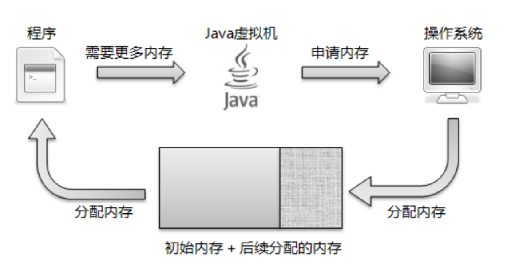
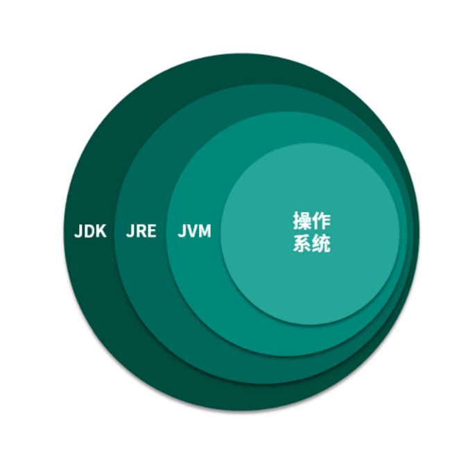
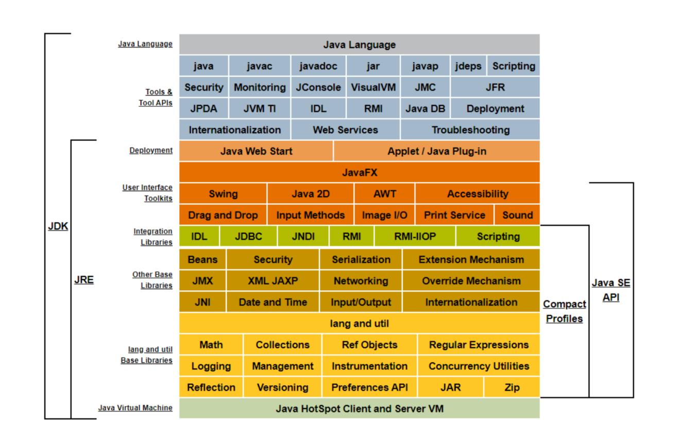
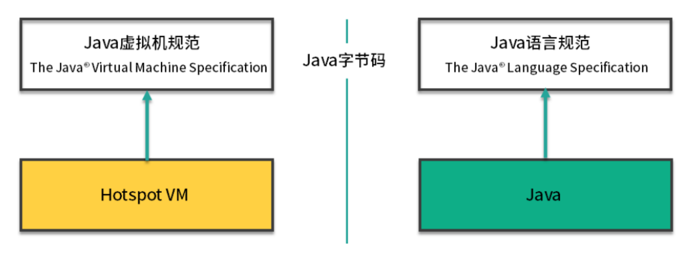
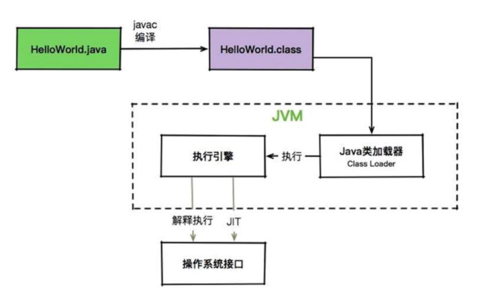

# 走近JVM


> 作者: 潘深练
>
> 更新: 2022-03-02

## 什么是JVM

> JVM是Java Virtual Machine（Java虚拟机）的缩写，JVM是一种用于计算设备的规范，它是一个虚构出来的计算
机，是通过在实际的计算机上仿真模拟各种计算机功能来实现的。

### 虚拟机家族


|  虚拟机  | 介绍 |
|---------|-----|
|  Sun Classic/Exact  | 虚拟机始祖 |
|  HotSpot  | Oracle/Sun JDK和OpenJDK都使用HotSPot VM的相同核心|
|  J9 |J9是IBM开发的高度模块化的JVM |
|  JRockit |JRockit 与 HotSpot 同属于 Oracle，目前为止 Oracle 一直在推进HotSpot 与 JRockit 两款各有优势的虚拟机进行融合互补|
|  Zing  | 由Azul Systems根据HostPot为基础改进的高性能低延迟的JVM |
|  Apache Harmony  | 挑战者 |
|  Google Android Dalvik  | Android上的Dalvik虽然名字不叫JVM，但骨子里就是不折不扣的JVM|
|  Mobile/Embedded  | 小家碧玉 |
|  Liquid/Azul  |  软硬合璧 |
|  Microsoft JVM  | 微软 |
|  其他  | .. |


## JVM与操作系统

> 为什么要在程序和操作系统中间添加一个JVM ?

Java 是一门抽象程度特别高的语言，提供了 **自动内存管理** 等一系列的特性。这些特性直接在操作系统上实现是不太可能的，所以就需要 JVM 进行一番转换。

Java程序 --> Java字节码 --> **JVM** --> 操作系统函数

有了 JVM 这个抽象层之后，Java 就可以实现跨平台了。JVM 只需要保证能够正确执行 .class 文件，就可以运行在诸如 Linux、Windows、MacOS 等平台上了。

而 Java 跨平台的意义在于一次编译，处处运行，能够做到这一点 JVM 功不可没。比如我们在 Maven 仓库下载同一版本的 jar 包就可以到处运行，不需要在每个平台上再编译一次。

现在的一些 JVM 的扩展语言，比如 Clojure、JRuby、Groovy 等，编译到最后都是 .class 文件，Java 语言的维护者，只需要控制好 JVM 这个解析器，就可以将这些扩展语言无缝的运行在 JVM 之上了。

> 应用程序、JVM、操作系统之间的关系



我们用一句话概括 JVM 与操作系统之间的关系：JVM 上承开发语言，下接操作系统，它的中间接口就是字节码。

## JVM、JRE、JDK 的关系



JVM 是 Java 程序能够运行的核心。但是需要注意，JVM 自己什么也干不了，你需要给它提供生产原料（.class 文件） 。

仅仅是 JVM，是无法完成一次编译，处处运行的。它需要一个基本的类库，比如怎么操作文件、怎么连接网络等。而 Java 体系很慷慨，会一次性将 JVM 运行所需的类库都传递给它。JVM 标准加上实现的一大堆基础类库，就组成了 Java 的运行时环境，也就是我们常说的 JRE（Java Runtime Environment）。

对于 JDK 来说，就更庞大了一些。除了 JRE，JDK 还提供了一些非常好用的小工具，比如 javac、java、jar 等。它是 Java 开发的核心，让外行也可以炼剑！

我们也可以看下 JDK 的全拼，Java Development Kit。我非常怕 kit（装备）这个单词，它就像一个无底洞，预示着你永无休止的对它进行研究。JVM、JRE、JDK 它们三者之间的关系，可以用一个包含关系表示。




## Java虚拟机规范和 Java 语言规范的关系



左半部分是 Java 虚拟机规范，其实就是为输入和执行字节码提供一个运行环境。右半部分是我们常说的 Java 语法规范，比如 switch、for、泛型、lambda 等相关的程序，最终都会编译成字节码。而连接左右两部分
的桥梁依然是Java 的字节码。

如果 .class 文件的规格是不变的，这两部分是可以独立进行优化的。但 Java 也会偶尔扩充一下 .class 文件的格式，增加一些字节码指令，以便支持更多的特性。

我们可以把 Java 虚拟机可以看作是一台抽象的计算机，它有自己的指令集以及各种运行时内存区域。

> 我们简单看一下一个 Java 程序的执行过程，它到底是如何运行起来的



这里的 Java 程序是文本格式的。比如下面这段 HelloWorld.java，它遵循的就是 Java 语言规范。其中，我们调用了 System.out 等模块，也就是 JRE 里提供的类库。

```java
public class HelloWorld { 
    public static void main(String[] args) { 
        System.out.println("Hello World"); 
    } 
}
```

使用 JDK 的工具 javac 进行编译后，会产生 HelloWorld 的字节码。

我们一直在说 Java 字节码是沟通 JVM 与 Java 程序的桥梁，下面使用 javap 来稍微看一下字节码到底长什么样子。

> javap -v HelloWord

或者

> idea 开发工具可以通过安装 jclasslib Bytecode viewer 插件来直接查看编译后的字节码内容

```.class

 0 getstatic #2 <java/lang/System.out> // getstatic 获取静态字段的值 

 3 ldc #3 <Hello World> // ldc 常量池中的常量值入栈 

 5 invokevirtual #4 <java/io/PrintStream.println> // invokevirtual 运行时方法绑定调用方法 

 8 return //void 函数返回

```

Java 虚拟机采用 **基于栈** 的架构，其指令由操作码和操作数组成。这些 `字节码指令` ，就叫作 `opcode`。其中， getstatic、ldc、invokevirtual、return 等，就是 opcode，可以看到是比较容易理解的。

JVM 就是靠解析这些 opcode 和操作数来完成程序的执行的。当我们使用 Java 命令运行 .class 文件的时候，实际上就相当于启动了一个 JVM 进程。然后 JVM 会翻译这些字节码，它有两种执行方式。常见的就是 **解释执行** ，将 opcode + 操作数翻译成机器码；另外一种执行方式就是 **JIT**，也就是我们常说的 `即时编译`，它会在一定条件下将字节码编译成机器码之后再执行。

## 关于编译JDK

（本篇完）

?> ❤️ 您也可以参与梳理，快来提交 [issue](https://github.com/senlypan/jvm-docs/issues) 或投稿参与吧~