# 经典垃圾收集器


> 作者: 潘深练
>
> 更新: 2022-03-09

## 前言

 | 收集器 | 是否并行收集 | 作用分代 | 是否STW | 收集算法 | 优点 | 缺点 | 
 | ----- | ----------- | -------- | ------- | ------ | ---- | ---- | 
 | Serial | 单线程串行 | 新生代 | 是 | 复制	 | 简单，高效，消耗额外内存最小 | 无法利用多线程优势，JVM内存不能太大 | 
 | ParNew | 多线程并行 | 新生代 | 是 | 复制 | 可以并行收集 | 在核心数少的场景下，无法发挥优势 | 
 | Parallel Scavenge | 多线程并行 | 新生代 | 是 | 复制 | 以吞吐量为优化目标，可以自动调节JVM内存各分代大小 | ---- | 
 | Serial Old | 单线程串行 | 老年代 | 是 | 标记-整理 | 作为CMS收集器失败后的预备方案 | 无法利用多线程优势，收集过程需要STW | 
 | Parallel Old | 多线程并行 | 老年代 | 是 | 标记-整理 | 以吞吐量为优化目标，可以自动调节JVM内存各分代大小 | ---- | 
 | CMS | 多线程并发 | 老年代 | 部分阶段 | 标记-清除 | 以获取最短回收停顿时间为目标，应用范围广 | 产生内存碎片，有可能出现回收失败 | 
 | G1 | 多线程并发 | 新生代和老年代 | 部分阶段 | 新生代：复制，Mixed GC：标记-整理 | 大内存收集优势明显，不会产生内存碎片，可以指定期望的停顿时间 | 占用额外内存和系统负载均高于CMS，小内存收集CMS优于G1 | 

- 部分收集（Partial GC） ： 指目标不是完整收集整个Java堆的垃圾收集， 其中又分为：
    - 新生代收集（Minor GC/Young GC）： 指目标只是新生代的垃圾收集。
    - 老年代收集（Major GC/Old GC）： 指目标只是老年代的垃圾收集，**目前只有CMS收集器会有单独收集老年代的行为**。
    - 混合收集（Mixed GC）： 指目标是收集整个新生代以及部分老年代的垃圾收集。 **目前只有G1收集器会有混合收集**。
- 整堆收集（Full GC） ：收集整个Java堆和方法区的垃圾收集。

## 垃圾收集器概述

> 垃圾回收器与垃圾回收算法

垃圾回收算法分类两类，

第一类算法 **判断对象生死** 算法，如引用计数法、可达性分析算法 ；

第二类 **收集死亡对象** 方法有四种,如标记-清除算法、标记-复制算法、标记-整理算法。

一般的实现采用 **分代回收** 算法，根据不同代的特点应用不同的算法。垃圾回收算法是 **内存回收** 的方法论。垃圾收集器是算法的落地实现。和回收算法一样，目前还没有出现完美的收集器，而是要根据具体的应用场景选择最合适的收集器，进行分代收集。

> 垃圾收集器分类


### 串行垃圾回收（Serial）

串行垃圾回收是为单线程环境设计且只使用一个线程进行垃圾回收，会暂停所有的用户线程，不适合交互性强的服务器环境


### 并行垃圾回收（Parallel）

多个垃圾收集器线程并行工作，同样会暂停用户线程，适用于科学计算、大数据后台处理等多交互场景。


### 并发垃圾回收（CMS）

用户线程和垃圾回收线程同时执行，不一定是并行的，可能是交替执行，可能一边垃圾回收，一边运行应用线程，不需要停顿用户线程，互联网应用程序中经常使用，适用对响应时间有要求的场景。


### G1垃圾回收

G1垃圾回收器将堆内存分割成不同的区域然后并发地对其进行垃圾回收。

> 七种垃圾收集器及其组合关系

**根据分代思想，我们有7种主流的垃圾回收器**

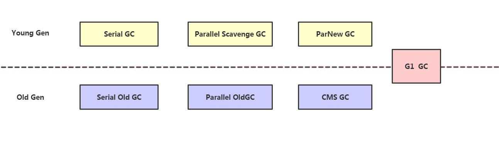

- 新生代垃圾收集器：Serial 、 ParNew 、Parallel Scavenge

- 老年代垃圾收集器：Serial Old 、 Parallel Old 、CMS

- 整理收集器：G1

**垃圾收集器的组合关系**

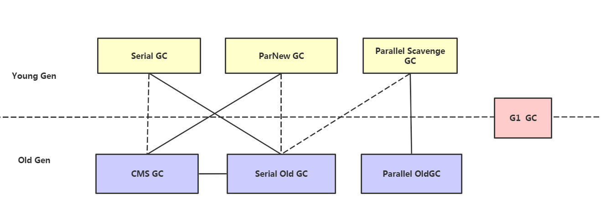

JDK8 默认使用组合是: Parallel Scavenge GC 、ParallelOld GC

**我的项目以往 JDK8 使用 parNew（新生代：复制算法） + CMS（老年代：标记清除算法）**

JDK9 默认是用 G1 为垃圾收集器

JDK14 弃用了: Parallel Scavenge GC 、Parallel OldGC

JDK14 移除了 CMS GC ，主要原因：

- 1.CMS收集器对CPU资源非常敏感。
- 2.CMS收集器无法处理浮动垃圾，可能出现"Concurrent Mode Failure"失败而导致另一次Full GC的产生。
- 3.空间碎片:CMS是一款基于标记-清除算法实现的收集器，所有会有空间碎片的现象。

> GC性能指标

- 吞吐量：即CPU用于运行用户代码的时间与CPU总消耗时间的比值（吞吐量 = 运行用户代码时间 / ( 运行用户代码时间 + 垃圾收集时间 )）。例如：虚拟机共运行100分钟，垃圾收集器花掉1分钟，那么吞吐量就是99%

- 暂停时间：执行垃圾回收时，程序的工作线程被暂停的时间

- 内存占用：java堆所占内存的大小

- 收集频率：垃圾收集的频次


## Serial收集器

单线程收集器，“单线程”的意义不仅仅说明它只会使用一个CPU或一个收集线程去完成垃圾收集工作；

更重要的是它在垃圾收集的时候，必须暂停其他工作线程，直到垃圾收集完毕；

这个收集器是一个单线程工作的收集器， 但它的“单线 程”的意义并不仅仅是说明它只会使用一个处理器或一条收集线程去完成垃圾收集工作， 更重要的是强 调在它进行垃圾收集时， 必须暂停其他所有工作线程， 直到它收集结束。 “`Stop The World`” 这个词语也 许听起来很酷， 但这项工作是由虚拟机在后台自动发起和自动完成的， 在用户不可知、 不可控的情况 下把用户的正常工作的线程全部停掉， 这对很多应用来说都是不能接受的。

> 示意了Serial/Serial Old收 集器的运行过程

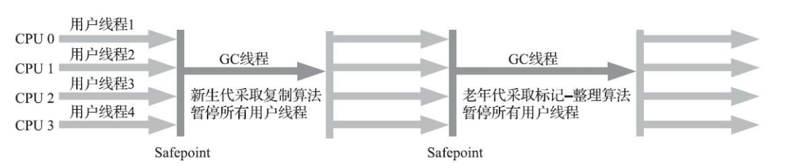

Serial收集器也并不是只有缺点；Serial收集器由于简单并且高效；

对于单CPU环境来说，由于Serial收集器没有线程间的交互，专心做垃圾收集自然可以做获得最高的垃圾收集效率使用方式：`-XX:+UseSerialGC`

## ParNew收集器

ParNew收集器实质上是Serial收集器的多线程并行版本， 除了同时使用多条线程进行垃圾收集之 外， 其余的行为包括Serial收集器可用的所有控制参数 、 收集算法、 `Stop The World`、 对象分配规则、 回收策略等都与Serial收集器完全一致， 在实现上这两种收集器也共用了相当多的代码.

> ParNew收 集器的工作过程

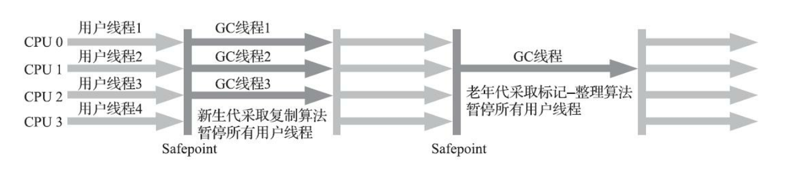

ParNew收集器在单CPU服务器上的垃圾收集效率绝对不会比Serial收集器高；

但是在多CPU服务器上，效果会明显比Serial好

使用方式：`-XX:+UseParNewGC`

设置线程数: `XX:ParllGCThreads`


## Parallel Scavenge收集器

> 什么是Parallel Scanvenge

又称为吞吐量优先收集器，和 `ParNew` 收集器类似，是一个新生代收集器。使用复制算法的并行多线程收集器。`Parallel Scavenge`是Java1.8默认的收集器，特点是并行的多线程回收，以吞吐量优先。

> 特点

- Parallel Scavenge收集器的目标是达到一个可控制的吞吐量（Throughput）；
    - 吞吐量=运行用户代码时间/(运行用户代码时间+垃圾收集时间)
    - (虚拟机总共运行100分钟，垃圾收集时间为1分钟，那么吞吐量就是99%)
- 自适应调节策略,自动指定年轻代、Eden、Suvisor区的比例。

> 适用场景

适合后台运算，交互不多的任务，如批量处理，订单处理，科学计算等。

> 参数

- 使用方式：`-XX:+UseParallelGC`
- 分别是控制:最大垃圾收集停顿时间`-XX:MaxGCPauseMillis`

```text
-XX： MaxGCPauseMillis参数允许的值是一个大于0的毫秒数， 收集器将尽力保证内存回收花费的时间不超过用户设定值。 

不过大家不要异想天开地认为如果把这个参数的值设置得更小一点就能使得系统的垃圾收集速度变得更快， 垃圾收集停顿时间缩短是以牺牲吞吐量和新生代空间为代价换取的：系统把新生代调得小一些， 收集 300MB 新生代肯定比收集 500MB 快， 但这也直接导致垃圾收集发生得更频繁， 原来10秒收集一次、 每次停顿100毫秒， 现在变成5秒收集一次、 每次停顿70毫秒。 

停顿时间的确在下降， 但吞吐量也降下来了。
```

- 吞吐量大小`-XX:GCTimeRatio`

```text
-XX： GCTimeRatio参数的值则应当是一个大于0小于100的整数， 也就是垃圾收集时间占总时间的比率， 相当于吞吐量的倒数。 假设GCTimeRatio的值为n，那么系统将花费不超过1/(1+n)的时间用于垃圾收集。譬如把此参数设置为19， 那允许的最大垃圾收集时间就占总时间的5%（即1/(1+19)） ， 默认值为99， 即允许最大1%（即1/(1+99)） 的垃圾收集时间
```

- 设置年轻代线程数 `XX:ParllGCThreads`

```text
当cpu合数小于等于8,默认cpu核数相同; 当cpu核数超过8, ParllGCThreads设置为 3+(5*CPU_COUNT)/8
```

- 与 `Parallel Scavenge` 收集器有关的还有一个参数：`-XX:+UseAdaptiveSizePolicy` (有了这个参数之后，就不要手工指定年轻代、Eden、Suvisor区的比例，晋升老年代的对象年龄等，因为虚拟机会根据系统运行情况进行自适应调节)

## Serial Old收集器

`Serial Old`是 `Serial` 收集器的老年代版本， 它同样是一个单线程收集器， 使用标记-整理算法。 这个收集器的主要意义也是供客户端模式下的HotSpot虚拟机使用。

> 特点

- 针对老年代；
- 采用"标记-整理"算法；
- 单线程收集；

> 执行流程

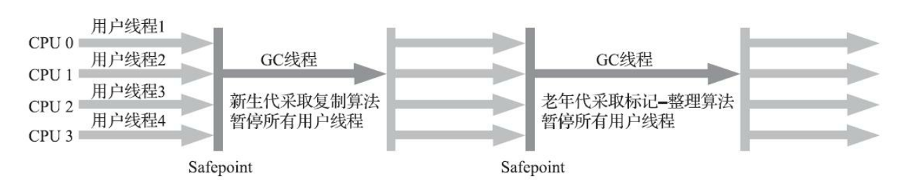

> 应用场景

主要用于Client模式

1. 在JDK1.5及之前，与Parallel Scavenge收集器搭配使用（JDK1.6有Parallel Old收集器可搭配）；
2. 作为 CMS收集器的后备预案 ，在并发收集发生Concurrent Mode Failure时使用

> 参数设置

使用方式：`-XX:+UseSerialGC`

> 注意事项

需要说明一下， `Parallel Scavenge`收集器架构中本身有`PS MarkSweep`收集器来进行老年代收集， 并非直接调用`Serial Old`收集器，但是这个`PS MarkSweep`收集器与`Serial Old`的实现几乎是一样的， 所以在官方的许多资料中都是直接以`Serial Old`代替`PS MarkSweep`进行讲解.

## Parallel Old收集器

`Parallel Old`是`Parallel Scavenge`收集器的老年代版本， 支持多线程并发收集， 基于标记-整理算法实现。 这个收集器是直到JDK 6时才开始提供的， 在此之前， 新生代的`Parallel Scavenge`收集器一直处于相 当尴尬的状态， 原因是如果新生代选择了`Parallel Scavenge`收集器， 老年代除了`Serial Old`（PS MarkSweep） 收集器以外别无选择， 其他表现良好的老年代收集器， 如CMS无法与它配合工作。

> Parallel Old收集器的工作过程

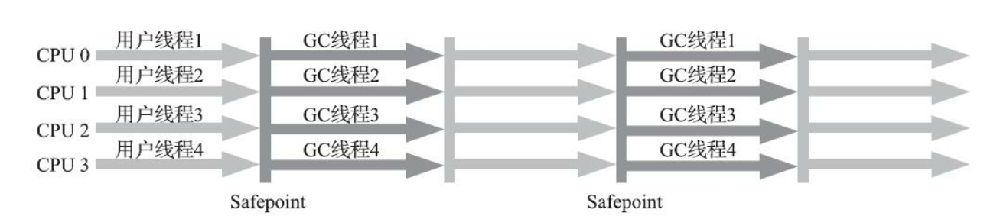

> 应用场景

JDK1.6及之后用来代替老年代的`Serial Old`收集器；

特别是在Server模式，多CPU的情况下；

这样在注重吞吐量以及CPU资源敏感的场景，就有了`Parallel Scavenge`加`Parallel Old`收集器的"给力"应用组合；

> 设置参数

"`-XX:+UseParallelOldGC`"：指定使用Parallel Old收集器

## CMS收集器

### CMS垃圾回收器

CMS（`concurrent mark sweep`）是以获取最短垃圾收集停顿时间为目标的收集器，CMS收集器的关注点尽可能缩短垃圾收集时用户线程的停顿时间,停顿时间越短就越适合与用户交互的程序,目前很大一部分的java应用几种在互联网的B/S系统服务器上，这类应用尤其注重服务器的响应速度，系统停顿时间最短，给用户带来良好的体验，CMS收集器使用的算法是`标记-清除算法`实现的；

### CMS垃圾收集过程

整个过程分4个步骤：

1. 初始标记
2. 并发标记
3. 重新标记
4. 并发清除

其中 **初始标记** 和 **重新标记** 都需要 `stopTheWorld`

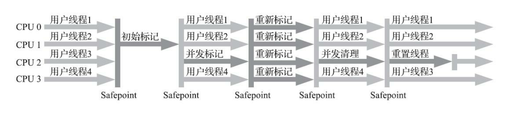

CMS整个过程比之前的收集器要复杂,整个过程分为4个阶段即 `初始标记` 、`并发标记` 、`重新标记` 、`并发清除`

- 初始标记（Initial-Mark）阶段：这个阶段程序所有的工作线程都将会因为"Stop-the-Wold"机制而出现短暂的的暂停,这个阶段的主要任务标记处GC Roots 能够关联到的对象.一旦标记完成后就恢复之前被暂停的的所有应用。 由于直接关联对象比较小，所以这里的操作速度非常快。

- 并发标记（Concurrent-Mark）阶段：从GC Roots的直接关联对象开始遍历整个对象图的过程,这个过程耗时较长,但是不需要暂停用户线程, 用户线程可以与垃圾回收器一起运行。

- 重新标记（Remark）阶段：由于并发标记阶段，程序的工作线程会和垃圾收集线程同时运行或者交叉运行，因此，为了修正并发标记期间因为用户继续运行而导致标记产生变动的那一部分对象的标记记录，这个阶段的停顿时间通常比初始标记阶段长一些，但也远比并发标记阶段时间短。

- 清除并发（Concurrent-Sweep）阶段: 此阶段清理删除掉标记判断已经死亡的对象,并释放内存空间。由于不需要移动存活对象，所以这个阶段可以与用户线程同时并发运行。

由于最消耗事件的并发标记与并发清除阶段都不需要暂停工作，因为整个回收阶段是`低停顿（低延迟）`的。

### 并发可达性分析

当前主流编程语言的垃圾收集器基本上都是依靠可达性分析算法来判定对象是否存活的， 可达性分析算法理论上要求全过程都基于一个能保障一致性的快照中才能够进行分析。

垃圾回收器的工作流程大体如下：

1. **标记** 出哪些对象是存活的，哪些是垃圾（可回收）；

2. 进行 **回收**（清除/复制/整理），如果有移动过对象（复制/整理），还需要更新引用。

> 三色标记

三色标记（`Tri-color Marking`）作为工具来辅助推导， 把遍历对象图过程中遇到的对象， 按照“是否访问过”这个条件标记成以下三种颜色：

要找出存活对象，根据可达性分析，从`GC Roots`开始进行遍历访问，可达的则为存活对象：

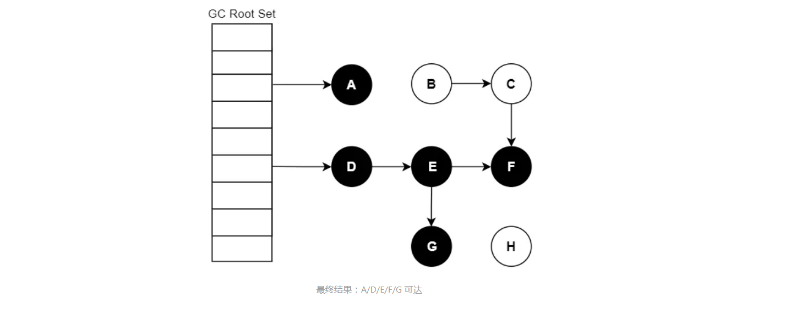

我们把遍历对象图过程中遇到的对象，按“是否访问过”这个条件标记成以下三种颜色：

- **白色**：尚未访问过。
- **黑色**：本对象已访问过，而且本对象 引用到 的其他对象 也全部访问过了。
- **灰色**：本对象已访问过，但是本对象 引用到 的其他对象尚未全部访问完。全部访问后，会转换为黑色。

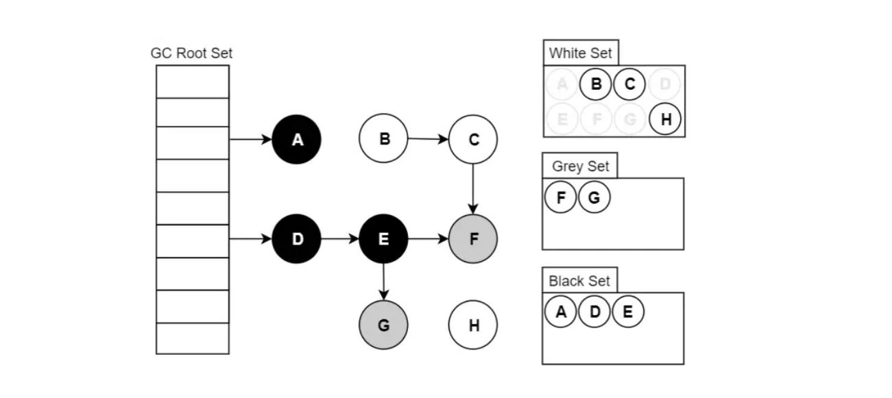

假设现在有白、灰、黑三个集合（表示当前对象的颜色），其遍历访问过程为：

1. 初始时，所有对象都在 【白色集合】中；
2. 将GC Roots 直接引用到的对象 挪到 【灰色集合】中；
3. 从灰色集合中获取对象：
  - 3.1. 将本对象 引用到的 其他对象 全部挪到 【灰色集合】中；
  - 3.2. 将本对象 挪到 【黑色集合】里面。
4. 重复步骤3，直至【灰色集合】为空时结束。
5. 结束后，仍在【白色集合】的对象即为GC Roots 不可达，可以进行回收。

**注：如果标记结束后对象仍为白色，意味着已经“找不到”该对象在哪了，不可能会再被重新引用。**

当`Stop The World `（以下简称 STW）时，对象间的引用 是不会发生变化的，可以轻松完成标记。 而当需要支持并
发标记时，即标记期间应用线程还在继续跑，`对象间的引用可能发生变化`，`多标`和`漏标`的情况就有可能发生。

> 多标-浮动垃圾

假设已经遍历到E（变为灰色了），此时应用执行了  `objD.fieldE = null`  ：

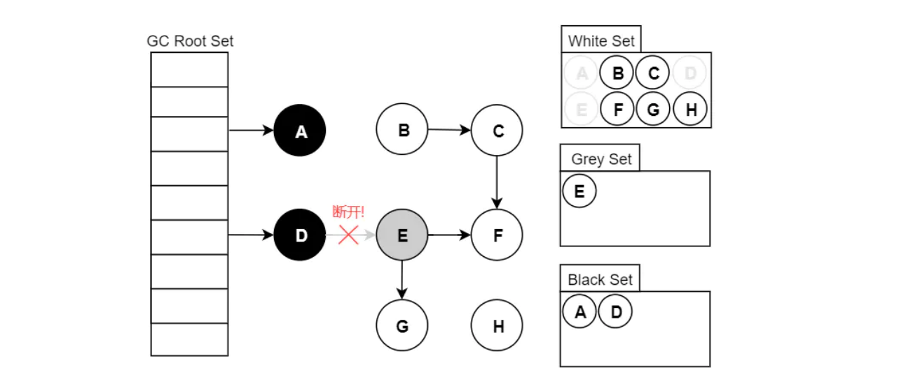

此刻之后，对象E/F/G是“应该”被回收的。然而因为`E已经变为灰色`了，其仍会被`当作存活对象`继续遍历下去。最终的结果是：这部分对象仍会被标记为存活，即`本轮GC不会回收这部分内存`。

这部分本应该回收 但是 没有回收到的内存，被称之为“`浮动垃圾`”。浮动垃圾并不会影响应用程序的正确性，只是需要等到下一轮垃圾回收中才被清除。

> 漏标

假设GC线程已经遍历到E（变为灰色了），此时应用线程先执行了：

```java
var G = objE.fieldG;
objE.fieldG = null;  // 灰色E 断开引用 白色G
objD.fieldG = G;  // 黑色D 引用 白色G
```

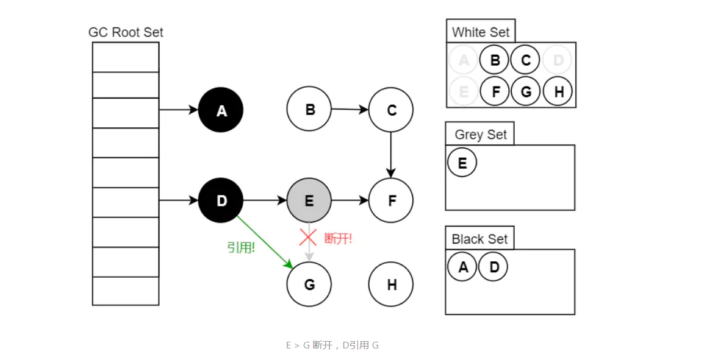

此时切回GC线程继续跑，因为 **E已经没有对G的引用了，所以不会将G放到灰色集合**；尽管因为D重新引用了G，但因为**D已经是黑色**了，不会再重新做遍历处理。 最终导致的结果是：G会一直停留在白色集合中，最后被当作垃圾进行清除。这 **直接影响到了应用程序的正确性**，是不可接受的。

不难分析，**漏标**只有同时满足以下两个条件时才会发生： 

**条件一**：灰色对象 断开了 白色对象的引用；即灰色对象原来成员变量的引用 发生了变化。 

**条件二**：黑色对象 重新引用了 该白色对象；即黑色对象 成员变量增加了 新的引用。

从 **代码的角度** 看：

```java
var G = objE.fieldG; // 1.读
objE.fieldG = null;  // 2.写
objD.fieldG = G;   // 3.写
```

1. **读取** 对象E的成员变量fieldG的引用值，即对象G；
2. 对象E 往其成员变量fieldG，**写入** null值。
3. 对象D 往其成员变量fieldG，**写入** 对象G ；

我们只要在上面这三步中的任意一步中做一些“手脚”，**将对象G记录起来，然后作为灰色对象再进行遍历**即可。比如放到一个特定的集合，等初始的GC Roots遍历完（并发标记），该集合的对象 遍历即可（重新标记）。

> **重新标记是需要STW的**，因为应用程序一直在跑的话，该集合可能会一直增加新的对象，导致永远都跑不完。当然，并发标记期间也可以将该集合中的大部分先跑了，从而缩短重新标记STW的时间，这个是优化问题了。

### CMS收集器三个缺点

> 1.CMS收集器对CPU资源非常敏感

其实，面向并发设计的程序都对CPU资源比较敏感。在并发阶段，它虽然不会导致用户线程停顿，但是会因为占用了一部分线程而导致应用程序变慢，总吞吐量会降低。CMS默认启动的回收线程数是（处理器核心数量 +3）/4，也就是说， 如果处理器核心数在`四个`或以上， 并发回收时垃圾收集线程只占用不超过`25%`的处理器运算资源， 并且会随着处理器核心数量的增加而下降。 但是当处理器核心数量不足`四个`时， CMS对用户程序的影响就可能变得很大。 如果应用本来的处理器负载就很高， 还要分出一半的运算能 力去执行收集器线程， 就可能导致用户程序的执行速度忽然大幅降低。

> 2.CMS收集器无法处理浮动垃圾，可能出现"`Concurrent Mode Failure`"失败而导致另一次Full GC的产生。

由于CMS并发清理阶段用户线程还在运行着，伴随程序运行自然就还会有新的垃圾不断产生，这一部分垃圾出现在标记过程之后，CMS无法在当次收集中处理掉它们，只好留待下一次GC时再清理掉。这一部分垃圾就称为"`浮动垃圾`"。同样也是由于在垃圾收集阶段用户线程还需要持续运行， 那就还需要预留足够内存空间提供给用户线程使用， 因此CMS收集器不能像其他收集器那样等待 到老年代几乎完全被填满了再进行收集， 必须预留一部分空间供并发收集时的程序运作使用。

在`JDK 5`的默认设置下， CMS收集器当老年代使用了`68%`的空间后就会被激活， 这是一个偏保守的设置， 如果在实际应用中老年代增长并不是太快， 可以适当调高参数`-XX： CMSInitiatingOccu-pancyFraction`的值 来提高CMS的触发百分比， 降低内存回收频率， 获取更好的性能。 到了`JDK 6`时， CMS收集器的启动 阈值就已经默认提升至`92%`。但这又会更容易面临另一种风险： 要是CMS运行期间预留的内存无法满 足程序分配新对象的需要， 就会出现一次“并发失败”（`Concurrent Mode Failure`） ， 这时候虚拟机将不 得不启动后备预案： 冻结用户线程的执行， 临时启用`Serial Old`收集器来重新进行老年代的垃圾收集， 但这样停顿时间就很长了。

> 3.空间碎片:CMS是一款基于标记-清除算法实现的收集器，所有会有空间碎片的现象。

当空间碎片过多时，将会给大对象分配带来很大麻烦，往往会出现老年代还有很大空间剩余，但是无法找到足够大的连续空间来分配当前对象，不得不提前触发一次`Full GC`。

为了解决这个问题， CMS收集器提供了一个`-XX： +UseCMS-CompactAtFullCollection`开关参数（默认是开启的， 此参数从 `JDK 9`开始废弃） ， 用于在CMS收集器不得不进行`Full GC`时开启内存碎片的合并整理过程， 由于这个 内存整理必须移动存活对象， 是无法并发的。 这样空间碎片问题是解 决了， 但停顿时间又会变长， 因此虚拟机设计者们还提供了另外一个参数`-XX： CMSFullGCsBeforeCompaction`（此参数从JDK 9开始废弃） ， 这个参数的作用是要求CMS收集器在执行过若干次（数量 由参数值决定） 不整理空间的`Full GC`之后， 下一次进入`Full GC`前会先进行碎片整理（默认值为0， 表 示每次进入`Full GC`时都进行碎片整理）。

## G1收集器

### G1垃圾收集器简介

`Garbage First`是一款面向服务端应用的垃圾收集器，主要针对配备多核CPU及大容量内存的机器，以极高概率满足GC停顿时间的同时，还兼具高吞吐量的性能特征。

### G1收集器特点

1. G1把内存划分为多个独立的区域Region

2. G1仍然保留分代思想,保留了新生代和老年代,但他们不再是物理隔离,而是一部分Region的集合

3. G1能够充分利用多CPU、多核环境硬件优势，尽量缩短STW

4. G1整体整体采用标记整理算法,局部是采用复制算法,不会产生内存碎片

5. G1的停顿可预测,能够明确指定在一个时间段内,消耗在垃圾收集上的时间不超过设置时间

6. G1跟踪各个Region里面垃圾的价值大小,会维护一个优先列表,每次根据允许的时间来回收价值最大的区域,从而保证在有限事件内高效的收集垃圾

### Region区域

`G1`不再坚持固定大小以及固定数量的 分代区域划分， 而是把连续的Java堆划分为多个独立区域（`Region`） ， 每一个`Region`都可以 根据需要， 扮演新生代的`Eden`空间、 `Survivor`空间， 或者`老年代`空间。

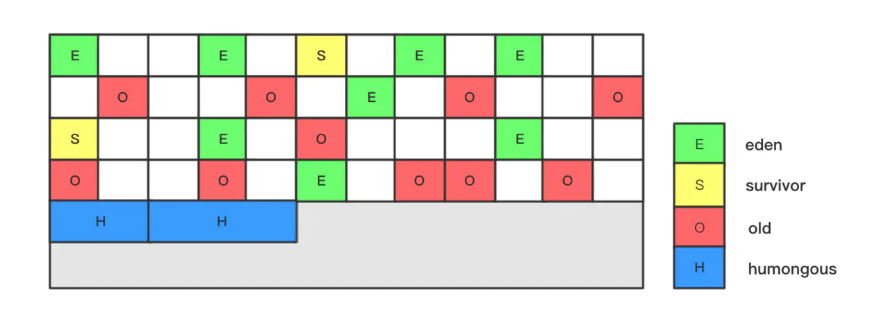

1. 将整个堆空间细分为若干个小的区域。

- 使用G1收集器时，它将整个Java堆划分成约2048个大小相同的独立Region块，每个Region块大小根据堆空间的实际大小而定，为2的N次幂，即1MB, 2MB, 4MB, 8MB, 16MB,32MB。

- 虽然还保留有新生代和老年代的概念，但新生代和老年代不再是物理隔离的了,它们都是一部分Region (不需要连续)的集合。通过Region的动态分配方式实现逻辑上的连续。

- G1垃圾收集器还增加了一种新的内存区域，叫做Humongous内存区域，如图中的H块。主要用于存储大对象，如果超过1 .5个region,就放到H。一般被视为老年代.

### G1 GC过程

G1提供了两种GC模式，`Young GC`和`Mixed GC`，两种均是完全`Stop The World`的。

- **Young GC**：选定所有年轻代里的Region。通过控制年轻代的region个数，即年轻代内存大小，来控制young GC的时间开销。

- **Mixed GC**：选定所有年轻代里的Region，外加根据global concurrent marking统计得出收集收益高的若干老年代Region。在用户指定的开销目标范围内尽可能选择收益高的老年代Region。

**在G1 GC垃圾回收的过程一个有四个阶段:**

`初始标记` :和CMS一样只标记`GC Roots`直接关联的对象

`并发标记` :进行`GC Roots Traceing`过程

`最终标记` :修正并发标记期间,因程序运行导致发生变化的那一部分对象

`筛选回收` :根据时间来进行价值最大化收集

下面是G1收集的示意图

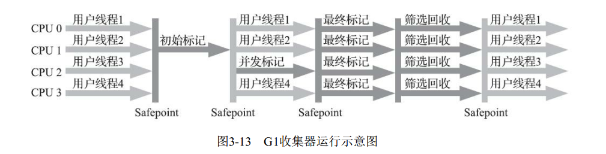

#### G1 YoungGC

> YoungGC执行前

堆分为大约2000个区域。最小大小为1Mb，最大大小为32Mb。蓝色区域保存老年代对象，绿色区域保存年轻对象。

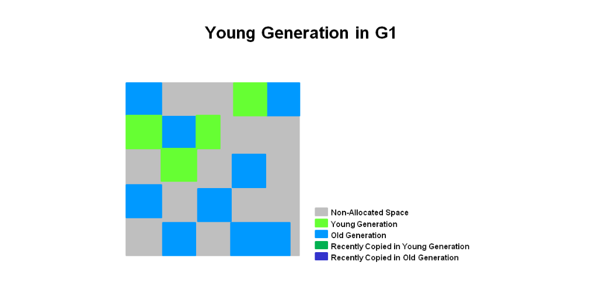

> 执行YoungGC

将存活的对象（即复制或移动）到一个或多个幸存者区域。如果满足老化阈值，则某些对象将被提升到老年代区域。

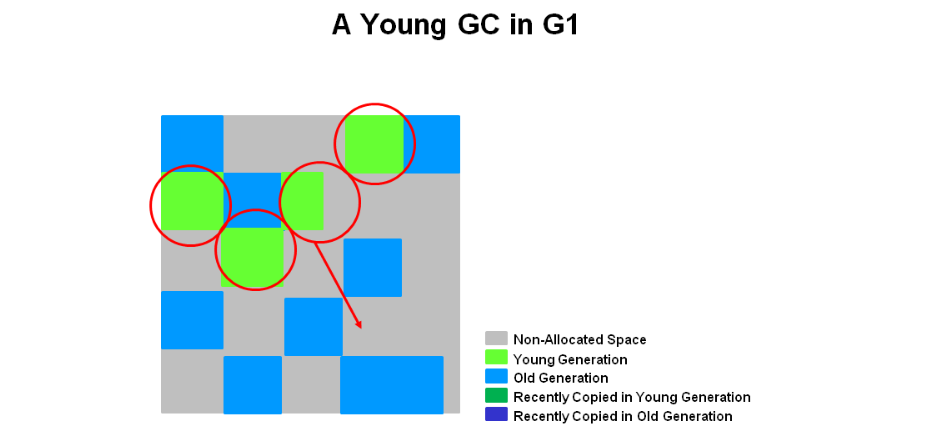

> G1的年轻GC结束

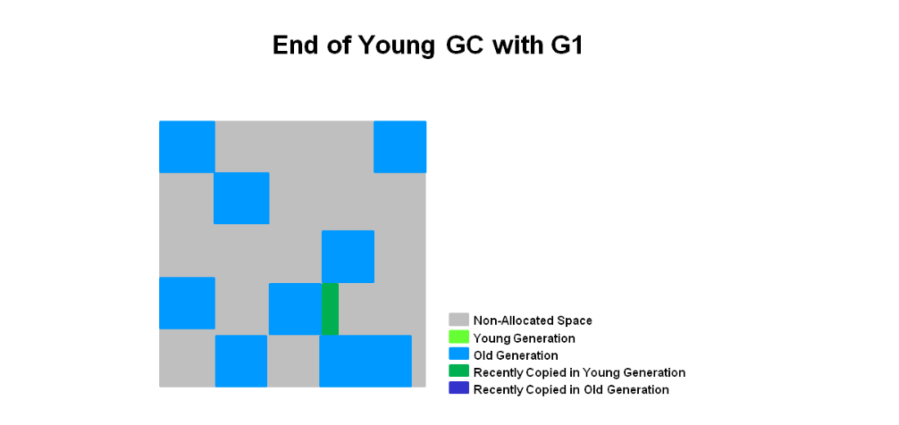

最近升级的对象以深蓝色显示。幸存者区域为绿色。

总而言之，关于G1的年轻一代，可以说以下几点：

- 堆是单个内存空间，分为多个区域。
- 年轻代内存由一组非连续区域组成。
- 年轻一代的垃圾收集器或年轻的GC出现STW。将停止所有应用程序线程以进行操作。
- 年轻的GC使用多个线程并行完成。
- 将活动对象复制到新的幸存者或老年代的地区。

#### G1 Mix GC

**初始标记阶段（initial mark，STW）**

存活的对象的初始标记背负在年轻的垃圾收集器上。在日志中，此标记为` GC pause (young)(inital-mark) `。

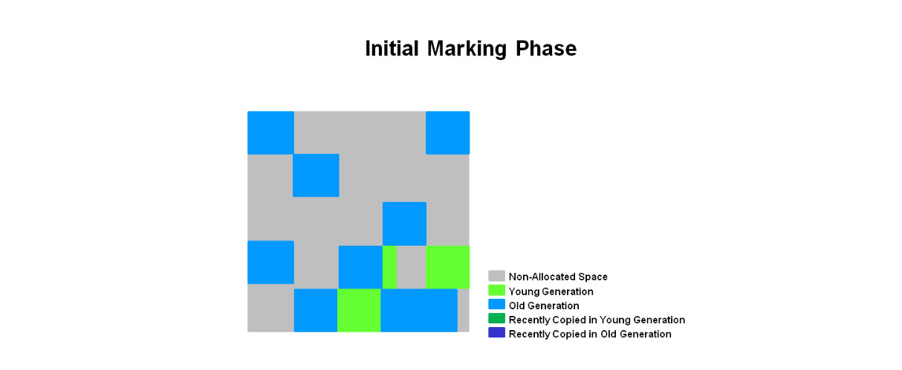

**并发标记阶段（Concurrent Marking）**

如果找到空白区域（如“ X”所示），则在Remark阶段将其立即删除。另外，计算确定活跃度的信息。

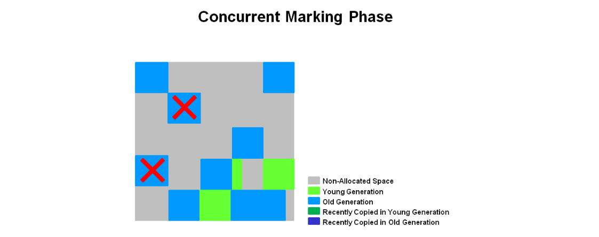

**最终标记阶段（Remark，STW）**

空区域将被删除并回收。现在可以计算所有区域的区域活跃度。

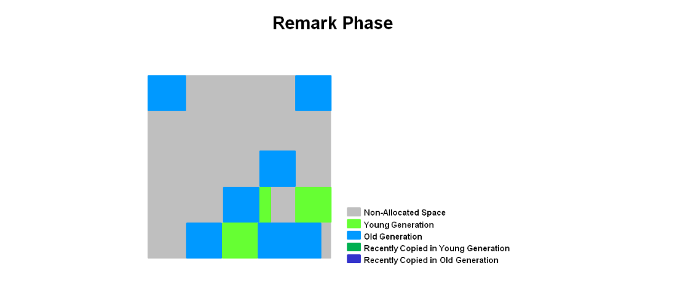

**筛选回收阶段/复制清理阶段（Cleanup，STW）**

G1选择“活度”最低的区域，这些区域可以被最快地收集。然后与年轻的GC同时收集这些区域。这在日志中表示为`[GC pause (mixed)]` 。因此，年轻代和老年代都是同时收集的。

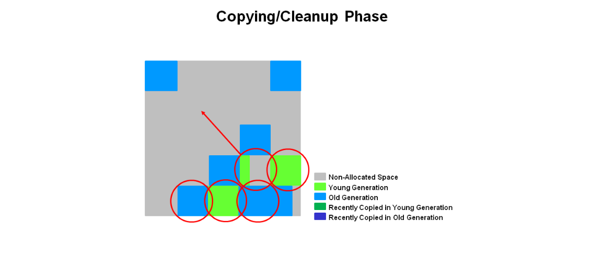

**筛选回收阶段-(复制/清理)阶段之后**

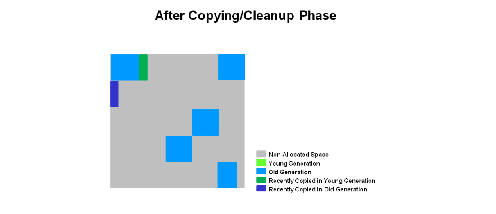

**总结:**

- 并发标记阶段
    - 活动信息是在应用程序运行时同时计算的。
    - 该活动信息标识在疏散暂停期间最适合回收的区域。
    - 像CMS中没有清扫阶段。
- 最终标记阶段
    - 使用开始快照（SATB）算法，该算法比CMS使用的算法快得多。
    - 完全回收空区域。
- 筛选回收阶段
    - 同时回收年轻一代和老一代。
    - 老年代地区是根据其活跃度来选择的。

### G1常用参数

| 参数/默认值| 含义|
|-----------|-----|
|-XX:+UseG1GC | 使用 G1 垃圾收集器|
|-XX:MaxGCPauseMillis=200 |设置期望达到的最大GC停顿时间指标（JVM会尽力实现，但不保证达到）|
|-XX:InitiatingHeapOccupancyPercent=45 |mixed gc中也有一个阈值参数 ，当老年代大小占整个堆大小百分比达到该阈值时，会触发一次mixed gc. 默认值为 45.|
|-XX:NewRatio=n |新生代与老生代(new/old generation)的大小比例(Ratio). 默认值为2.|
|-XX:SurvivorRatio=n | eden/survivor 空间大小的比例(Ratio). 默认值为 8.|
|-XX:MaxTenuringThreshold=n | 提升年老代的最大临界值(tenuring threshold). 默认值为 15.|
|-XX:ParallelGCThreads=n|设置垃圾收集器在并行阶段使用的线程数,默认值随JVM运行的平台不同而不同.|
|-XX:ConcGCThreads=n|并发垃圾收集器使用的线程数量. 默认值随JVM运行的平台不同而不同.|
|-XX:G1ReservePercent=n |设置堆内存保留为假天花板的总量,以降低提升失败的可能性. 默认值是 10.|
|-XX:G1HeapRegionSize=n |使用G1时Java堆会被分为大小统一的的区(region)。此参数可以指定每个heap区的大小. 默认值将根据 heap size 算出最优解. 最小值为 1Mb, 最大值为 32Mb.|

## ZGC

（本篇完）

?> ❤️ 您也可以参与梳理，快来提交 [issue](https://github.com/senlypan/jvm-docs/issues) 或投稿参与吧~