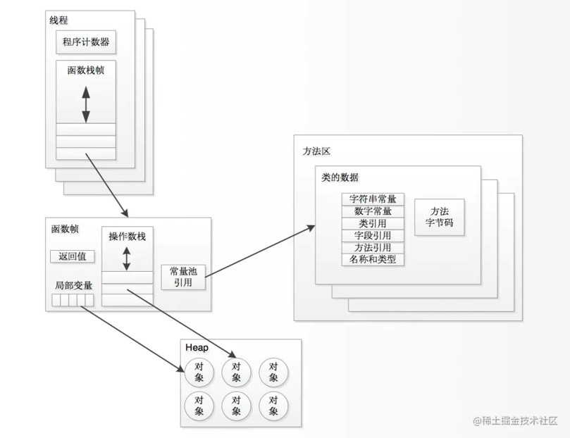

# GC相关概念

> 作者: 潘深练
>
> 更新: 2022-03-02

## ✨ 内容已经在梳理，持续发布
?> ❤️ 您也可以参与梳理，快来提交 [issue](https://github.com/senlypan/jvm-docs/issues) 或投稿参与吧~

## GC

## 安全点

**什么是安全点？**
	
从线程角度看，safepoint 可以理解成是在代码执行过程中的一些特殊位置，当线程执行到这些位置的时候，说明虚拟机当前的状态是安全的，如果有需要，可以在这个位置暂停，比如发生 GC 时，需要暂停暂停所以活动线程，但是线程在这个时刻，还没有执行到一个安全点，所以该线程应该继续执行，到达下一个安全点的时候暂停，等待 GC 结束。

如果要触发一次 GC STW ，那么 JVM 里的所有 Java 线程都必须到达 GC safepoint。

## 评价标准
**评价 GC 算法的性能时，我们采用以下 4 个标准。**
- 吞吐量
- 最大暂停时间
- 堆使用效率
- 访问的局部性

（待补充）