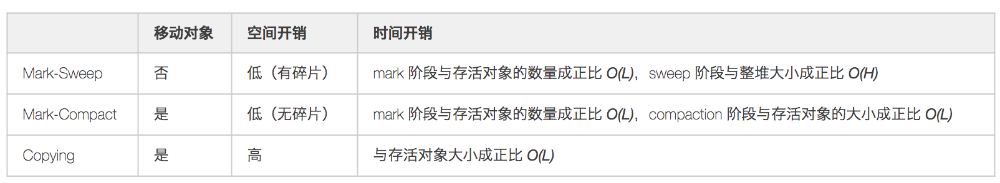

# 走近GC


> 作者: 潘深练
>
> 更新: 2022-03-02

## 什么是GC

GC , 全称 `Garbage Collection` ，就是垃圾回收的意思。在计算机科学中，垃圾回收( GC ) 是一种 **自动内存管理** 形式。垃圾回收的基本原理是在程序中找到以后无法访问（我们后续认为是已死状态）的数据对象，并回收这些对象所占用的资源。

垃圾回收技术不是 `Java` 语言的伴生产物。事实上，垃圾回收的历史远远比`Java`久远，垃圾回收是由美国计算机科学家 [John McCarthy](https://en.wikipedia.org/wiki/John_McCarthy_(computer_scientist)) 于 1959 年左右发明的，用于简化Lisp中的手动内存管理。

垃圾回收使程序员免于执行**手动内存管理**，其中程序员指定释放哪些对象并返回到内存系统，以及何时这样做。其他类似的技术包括堆栈分配、区域推断、内存所有权以及多种技术的组合。垃圾回收可能会**占用程序总处理时间**的很大一部分，因此会对 **性能** 产生重大影响。

除了内存资源以外，其它譬如网络 `socket`、数据库引用、用户交互窗口、文件和设备描述符等，通常 **不由垃圾回收处理**。

> 在Java语言中，垃圾回收主要完成的三件事情：

1. 哪些内存需要回收？
  - 堆
  - 方法区

2. 什么时候回收？
  - 数据对象处于无法访问（或我们习惯称为已死状态）

3. 如何回收？
  - 通过垃圾回收器（不同垃圾回收器基于不同的垃圾回收算法实现）


## 垃圾回收算法

垃圾回收算法解决两个问题：`识别垃圾`和`清除垃圾`。

- **识别垃圾** 的思路有两种：`引用计数`和`遍历标记`。
- **清除垃圾** 的方式也有两种：`原地回收`和`复制回收`。

各路算法按照这两种思路和方式的结合，通过各种方式去缩短GC停顿时间（延迟）、吞吐量、提供堆使用率、保持程序局部性等。

- 参考 JDK 10 [JEP 304: Garbage Collector Interface](https://openjdk.java.net/jeps/304)
- 参考 JDK 11 [JEP 333: ZGC: A Scalable Low-Latency Garbage Collector](https://openjdk.java.net/jeps/333)

## 识别垃圾

- **引用计数法（Reference Counting）** ： 对每个对象的引用进行计数，每当有一个地方引用它时计数器 +1、引用失效则 -1，引用的计数放到对象头中，大于 0 的对象被认为是存活对象。虽然循环引用的问题可通过 Recycler 算法解决，但是在多线程环境下，引用计数变更也要进行昂贵的同步操作，性能较低，早期的编程语言会采用此算法。

- **可达性分析，又称引用链法（Tracing GC）** ： 从 GC Root 开始进行对象搜索，可以被搜索到的对象即为可达对象，此时还不足以判断对象是否存活/死亡，需要经过多次标记才能更加准确地确定，整个连通图之外的对象便可以作为垃圾被回收掉。目前 Java 中主流的虚拟机均采用此算法。

> 备注：引用计数法是可以处理循环引用问题的。

## 清除垃圾

自从有自动内存管理出现之时就有的一些收集算法，不同的收集器也是在不同场景下进行组合。

- **Mark-Sweep（标记-清除）** ： 回收过程主要分为两个阶段，第一阶段为追踪（Tracing）阶段，即从 GC Root 开始遍历对象图，并标记（Mark）所遇到的每个对象，第二阶段为清除（Sweep）阶段，即回收器检查堆中每一个对象，并将所有未被标记的对象进行回收，整个过程不会发生对象移动。整个算法在不同的实现中会使用三色抽象（Tricolour Abstraction）、位图标记（BitMap）等技术来提高算法的效率，存活对象较多时较高效。

- **Mark-Compact （标记-整理）** ： 这个算法的主要目的就是解决在非移动式回收器中都会存在的碎片化问题，也分为两个阶段，第一阶段与 Mark-Sweep 类似，第二阶段则会对存活对象按照整理顺序（Compaction Order）进行整理。主要实现有双指针（Two-Finger）回收算法、滑动回收（Lisp2）算法和引线整理（Threaded Compaction）算法等。

- **Copying（复制）** ： 将空间分为两个大小相同的 From 和 To 两个半区，同一时间只会使用其中一个，每次进行回收时将一个半区的存活对象通过复制的方式转移到另一个半区。有递归（Robert R. Fenichel 和 Jerome C. Yochelson提出）和迭代（Cheney 提出）算法，以及解决了前两者递归栈、缓存行等问题的近似优先搜索算法。复制算法可以通过碰撞指针的方式进行快速地分配内存，但是也存在着空间利用率不高的缺点，另外就是存活对象比较大时复制的成本比较高。

三种算法在是否移动对象、空间和时间方面的一些对比，假设存活对象数量为 *L*、堆空间大小为 *H*，则：



把 mark、sweep、compaction、copying 这几种动作的耗时放在一起看，大致有这样的关系：


虽然 compaction 与 copying 都涉及移动对象，但取决于具体算法，compaction 可能要先计算一次对象的目标地址，然后修正指针，最后再移动对象。copying 则可以把这几件事情合为一体来做，所以可以快一些。另外，还需要留意 GC 带来的开销不能只看 Collector 的耗时，还得看 Allocator 。如果能保证内存没碎片，分配就可以用 pointer bumping 方式，只需要挪一个指针就完成了分配，非常快。而如果内存有碎片就得用 freelist 之类的方式管理，分配速度通常会慢一些。

## 收集器

目前在 Hotspot VM 中主要有 **分代收集** 和 **分区收集** 两大类，具体可以看下面的这个图，不过未来会逐渐向 **分区收集** 发展。另外在 JDK11 后提供了一个不执行任何垃圾回收动作的回收器 Epsilon（A No-Op Garbage Collector）用作性能分析。另外一个就是 Azul 的 Zing JVM，其 C4（Concurrent Continuously Compacting Collector）收集器也在业内有一定的影响力。


### 分代收集器

- **ParNew** ：一款多线程的收集器，采用复制算法，主要工作在 Young 区，可以通过 -XX:ParallelGCThreads 参数来控制收集的线程数，整个过程都是 STW 的，常与 CMS 组合使用。

- **CMS** ：以获取最短回收停顿时间为目标，采用“标记-清除”算法，分 4 大步进行垃圾回收，其中初始标记和重新标记会 STW ，多数应用于互联网站或者 B/S 系统的服务器端上，JDK9 被标记弃用，JDK14 被删除，详情可见 [JEP 363](https://openjdk.java.net/jeps/363)。

### 分区收集器

- **G1** ： 一种服务器端的垃圾回收器，应用在多处理器和大容量内存环境中，在实现高吞吐量的同时，尽可能地满足垃圾回收暂停时间的要求。

- **ZGC** ： JDK11 中推出的一款低延迟垃圾回收器，适用于大内存低延迟服务的内存管理和回收，SPECjbb 2015 基准测试，在 128G 的大堆下，最大停顿时间才 1.68 ms，停顿时间远胜于 G1 和 CMS。

- **Shenandoah** ： 由 Red Hat 的一个团队负责开发，与 G1 类似，基于 Region 设计的垃圾回收器，但不需要 Remember Set 或者 Card Table 来记录跨 Region 引用，停顿时间和堆的大小没有任何关系。停顿时间与 ZGC 接近，下图为与 CMS 和 G1 等收集器的 benchmark。


## 常用收集器

目前使用最多的是 CMS 和 G1 收集器，二者都有分代的概念，主要内存结构如下：


## 其他收集器

以上仅列出常见收集器，除此之外还有很多，如 Metronome、Stopless、Staccato、Chicken、Clover 等实时回收器，Sapphire、Compressor、Pauseless 等并发复制/整理回收器，Doligez-Leroy-Conthier 等标记整理回收器，由于篇幅原因，不在此一一介绍。


## 原地回收

> 原地回收的算法主要有引用计数算法和标记清除算法。

**引用计数算法** 是引用计数和原地回收的结合。它具有GC最大暂停时间短、可以保持程序局部性的优点，但是存在循环引用对象不能清除、引用计数位频繁更新的缺点。部分标记清除算法对root引用对象转移做了特殊处理，使用标记清除算法来识别垃圾，避免了循环引用对象不被root引用后，不能被清除的问题。Sticky 引用计数法和ZCT引用计数法分别通过忽略计数位溢出，延迟计数位更新的方法减缓了引用计数位频繁更新的问题。

**标记清除算法** 是标记和原地回收的结合。作为一种保守式GC算法，它不需要移动对象，不需要更新引用指针，经常是其他GC算法（如部分标记清除算法，Ungar分代GC算法）的补充手段。标记清除算法存在内存碎片化、不兼容写时复制技术的缺点。通过规整分块大小（BiBOP）可以减缓内存碎片。使用位图记录标记位可以使其兼容写时复制技术。

## 复制回收

> 通过复制活动对象来进行垃圾回收的算法大部分使用了标记来识别垃圾。

**标记整理算法** 是标记和复制算法的结合。它通过将活动对象挪到一起来回收空闲空间，解决了标记清除算法带来的堆内存碎片问题。LISP2算法在移动对象过程中会保持对象顺序，可以保持程序的局部性，但是需要三次遍历堆（分别是计算对象新位置、更新指针、移动对象），导致GC暂停时间过长。Two-Finger算法在对象大小一致的前提下，采用类似于交换排序的方式，将空闲的内存块移动到堆末尾，它将遍历堆的次数从3次降低到2次。表格算法通过对象群和间隙表格，在保持2次遍历的基础上，维持了堆内对象的顺序，而且不要求对象大小一致。

**分代GC** 侧重解决复制带来的GC最大暂停时间过长问题。利用大部分对象生成后会很快被销毁的特点，将堆分成多个区间（代），在不同代之间采用不同的垃圾识别算法，并且保持不同的GC频率。通过减少每次GC扫描的对象来缩短GC暂停时间。Ungar算法将堆分成新生代和老生代，新生代使用复制算法，在老生代采用标记清除算法。同时它通过记录集和写屏障，保证被老生代对象引用的新生代对象不会被回收。列车算法在老生代也采用复制回收算法，它可以减少老生代GC的最大暂停时间，但代价是写屏障会更加繁重。

**渐进式GC** 则是针对标记清除算法的一种改进，它把GC的过程分成扫描root、遍历扫描堆、清除堆内垃圾三个阶段，每个阶段都可以暂停下来，以此到达减少GC最大暂停时间的效果。为了记住对象是否被扫描过，需要使用三色标记法对对象进行标记，并且使用写屏障，在指针更新的时候对标记进行更新。按照写屏障更新标记的时机和对象，可以分成Dijkstra算法、Steele算法等。 


## ✨ 值得关注的ZGC（可扩展的低延迟垃圾回收器）

> ZGC 由JEP 333集成到 JDK 11 中 ，并在JEP 377中集成到 JDK 15 并正式发布，官方的描述是：
>
> ZGC is a concurrent, single-generation, region-based, NUMA-aware, compacting collector. 

### ZGC的目标

- GC pause times should not exceed 10ms
- Handle heaps ranging from relatively small (a few hundreds of megabytes) to very large (many terabytes) in size
- No more than 15% application throughput reduction compared to using G1
- Lay a foundation for future GC features and optimizations leveraging colored pointers and load barriers
- Initially supported platform: Linux/x64

### ZGC表现可佳

已使用 SPECjbb® 2015 <sup>[1]</sup> 进行定期性能测量。从吞吐量和延迟的角度来看，性能看起来不错。以下是使用 128G 堆在复合模式下比较 ZGC 和 G1 的典型基准分数（以百分比表示，根据 ZGC 的 max-jOPS 标准化）

```java

（越高越好）

ZGC
       max-jOPS: 100%
  critical-jOPS: 76.1%

G1
       max-jOPS: 91.2%
  critical-jOPS: 54.7%


```

以下是来自同一基准测试的典型 GC 暂停时间。ZGC 设法保持远低于 10 毫秒的目标。请注意，确切的数字可能会有所不同（上下变化，但不显着），具体取决于所使用的确切机器和设置。

```java

ZGC
                avg: 1.091ms (+/-0.215ms)
    95th percentile: 1.380ms
    99th percentile: 1.512ms
  99.9th percentile: 1.663ms
 99.99th percentile: 1.681ms
                max: 1.681ms

G1
                avg: 156.806ms (+/-71.126ms)
    95th percentile: 316.672ms
    99th percentile: 428.095ms
  99.9th percentile: 543.846ms
 99.99th percentile: 543.846ms
                max: 543.846ms

```

还对各种其他 SPEC® 基准和内部工作负载进行了临时性能测量。通常，ZGC 设法维持个位数毫秒的暂停时间。

[1] SPECjbb® 2015 是 Standard Performance Evaluation Corporation (spec.org) 的注册商标。实际结果未表示为合规，因为 SUT 可能不符合 SPEC 对一般可用性的要求。


- 参考 JDK 15 [JEP 377: ZGC: A Scalable Low-Latency Garbage Collector](https://openjdk.java.net/jeps/377)
- 参考 美团技术 [Java中9种常见的CMS GC问题分析与解决](https://tech.meituan.com/2020/11/12/java-9-cms-gc.html)

（本篇完）

?> 您也可以参与梳理，快来提交 [issue](https://github.com/senlypan/jvm-docs/issues) 或投稿参与吧~