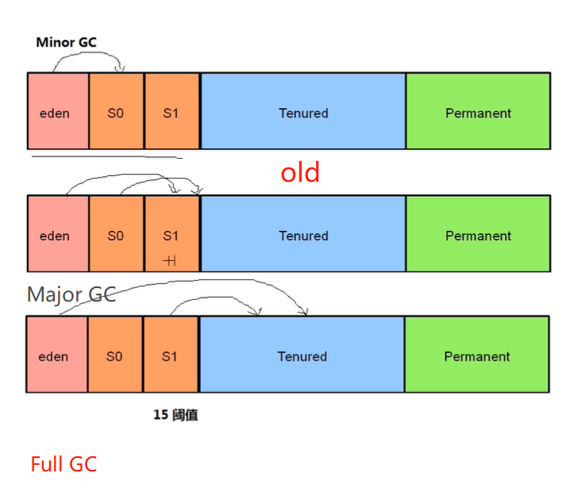

# 分代垃圾回收

> 作者: 潘深练
>
> 更新: 2022-03-09

## 分代回收理论

分代回收理论，是根据对象的`生命周期`将`内存`划分，然后进行分区管理。 当前商业虚拟机的垃圾回收器， 大多数都遵循了“`分代回收`”（`Generational Collection`）的理论进行设计，分代回收名为理论， 实质是一套符合大多数程序运行实际情况的经验法则， 它建立在两个分代假说之上：

1. **弱分代假说（Weak Generational Hypothesis）** ： 绝大多数对象都是朝生夕灭的。
2. **强分代假说（Strong Generational Hypothesis）** ： 熬过越多次垃圾收集过程的对象就越难以消亡。

这两个分代假说共同奠定了多款常用的垃圾回收器的一致的设计原则： 收集器应该将Java堆划分 出不同的区域，然后将回收对象依据其年龄（年龄即对象熬过垃圾收集过程的次数） 分配到不同的区 域之中存储。 显而易见， 如果一个区域中大多数对象都是朝生夕灭， 难以熬过垃圾收集过程的话， 那 么把它们集中放在一起， 每次回收时只关注如何保留少量存活而不是去标记那些大量将要被回收的对 象， 就能以较低代价回收到大量的空间； 如果剩下的都是难以消亡的对象， 那把它们集中放在一块， 虚拟机便可以使用较低的频率来回收这个区域， 这就同时兼顾了垃圾收集的时间开销和内存的空间有 效利用。

在Java堆划分出不同的区域之后， 垃圾回收器才可以每次只回收其中某一个或者某些部分的区域 ——因而才有了“`Minor GC`”“`Major GC`”“`Full GC`”这样的回收类型的划分； 也才能够针对不同的区域安 排与里面存储对象存亡特征相匹配的垃圾收集算法——因而发展出了“`标记-复制算法`”“`标记-清除算法`”“`标记-整理算法`”等针对性的垃圾收集算法。

他针对不同分代的类似名词， 为避免产生混淆， 在这里统一定义 :

- 部分收集（Partial GC） ： 指目标不是完整收集整个Java堆的垃圾收集， 其中又分为：
    - 新生代收集（Minor GC/Young GC）： 指目标只是新生代的垃圾收集。
    - 老年代收集（Major GC/Old GC）： 指目标只是老年代的垃圾收集，目前只有CMS收集器会有单 独收集老年代的行为。
    - 混合收集（Mixed GC）： 指目标是收集整个新生代以及部分老年代的垃圾收集。 目前只有G1收集器会有这种行为。
    
- 整堆收集（Full GC） ： 收集整个Java堆和方法区的垃圾收集。

（本篇完）

?> ❤️ 您也可以参与梳理，快来提交 [issue](https://github.com/senlypan/jvm-docs/issues) 或投稿参与吧~