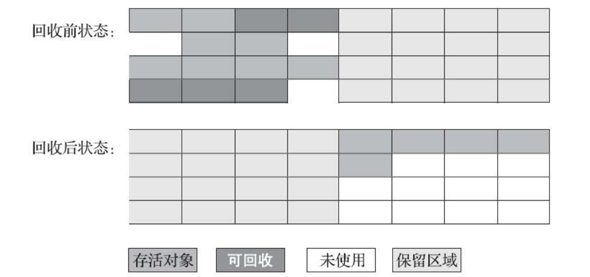
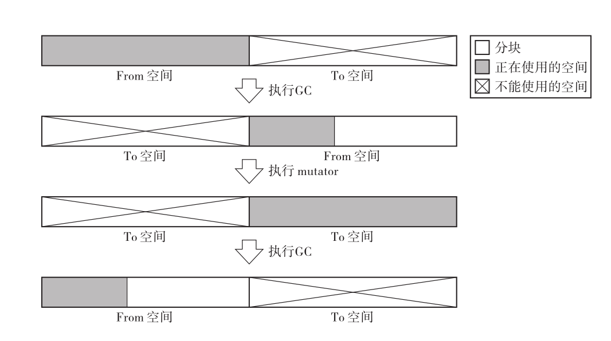

# 标记-复制算法

> 作者: 潘深练
>
> 更新: 2022-03-09

## 什么是标记-复制算法

标记-复制算法常被简称为复制算法。

为了解决标记-清除算法面对大量可回收对象时执行效率低的问题， 1969年 Robert R. Fenichel 与 Jerome C. Yochelson 提出了一种称为“半区复制”（Semispace Copying） 的垃圾收集算法， 它将可用 内存按容量划分为大小相等的两块， 每次只使用其中的一块。 当这一块的内存用完了， 就将还存活着 的对象复制到另外一块上面， 然后再把已使用过的内存空间一次清理掉。 如果内存中多数对象都是存活的， 这种算法将会产生大量的内存间复制的开销， 但对于多数对象都是可回收的情况， 算法需要复制的就是占少数的存活对象， 而且每次都是针对整个半区进行内存回收， 分配内存时也就不用考虑有空间碎片的复杂情况， 只要移动堆顶指针， 按顺序分配即可.

GC 复制算法是利用 From 空间进行分配的。当 From 空间被完全占满时，GC 会将活动对象全部复制到 To 空间。当复制完成后，该算法会把 From 空间和 To 空间互换，GC 也就结束了。From 空间和 To 空间大小必须一致。这是为了保证能把 From 空间中的所有活动对象都收纳到 To 空间里。

## 优点

### 优秀的吞吐量

GC 标记-清除算法消耗的吞吐量是搜索活动对象（标记阶段）所花费的时间和搜索整体堆（清除阶段）所花费的时间之和。

而 GC 复制-清除算法只搜索并复制活动对象，所以跟一般的 GC 标记-清除算法相比，它能在较短时间内完成 GC。也就是说，其吞吐量优秀。

尤其是堆越大，差距越明显。GC 标记-清除算法在清除阶段所花费的时间会不断增加，但 GC 复制算法就不会产生这种消耗。毕竟它消耗的时间是与活动对象的数量成比例的。

### 可实现高速分配

> GC 复制算法不使用空闲链表

因为分块是一个连续的内存空间。因此，调查这个分块的大小，只要这个分块大小不小于所申请的大小，那么移动指针就可以进行分配了。

比起 GC 标记-清除算法和引用计数法等使用空闲链表的分配，GC 复制算法明显快得多。

大家想一下，使用空闲链表时为了找到满足要求的分块，需要遍历空闲链表对吧？最坏的情况就是我们不得不从空闲链表中取出最后一个分块，这样就要花大把时间把所有分块都调查一遍。

### 不会发生碎片化

基于算法性质，活动对象被集中安排在 From 空间的开头对吧。像这样把对象重新集中，放在堆的一端的行为就叫作压缩。在 GC 复制算法中，每次运行 GC 时都会执行压缩。

因此 GC 复制算法有个非常优秀的特点，就是不会发生碎片化。也就是说，可以安排分块允许范围内大小的对象。

而在 GC 标记-清除算法等 GC 算法中，一旦安排了对象，原则上就不能再移动它了，所以多多少少会产生碎片化。

### 与缓存兼容

在 GC 复制算法中有引用关系的对象会被安排在堆里离彼此较近的位置。这种情况有一个优点，那就是 mutator 执行速度极快。近来很多 CPU 都通过缓存来高速读取位置较近的对象。这也是借助压缩来完成的，通过压缩来把有引用关系的对象安排在堆中较近的位置。

## 缺点

1. GC 复制算法把堆二等分，通常只能利用其中的一半来安排对象。也就是说，只有一半堆能被使用。相比其他能使用整个堆的 GC 算法而言，可以说这是 GC 复制算法的一个重大的缺陷。并且需要提前预留一半的内存区域用来存放存活的对象（经过垃圾收集后还存活的对象），这样导致可用的对象区域减小一半，总体的GC更加频繁了。

2. 如果出现存活对象数量比较多的时候，需要复制较多的对象，成本上升，效率降低

3. 如果99%的对象都是存活的（老年代），那么**老年代是无法使用这种算法**的。
 

**注意事项：**

现在的商用Java虚拟机大多都 **优先采用了这种收集算法去回收新生代**， IBM公司曾有一项专门研 究对新生代“朝生夕灭”的特点做了更量化的诠释——新生代中的对象有98%熬不过第一轮收集。 因此 并不需要按照1∶1的比例来划分新生代的内存空间。`Appel`式回收的具体做法是把新生代分为一块较大的`Eden`空间和两块较小的 `Survivor`空间， 每次分配内存只使用Eden和其中一块`Survivor`。 发生垃圾搜集时， 将`Eden`和`Survivor`中仍 然存活的对象一次性复制到另外一块Survivor空间上， 然后直接清理掉Eden和已用过的那块`Survivor`空 间。 HotSpot虚拟机默认`Eden`和`Survivor`的大小比例是8∶1， 也即每次新生代中可用内存空间为整个新 生代容量的90%（`Eden`的80%加上一个`Survivor`的10%） ， 只有一个`Survivor`空间， 即10%的新生代是会 被“浪费”的。

（本篇完）

?> ❤️ 您也可以参与梳理，快来提交 [issue](https://github.com/senlypan/jvm-docs/issues) 或投稿参与吧~