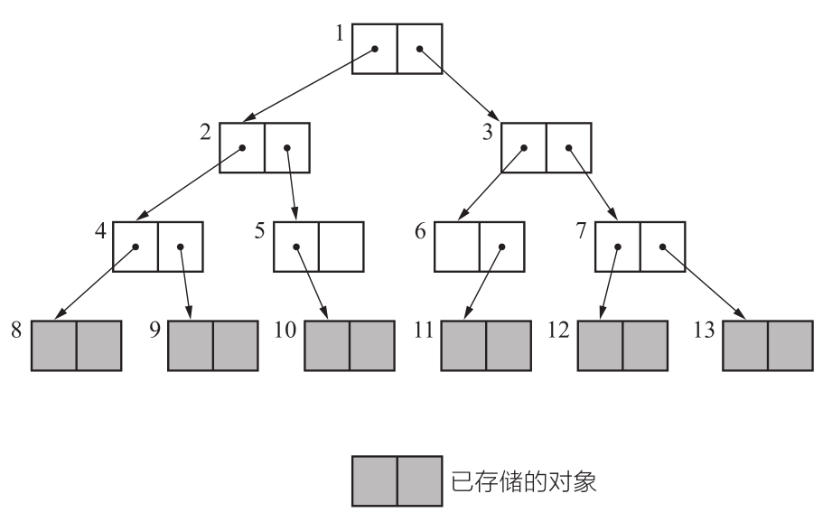

# 标记-清除算法

> 作者: 潘深练
>
> 更新: 2022-03-09

## 什么是标记-清除算法?

> 世界上首个值得纪念的 GC 算法是 GC 标记 - 清除算法（`Mark Sweep GC`）。自其问世以来，一直到半个世纪后的今天，它依然是各种处理程序所用的伟大的算法。

最早出现也是最基础的垃圾收集算法是“标记-清除”（Mark-Sweep） 算法， 在1960年由Lisp之父 John McCarthy所提出。 如它的名字一样， 算法分为“标记”和“清除”两个阶段： 首先标记出所有需要回收的对象， 在标记完成后，统一回收掉所有被标记的对象， 也可以反过来， 标记存活的对象， 统一回 收所有未被标记的对象。


```java
mark_sweep(){
    mark_phase()
    sweep_phase()
}
```

标记过程就是对象是否属于垃圾的判定过程， 之所以说它是最基础的收集算法， 是因为后续的收集算法大多都是以标记-清除算法为基础， 对其缺点进行改进而得到的。

关于标记阶段的说明。用一句话概括，标记阶段就是“`遍历对象并标记`”的处理过程。这个“`遍历对象`”的处理过程在 GC 中是一个非常重要的概念。

> 深度优先搜索与广度优先搜索

我们在搜索对象并进行标记时使用的是深度优先搜索（`depth - first search`）。这是尽可能从深度上搜索树形结构的方法。


另一方面，还有广度优先搜索（`breadth - first search`）方法。这是尽可能从广度上搜索树形结构的方法。



顺便说一下，图中各对象旁边的号码表示搜索顺序。

GC 会搜索所有对象。不管使用什么搜索方法，搜索相关的步骤数（调查的对象数量）都不会有差别。

另一方面，比较一下内存使用量（已存储的对象数量）就可以知道，深度优先搜索比广度优先搜索更能`压低内存使用量`。因此我们在标记阶段经常用到`深度优先`搜索。

在清除阶段，程序会遍历所有堆，进行垃圾回收。也就是说，所花费时间与堆大小成正比。堆越大，清除阶段所花费的时间就会越长。

## 优点

### 实现简单

说到 GC 标记 - 清除算法的优点，那当然要数算法简单，实现容易了。

例如引用计数法，在引用计数法中就很难切实管理计数器的增减，实现也很困难。

另外，如果算法实现简单，那么它与其他算法的组合也就相应地简单。

### 与保守式GC算法兼容

像保守式 GC 算法中，对象是不能被移动的。因此保守式 GC 算法跟 GC 复制算法、标记-整理算法不兼容。

而 GC 标记 - 清除算法因为不会移动对象，所以非常适合搭配保守式 GC 算法。事实上，在很多采用保守式 GC 算法的处理程序中也用到了 GC 标记 - 清除算法。

## 缺点

### 碎片化

内存空间的碎片化问题， 标记、 清除之后会产生大 量不连续的内存碎片， 空间碎片太多可能会导致当以
后在程序运行过程中需要分配较大对象时无法找 到足够的连续内存而不得不提前触发另一次垃圾收集动作。

### 分配速度

GC 标记 - 清除算法中分块不是连续的，因此每次分配都必须遍历空闲链表，找到足够大的分块。最糟的情况就是每次进行分配都得把空闲链表遍历到最后。

相反，像 GC 复制算法和 GC 标记-整理算法，分块是作为一个连续的内存空间存在的，所以没必要遍历空闲链表，分配就能非常高速地进行，而且还能在堆允许范围内分配很大的对象。

### 执行效率

执行效率不稳定， 如果Java堆中包含大量对象， 而且其中大部分是需要被回收的， 这时必须进行大量标
记和清除的动作， 导致标记和清除两个过 程的执行效率都随对象数量增长而降低；
 
### 与 `copy-on-write `不兼容

写时复制技术（`copy-on-write`）是在 `Linux` 等众多 `UNIX` 操作系统的虚拟存储中用到的`高速化`方法。打个比方，在 `Linux` 中复制进程，也就是使用 `fork()` 函数时，大部分内存空间都不会被复制。只是复制进程，就复制了所有内存空间的话也太说不过去了吧。因此，写时复制技术只是装作已经复制了内存空间，实际上是将`内存空间共享`了。

在各个进程中访问数据时，能够访问共享内存就没什么问题了。

然而，当我们对共享内存空间进行写入时，不能直接重写共享内存。因为从其他程序访问时，会发生数据不一致的情况。在重写时，要复制自己私有空间的数据，对这个私有空间进行重写。复制后只访问这个私有空间，不访问共享内存。像这样，因为这门技术是“`在写入时进行复制`”的，所以才被称为`copy-on-write`。

这样的话，GC 标记 - 清除算法就会存在一个问题 — 与写时复制技术不兼容。即使没重写对象，GC 也会设置所有活动对象的标志位，这样就会频繁发生本不应该发生的复制，压迫到内存空间。为了处理这个问题，我们采用位图标记（`bitmap marking`）的方法。


## 多个空闲链表

标记 - 清除算法中只用到了一个空闲链表，在这个空闲链表中，对大的分块和小的分块进行同样的处理。但是这样一来，每次分配的时候都要遍历一次空闲链表来寻找合适大小的分块，这样非常浪费时间。

因此，我们有一种方法，就是利用分块大小不同的空闲链表，即创建只连接大分块的空闲链表和只连接小分块的空闲链表。这样一来，只要按照 mutator 所申请的分块大小选择空闲链表，就能在短时间内找到符合条件的分块了。

## BiBOP法

`BiBOP` 是 `Big Bag Of Pages` 的缩写。这么说可能比较难懂，用一句话概括就是“将大小相近的对象整理成固定大小的块进行管理的做法”。

我们来详细说明一下。前面已经跟大家讲过，GC 标记 - 清除算法中会发生碎片化。碎片化的原因之一就是堆上杂乱散布着大小各异的对象。

对此，我们可以用这个方法：把堆分割成固定大小的块，让每个块只能配置同样大小的对象。这就是 BiBOP 法。

仅看文字说明可能还是比较难懂，请看下图:


如图所示，3 个字的对象被整合分配到左数第 1 个和第 3 个块，2 个字的对象被整合分配到左数第 2 个块。像这样配置对象，就会提高内存的使用效率。因为每个块中只能配置同样大小的对象，所以不可能出现大小不均的分块。

但是，使用 `BiBOP` 法并不能完全消除碎片化。比方说在全部用于 2 个字的块中，只有 1到 2 个活动对象，这种情况下就不能算是有效利用了堆。

`BiBOP` 法原本是为了消除碎片化，提高堆使用效率而采用的方法。但像上面这样，在多个块中分散残留着同样大小的对象，反而会降低堆使用效率。

## 位图标记
## 延迟清除法

延迟清除法（`Lazy Sweep`）是缩减因清除操作而导致的 `mutator` 最大暂停时间的方法。在标记操作结束后，不一并进行清除操作，而是如其字面意思一样让它“延迟”，通过“延迟”来防止 `mutator` 长时间暂停。


（本篇完）

?> ❤️ 您也可以参与梳理，快来提交 [issue](https://github.com/senlypan/jvm-docs/issues) 或投稿参与吧~