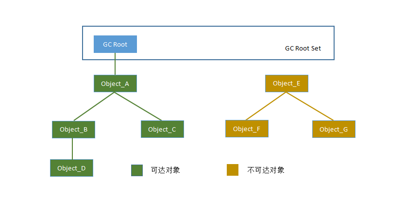
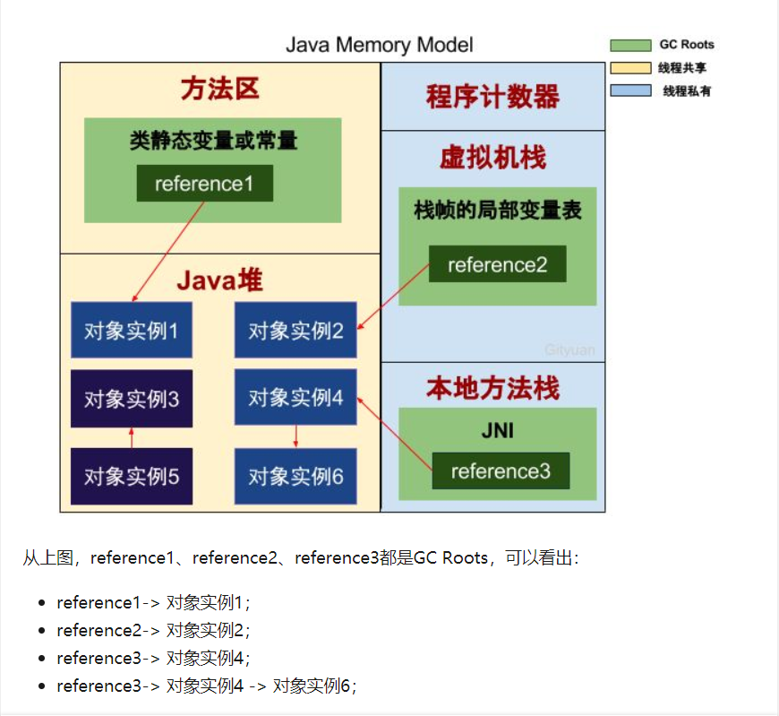
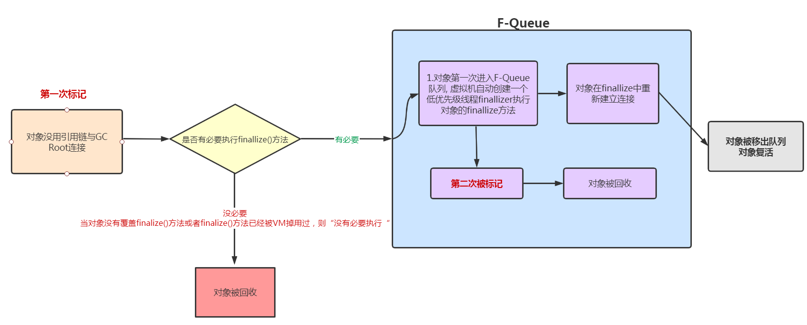

# 可达性分析算法

> 作者: 潘深练
>
> 更新: 2022-03-08

## 什么是可达性分析算法

在主流的商用程序语言如`Java`、`C#`等的主流实现中，都是通过可达性分析(`Reachability Analysis`)来判断对象是否存活的。此算法的基本思路就是通过一系列的“`GC Roots`”的对象作为起始点，从起始点开始向下搜索到对象的路径。搜索所经过的路径称为引用链(`Reference Chain`)，当一个对象到任何`GC Roots`都没有引用链时，则表明对象“`不可达`”，即该对象是`不可用`的。



**在Java语言中，可作为GC Roots的对象包括下面几种：**

- 栈帧中的局部变量表中的`reference`引用所引用的对象
- 方法区中`static`静态引用的对象
- 方法区中`final`常量引用的对象
- 本地方法栈中`JNI`(`Native`方法)引用的对象
- `Java`虚拟机内部的引用， 如基本数据类型对应的`Class`对象， 一些常驻的异常对象（比如 `NullPointExcepiton`、`OutOfMemoryError`） 等， 还有系统类加载器。
- 所有被同步锁（`synchronized`关键字） 持有的对象。
- 反映`Java`虚拟机内部情况的`JMXBean`、 `JVMTI`中注册的回调、 本地代码缓存等。



## JVM判断对象是否存活

**`finalize()`方法最终判定对象是否存活**

即使在可达性分析算法中判定为`不可达`的对象， 也不是“`非死不可`”的， 这时候它们暂时还处于“`缓刑`”阶段，要真正宣告一个对象死亡， 至少要经历两次标记过程：

### 第一次标记

如果对象在进行可达性分析后发现没有与`GC Roots`相连接的引用链， 那它将会被第一次标记， 随后进行一次筛选， 筛选的条件是此对象是否有必要执行`finalize()`方法。

### 没有必要

假如对象没有覆盖`finalize()`方法， 或者`finalize()`方法已经被虚拟机调用过， 那么虚拟机将这两种情况都视为“`没有必要执行`”。

### 有必要

如果这个对象被判定为确有必要执行`finalize()`方法， 那么该对象将会被放置在一个名为`F-Queue`的 队列之中，并在稍后由一条由虚拟机自动建立的、低调度优先级的Finalizer线程去执行它们的`finalize()` 方法。 `finalize()`方法是对象逃脱死亡命运的最后一次机会，稍后收集器将对`F-Queue`中的对象进行第二次小规模的标记，如果对 象要在`finalize()`中成功拯救自己——只要重新与引用链上的任何一个对象建立关联即可，譬如把自己（`this`关键字）赋值给某个类变量或者对象的成员变量， 那在第二次标记时它将被移出“即将回收”的集 合； 如果对象这时候还没有逃脱，那基本上它就真的要被回收了。



一次对象自我拯救的演示

```java
/**
* 此代码演示了两点：
* 1.对象可以在被GC时自我拯救。
* 2.这种自救的机会只有一次， 因为一个对象的finalize()方法最多只会被系统自动调用一次
*/
public class FinalizeEscapeGC {
  public static FinalizeEscapeGC SAVE_HOOK = null;
  public void isAlive() {
    System.out.println("yes, i am still alive :)");
 }
  @Override
  protected void finalize() throws Throwable {
    super.finalize();
    System.out.println("finalize method executed!");
    FinalizeEscapeGC.SAVE_HOOK = this;
 }
  public  static void main(String[] args) throws Throwable {
    SAVE_HOOK = new FinalizeEscapeGC();
    //对象第一次成功拯救自己
    SAVE_HOOK = null;
    System.gc();
    // 因为Finalizer方法优先级很低， 暂停0.5秒， 以等待它
    Thread.sleep(500);
    if (SAVE_HOOK != null) {
     SAVE_HOOK.isAlive();
   } else {
      System.out.println("no, i am dead :(");
   }
    //下面这段代码与上面的完全相同，但是这次自救却失败了
    SAVE_HOOK = null;
    System.gc();
    // 因为Finalizer方法优先级很低， 暂停0.5秒， 以等待它
    Thread.sleep(500);
    if (SAVE_HOOK != null) {
      SAVE_HOOK.isAlive();
   } else {
      System.out.println("no, i am dead :(");
   }
 }
}
```

> 注意

`Finalizer`线程去执行它们的`finalize()` 方法, 这里所说的“执行”是指虚拟机会触发这个方法开始运行， 但并不承诺一定会等待它运行结束。 这样做的原因是， 如果某个对象的`finalize()`方法执行缓慢， 或者更极端地发生了死循环， 将很可能导致`F-Queue`队列中的其他对象永久处于等待， 甚至导致整个内存回收子系统的崩溃。

## 再谈引用


（本篇完）

?> ❤️ 您也可以参与梳理，快来提交 [issue](https://github.com/senlypan/jvm-docs/issues) 或投稿参与吧~