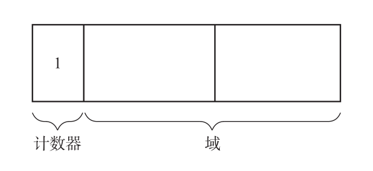

# 引用计数算法

> 作者: 潘深练
>
> 更新: 2022-03-08

## 什么是引用计数算法

GC 原本是一种“释放怎么都无法被引用的对象的机制”。那么人们自然而然地就会想到，可以让所有对象事先记录下“有多少程序引用自己”。让各对象知道自己的“人气指数”，从而让没有人气的对象自己消失，这就是引用计数法（Reference Counting），它是George E. Collins 于 1960 年钻研出来的。

引用计数算法可以这样实现：给每个创建的对象添加一个`引用计数器`，每当此对象被某个地方引用时，计数值`+1`，引用失效时`-1`，所以当计数值为`0`时表示对象已经不能被使用。引用计数算法大多数情况下是个比较不错的算法，简单直接，也有一些著名的应用案例。

但是对于Java虚拟机来说，并不是一个好的选择，因为它很难解决对象直接相互`循环引用`的问题。

### 引用计数法中的对象



### 优点：

- 可即刻回收垃圾
    - 在引用计数法中，每个对象始终都知道自己的被引用数（就是计数器的值）。当被引用数的值为 0 时，对象马上就会把自己作为空闲空间连接到空闲链表。也就是说，各个对象在变成垃圾的同时就会立刻被回收。要说这有什么意义，那就是内存空间不会被垃圾占领。垃圾全部都已连接到空闲链表，能作为分块再被利用。
    - 另一方面，在其他的 GC 算法中，即使对象变成了垃圾，程序也无法立刻判别。只有当分块用尽后 GC 开始执行时，才能知道哪个对象是垃圾，哪个对象不是垃圾。也就是说，直到 GC 执行之前，都会有一部分内存空间被垃圾占用。

- 最大暂停时间短
    - 在引用计数法中，只有当通过 mutator 更新指针时程序才会执行垃圾回收。也就是说，每次通过执行 mutator 生成垃圾时这部分垃圾都会被回收，因而大幅度地削减了 mutator 的最大暂停时间。根据 mutator 的用途不同，最大暂停时间的长短会成为非常重要的因素。

- 没有必要沿指针查找
    - 引用计数法和 GC 标记 - 清除算法不一样，没必要由根沿指针查找。当我们想减少沿指针查找的次数时，它就派上用场了。打个比方，在分布式环境中，如果要沿各个计算节点之间的指针进行查找，成本就会增大，因此需要极力控制沿指针查找的次数。所以，有一种做法是在各个计算节点内回收垃圾时使用 GC 标记 - 清除算法，在考虑到节点间的引用关系时则采用引用计数法。

- 实现简单
- 执行效率高
- 很好的和程序交织。

### 缺点：

- 计数器值的增减处理繁重
    - 虽然依据执行的 mutator 的动作不同而略有差距，我们不能一概而论，不过在大多数情况下指针都会频繁地更新。特别是有根的指针，会以近乎令人目眩的势头飞速地进行更新。这是因为根可以通过 mutator 直接被引用。在引用计数法中，每当指针更新时，计数器的值都会随之更新，因此值的增减处理必然会变得繁重。

- 计数器需要占用很多位
    - 用于引用计数的计数器最大必须能数完堆中所有对象的引用数。打个比方，假如我们用的是 32 位机器，那么就有可能要让 2 的 32 次方个对象同时引用一个对象。考虑到这种情况，就有必要确保各对象的计数器有 32 位大小。也就是说，对于所有对象，必须留有 32 位的空间。这就害得内存空间的使用效率大大降低了。打比方说，假如对象只有 2 个域，那么其计数器就占了它整体的 1/3。

- 实现烦琐复杂
    - 引用计数的算法本身很简单，但事实上实现起来却不容易。
    - 进行指针更新操作的 update_ptr() 函数是在 mutator 这边调用的。打个比方，我们需要把以往写成 *ptr=obj 的地方都重写成 update_ptr(ptr,obj)。因为调用 update_ptr() 函数的地方非常多，所以重写过程中很容易出现遗漏。如果漏掉了某处，内存管理就无法正确进行，就会产生 BUG。

- 无法检测出循环引用。
    - 譬如有A和B两个对象，他们都互相引用，除此之外都没有任何对外的引用，那么理论上A和B都可以被作为垃圾回收掉，但实际如果采用引用计数算法，则A、B的引用计数都是1，并不满足被回收的条件，如果A和B之间的引用一直存在，那么就永远无法被回收了

> 我们说了很多引用计数法的缺点，像“处理繁重”“内存使用效率低下”等。那么引用计数法是不是一个“完全没法用”的算法呢？不，绝对不是。事实上，很多处理系统和应用都在使用引用计数法。要说为什么，那是因为引用计数法只要稍加改良，就会变得非常具有实用性了。


```java
public class App {
  public static void main(String[] args) {
    Test object1 = new Test();
    Test object2 = new Test();
    object1.object = object2;
    object2.object = object1;
    object1 = null;
    object2 = null;
 }
}
class Test {
  public Test object = null;
}
```

这两个对象再无任何引用， 实际上这两个对象已经不可能再被访问， 但是它们因为互相引用着对方， 导致它们的引用计数都不为零，引用计数算法也就无法回收它们 。

**这只是个例子，其实在 java 程序中这两个对象仍然会被回收，因为java中并没有使用引用计数算法。**

## 延迟引用计数法
## Sticky引用计数法
## 1位引用计数法

（本篇完）

?> ❤️ 您也可以参与梳理，快来提交 [issue](https://github.com/senlypan/jvm-docs/issues) 或投稿参与吧~