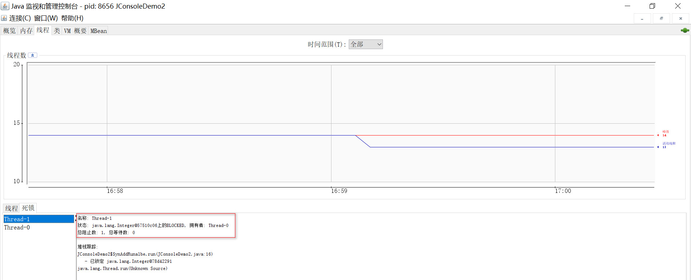
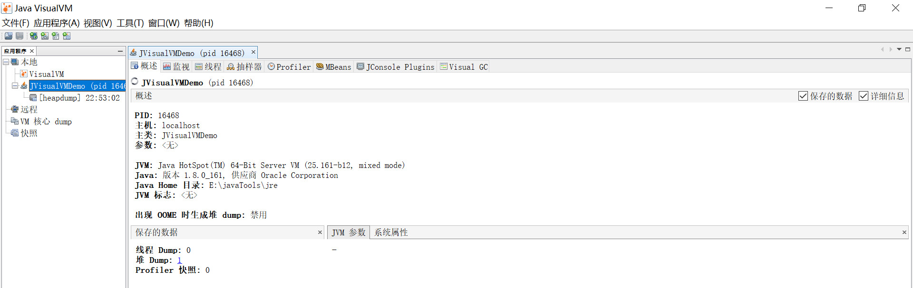
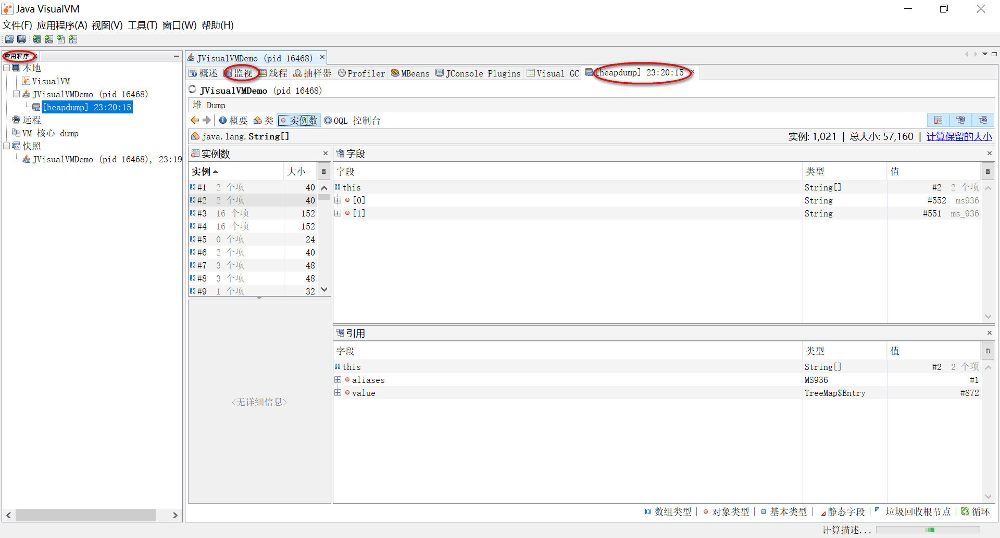

# 常用指令与可视化调优


> 作者: 潘深练
>
> 更新: 2022-03-02


## 一、常用工具

工欲善其事，必先利其器，此处列出一些笔者常用的工具，具体情况可以自由选择，使用这些工具来定位和分析问题。

### 1.1、命令行终端

- 标准终端类：jps、jinfo、jstat、jstack、jmap
- 功能整合类：jcmd、vjtools、arthas、greys

### 1.2、可视化界面

- 简易：JConsole、JVisualvm、HA、GCHisto、GCViewer
- 进阶：MAT、JProfiler

> 命令行推荐 arthas ，可视化界面推荐 JProfiler，此外还有一些在线的平台 gceasy、heaphero、fastthread ，美团内部的 Scalpel（一款自研的 JVM 问题诊断工具，暂时未开源）也比较好用。

### 1.3、分析 dump 三驾马车

- JVisualvm
- MAT
- JProfiler

## 二、常用指令

### 2.1、jps

jps 是（java process Status Tool）, Java版的ps命令，查看java进程及其相关的信息，如果你想找到一个java进程的
pid，那可以用jps命令替代linux中的ps命令了，简单而方便。

> 命令格式：

jps [options] [hostid]

> options参数解释：

- -l : 显示进程id,显示主类全名或jar路径

- -q : 显示进程id

- -m : 显示进程id, 显示JVM启动时传递给main()的参数

- -v : 显示进程id,显示JVM启动时显示指定的JVM参数

hostid : 主机或其他服务器ip

**最常用示例：**

```shell
jps -l 输出jar包路径，类全名
jps -m 输出main参数
jps -v 输出JVM参数
```

### 2.2、jinfo

jinfo是用来查看JVM参数和动态修改部分JVM参数的命令

> 命令格式：jinfo [option] <pid>

**options参数解释：**

no options 输出所有的系统属性和参数

- -flag 打印指定名称的参数

- -flag [+|-] 打开或关闭参数

- -flag = 设置参数

- -flags 打印所有参数

- -sysprops 打印系统配置

参考代码:

```java
/**
jinfo [option] <pid>
  options参数解释：
- no options 输出所有的系统属性和参数
- -flag <name> 打印指定名称的参数
- -flag [+|-]<name> 打开或关闭参数
- -flag <name>=<value> 设置参数
- -flags 打印所有参数
- -sysprops 打印系统配置
*
*/
public class Demo_jinfo {
  public static void main(String[] args) {
    System.out.println("jinfo 指令");
    try {
      Thread.sleep(2000000);
   } catch (InterruptedException e) {
      e.printStackTrace();
   }
 }
}
```

**最常用示例：**

其中11666为pid

查看JVM参数和系统配置

```shell
jinfo 11666
jinfo -flags 11666
jinfo -sysprops 11666
```

打开GC日志参数

```shell
jinfo -flag +PrintGC 11666
jinfo -flag +PrintGCDetails 11666
```

关闭GC日志参数

```shell
jinfo -flag -PrintGC 11666
jinfo -flag -PrintGCDetails 11666
```

还可以使用下面的命令查看那些参数可以使用jinfo命令来管理：

常用JVM参数：

```shell
-Xms：初始堆大小，默认为物理内存的1/64(<1GB)；默认(MinHeapFreeRatio参数可以调整)空余堆内存小于40%时，JVM就会增
大堆直到-Xmx的最大限制
-Xmx：最大堆大小，默认(MaxHeapFreeRatio参数可以调整)空余堆内存大于70%时，JVM会减少堆直到 -Xms的最小限制
-Xmn：新生代的内存空间大小，注意：此处的大小是（eden+ 2 survivor space)。与jmap -heap中显示的New gen是不同
的。整个堆大小=新生代大小 + 老生代大小 + 永久代大小。
在保证堆大小不变的情况下，增大新生代后,将会减小老生代大小。此值对系统性能影响较大,Sun官方推荐配置为整个堆的3/8。
-XX:SurvivorRatio：新生代中Eden区域与Survivor区域的容量比值，默认值为8。两个Survivor区与一个Eden区的比值为
2:8,一个Survivor区占整个年轻代的1/10。
-Xss：每个线程的堆栈大小。JDK5.0以后每个线程堆栈大小为1M,以前每个线程堆栈大小为256K。应根据应用的线程所需内存大小
进行适当调整。在相同物理内存下,
减小这个值能生成更多的线程。但是操作系统对一个进程内的线程数还是有限制的，不能无限生成，经验值在3000~5000左右。一般
小的应用， 如果栈不是很深， 应该是128k够用的，
大的应用建议使用256k。这个选项对性能影响比较大，需要严格的测试。和threadstacksize选项解释很类似,官方文档似乎没有
解释,
在论坛中有这样一句话:"-Xss ``is translated ``in a VM flag named ThreadStackSize”一般设置这个值就可以了。
-XX:PermSize：设置永久代(perm gen)初始值。默认值为物理内存的1/64。
-XX:MaxPermSize：设置持久代最大值。物理内存的1/4。
```

### 2.3、jstat

jstat命令是使用频率比较高的命令，主要用来查看JVM运行时的状态信息，包括内存状态、垃圾回收等。

> 命令格式：jstat [option] VMID [interval] [count ]

其中VMID是进程id，interval是打印间隔时间（毫秒），count是打印次数（默认一直打印）

**option参数解释：**

- -class class loader的行为统计
- -compiler HotSpt JIT编译器行为统计
- -gc 垃圾回收堆的行为统计
- -gccapacity 各个垃圾回收代容量(young,old,perm)和他们相应的空间统计
- -gcutil 垃圾回收统计概述
- -gccause 垃圾收集统计概述（同-gcutil），附加最近两次垃圾回收事件的原因
- -gcnew 新生代行为统计
- -gcnewcapacity 新生代与其相应的内存空间的统计
- -gcold 年老代和永生代行为统计
- -gcoldcapacity 年老代行为统计
- -printcompilation HotSpot编译方法统计

常用示例及打印字段解释：

```shell
jstat -gcutil 11666 1000 3
```

11666为pid，每隔1000毫秒打印一次，打印3次

```shell
S0 S1 E O M CCS YGC YGCT FGC FGCT GCT
6.17 0.00 6.39 33.72 93.42 90.57 976 57.014 68 53.153 110.168
6.17 0.00 6.39 33.72 93.42 90.57 976 57.014 68 53.153 110.168
6.17 0.00 6.39 33.72 93.42 90.57 976 57.014 68 53.153 110.168
```

字段解释:

- S0 survivor0使用百分比
- S1 survivor1使用百分比
- E Eden区使用百分比
- O 老年代使用百分比
- M 元数据区使用百分比
- CCS 压缩使用百分比
- YGC 年轻代垃圾回收次数
- YGCT 年轻代垃圾回收消耗时间
- FGC Full GC垃圾回收次数
- FGCT Full GC垃圾回收消耗时间
- GCT 垃圾回收消耗总时间

```shell
jstat -gc 11666 1000 3
```

-gc和-gcutil参数类似，只不过输出字段不是百分比，而是实际的值。


字段解释：

- S0C survivor0大小
- S1C survivor1大小
- S0U survivor0已使用大小
- S1U survivor1已使用大小
- EC Eden区大小
- EU Eden区已使用大小
- OC 老年代大小
- OU 老年代已使用大小
- MC 方法区大小
- MU 方法区已使用大小
- CCSC 压缩类空间大小
- CCSU 压缩类空间已使用大小
- YGC 年轻代垃圾回收次数
- YGCT 年轻代垃圾回收消耗时间
- FGC Full GC垃圾回收次数
- FGCT Full GC垃圾回收消耗时间
- GCT 垃圾回收消耗总时间


### 2.4、jstack

jstack是用来查看JVM线程快照的命令，线程快照是当前JVM线程正在执行的方法堆栈集合。使用jstack命令可以定位线程出现长时间卡顿的原因，例如死锁，死循环等。jstack还可以查看程序崩溃时生成的core文件中的stack信息。

> 命令格式：

jstack [options]

**option参数解释：**

- -F 当使用jstack 无响应时，强制输出线程堆栈。
- -m 同时输出java堆栈和c/c++堆栈信息(混合模式)
- -l 除了输出堆栈信息外,还显示关于锁的附加信息

> cpu占用过高问题

1.使用Process Explorer工具找到cpu占用率较高的线程
2.在thread卡中找到cpu占用高的线程id
3.线程id转换成16进制
4.使用jstack -l 查看进程的线程快照
5.线程快照中找到指定线程,并分析代码

> jstack检查死锁问题

```java
public class DeadLock {
  private static Object obj1 = new Object();
  private static Object obj2 = new Object();
  public static void main(String[] args) {
    new Thread(new Thread1()).start();
    new Thread(new Thread2()).start();
 }
  private static class Thread1 implements Runnable{
    public void run() {
      synchronized (obj1){
        System.out.println("Thread1 拿到了 obj1 的锁！");
        try {
// 停顿2秒的意义在于，让Thread2线程拿到obj2的锁
          Thread.sleep(2000);
       } catch (InterruptedException e) {
          e.printStackTrace();
       }
        synchronized (obj2){
          System.out.println("Thread1 拿到了 obj2 的锁！");
       }
     }
   }
 }
  private static class Thread2 implements Runnable{
    public void run() {
      synchronized (obj2){
        System.out.println("Thread2 拿到了 obj2 的锁！");
        try {
// 停顿2秒的意义在于，让Thread1线程拿到obj1的锁
          Thread.sleep(2000);
       } catch (InterruptedException e) {
          e.printStackTrace();
       }
        synchronized (obj1){
          System.out.println("Thread2 拿到了 obj1 的锁！");
       }
     }
   }
 }
}
```

执行指令：

```shell
jstack -l 11666
```

打印结果:

```shell

Found one Java-level deadlock:
=============================
"Thread-1":
waiting to lock monitor 0x00007efc880062c8 (object 0x00000000ec1dc5c8, a java.lang.Object),
which is held by "Thread-0"
"Thread-0":
waiting to lock monitor 0x00007efc88004e28 (object 0x00000000ec1dc5d8, a java.lang.Object),
which is held by "Thread-1"
Java stack information for the threads listed above:
===================================================
"Thread-1":
   at DeadLock$Thread2.run(DeadLock.java:35)
    - waiting to lock <0x00000000ec1dc5c8> (a java.lang.Object)
    - locked <0x00000000ec1dc5d8> (a java.lang.Object)
   at java.lang.Thread.run(Thread.java:748)
"Thread-0":
   at DeadLock$Thread1.run(DeadLock.java:19)
    - waiting to lock <0x00000000ec1dc5d8> (a java.lang.Object)
    - locked <0x00000000ec1dc5c8> (a java.lang.Object)
   at java.lang.Thread.run(Thread.java:748)
Found 1 deadlock.

```

### 2.5、jmap

jmap可以生成 java 程序的 dump 文件， 也可以查看堆内对象示例的统计信息、查看 ClassLoader 的信息以及finalizer 队列

> 命令格式：

jmap [option] (连接正在执行的进程)

> option参数解释：

如果使用不带选项参数的jmap打印共享对象映射，将会打印目标虚拟机中加载的每个共享对象的起始 地址、映射大小以及共享对象文件的路径全称。

- -heap 打印java heap摘要
- -histo[:live] 打印堆中的java对象统计信息
- -clstats 打印类加载器统计信息
- -finalizerinfo 打印在f-queue中等待执行finalizer方法的对象
- -dump: 生成java堆的dump文件
    - dump-options:
    - live 只转储存活的对象，如果没有指定则转储所有对象
    - format=b 二进制格式
    - file= 转储文件到

> 常用示例：

```shell
jmap -dump:live,format=b,file=dump.bin 11666
```

### 2.6、jhat

jhat是用来分析jmap生成dump文件的命令，jhat内置了应用服务器，可以通过网页查看dump文件分析结果，jhat一般是用在离线分析上。

> 命令格式

jhat [option][dumpfile]

> option参数解释：

- -stack false: 关闭对象分配调用堆栈的跟踪
- -refs false: 关闭对象引用的跟踪
- -port : HTTP服务器端口，默认是7000
- -debug : debug级别
- -version 分析报告版本

> 常用实例

```shell
jhat dump.bin
```

## 三、功能整合

### 3.1、jcmd
### 3.2、vjtools
### 3.3、arthas
### 3.4、greys

## 四、可视化调优

### 4.1、Jconsole

Jconsole（Java Monitoring and Management Console）是从java5开始，Jconsole 监控管理工具，在JDK中自带的java监控和管理控制台，用于对JVM中内存，线程和类等的监控，是一个基于JMX（java management extensions）的GUI性能监测工具。jconsole使用jvm的扩展机制获取并展示虚拟机中运行的应用程序的性能和资源消耗等信息。

> 直接在jdk/bin目录下点击jconsole.exe即可启动

#### 4.1.1、内存监控

代码准备

```java
import java.util.*;
public class JConsoleDemo {
 
  static class OOMObject {
    public byte[] placeholder = new byte[64 * 1024];
 }
  public static void fillHeap(int num) throws InterruptedException {
    List<OOMObject> list = new ArrayList<OOMObject>();
    for (int i = 0; i < num; i++) {
      Thread.sleep(50);
      list.add(new OOMObject());
   }
    System.gc();
 }
  public static void main(String[] args) throws Exception {
    fillHeap(1000);
    //System.gc();
    Thread.sleep(10000);
 }
}
```

编译运行JConsoleDemo类, 运行时设置的虚拟机参数为 -Xms100m -Xmx100m -XX:+UseSerialGC ,在%JAVA_HOME%\bin目录下, 启动jconsole.exe , 将自动搜索出本机运行的所有虚拟机进程, 这里我们选择JConsoleDemo对应的进程2464。


启动后主界面如下:

“概述”页签显示的是整个虚拟机主要运行数据的概览,其中包括“堆内存使用情况”、“线程”、“类”、“CPU使用情况”4种信息的曲线图,这些曲线图是后面“内存” 、“线程”、 ‘类”页签的信息汇总,具体内容将在后面介绍。


在"内存"页签, 查看堆内存Eden区的运行趋势如下:


从图中详细信息可以看出, Eden区的内存大小为27.328KB, 所以折线图中显示每次到27Mb左右时系统就会进行一次GC。当1000次循环结束后, 执行System.gc(), 柱状图中显示Eden区和Survivor区基本被清空, 但老年代的对应柱状图仍保持峰值状态, 这是因为System.gc()是在fillHeap()方法内执行, 所以list对象在System.gc()执行时仍然是存活的( 处于作用域之内、被引用)。如果将System.gc()移动到fillHeap()方法外执行, 如下柱状图所示, 则会回收包括老年代的所有内存。


#### 4.1.2、线程监控

查看CPU使用率及活锁阻塞线程

代码准备

```java
import java.io.BufferedReader;
import java.io.InputStreamReader;
public class Demo7_JConsole02 {
  /**
  * 线程死循环演示
  */
  public static void createBusyThread() {
    Thread thread = new Thread(new Runnable() {
      public void run() {
        while (true);
     }
   }, "testBusyThread");
    System.out.println("启动testBusyThread 线程完毕..");
    thread.start();
 }
  /**
  * 线程锁等待演示
  */
  public static void createLockThread(final Object lock) {
    Thread thread = new Thread(new Runnable() {
      public void run() {
        synchronized (lock) {
          try {
            lock.wait();
         } catch (InterruptedException e) {
            e.printStackTrace();
         }
       }
     }
   }, "testLockThread");
    thread.start();
    System.out.println("启动testLockThread 线程完毕..");
 }
  public static void main(String[] args) throws Exception {
    System.out.println("main 线程..");
    BufferedReader br = new BufferedReader(new InputStreamReader(System.in));
    System.out.println("redLine阻塞");
    br.readLine();
    createBusyThread();
    System.out.println("redLine阻塞");
    br.readLine();
    Object obj = new Object();
    createLockThread(obj);
    System.out.println("main 线程结束..");
 }
}
```

查看死锁线程

```java
public class Demo7_JConsole03 {
  /**
  * 线程死锁等待演示
  */
  static class SynAddRunalbe implements Runnable {
    int a, b;
    public SynAddRunalbe(int a, int b) {
      this.a = a;
      this.b = b;
   }
    public void run() {
      synchronized (Integer.valueOf(a)) {
        synchronized (Integer.valueOf(b)) {
          System.out.println(a + b);
       }
     }
   }
 }
  public static void main(String[] args) {
    for (int i = 0; i < 100; i++) {
      new Thread(new SynAddRunalbe(1, 2)).start();
      new Thread(new SynAddRunalbe(2, 1)).start();
   }
 }
}
```

编译运行, 在"线程"页签可查看"死锁"描述。这是因为1、2两个数值在Integer类的缓存常量池[-128, 127]范围内, 这样当多次调用Integer.valueOf()方法时, 不会再每次都创建对象, 而是直接返回缓存常量池中的对象。所以上面两个线程的同步代码块中实际上只创建了两个锁对象, 且在某一时刻互相持有对方的锁, 即"死锁"现象。



### 4.2、VisualVM （简易分析 dump 文件）

VisualVM 可视化优化工具。VisualVM 是一个工具，它提供了一个可视界面，用于查看 Java 虚拟机 (Java Virtual Machine, JVM) 上运行的基于
Java 技术的应用程序（Java 应用程序）的详细信息。VisualVM 对 Java Development Kit (JDK) 工具所检索的 JVM 软件相关数据进行组织，并通过一种使您可以快速查看有关多个 Java 应用程序的数据的方式提供该信息。您可以查看本地应用程序以及远程主机上运行的应用程序的相关数据。此外，还可以捕获有关 JVM 软件实例的数据，并将该数据保存到本地系统，以供后期查看或与其他用户共享。

> 在 oracle jdk 6~8 的版本安装包中内置了 VisualVM 工具，之后 JDK 9 版本不再内置，需要根据 jdk 版本号进行下载。
    
VisualVM 下载地址： [https://visualvm.github.io/](https://visualvm.github.io/)

#### 4.2.1、概述与插件安装

VisualVM 基于NetBeans平台开发, 因此它一开始就具备了插件扩展的特性, 通过插件支持, VisualVM 可以做许多事情,例如:

- 显示虚拟机进程和进程的配置、环境信息(jps、jinfo)
- 监视应用程序的CPU、GC、堆、方法区及线程的信息(jstat、jstack)
- dump及分析堆转储快照(jmap、jhat)
- 方法级的程序运行性能分析, 找出被调用最多、运行时间最长的方法
- 离线程序快照: 收集程序的运行时配置、线程dump、内存dump等信息建立一个快照, 可以将快照发送开发者处进行bug反馈等等

在%JAVA_HOME%\bin目录下, 启动jvisualvm.exe进入主界面, 点击"工具"→"插件"→"可用插件"选项, 选择所需的插件安装。


安装好插件后, 选择一个正在运行的java程序就可以查看程序监控的主界面了



#### 4.2.2 堆转储快照

两种方式生成堆dump文件:

- 在"应用程序"窗口中右键单击应用程序节点, 选择"堆 Dump"
- 在"监视"页签中选择"堆 Dump"



#### 4.2.3、分析程序性能

在Profiler页签中, 可以对程序运行期间方法级的CPU和内存进行分析, 这个操作会对程序运行性能有很大影响, 所以一般不再生产环境使用。CPU分析将会统计每个方法的执行次数、执行耗时; 内存分析则会统计每个方法关联的对象数及对象所占空间。


### 4.3、HA
### 4.4、GCHisto
### 4.5、GCViewer 

### 4.6、MAT  （精细分析 dump 文件）

Eclipse Memory Analyzer™ 提供了一个通用工具包来分析 Java heap dump 。除了堆遍历和快速计算保留大小之外，MAT 还报告泄漏疑点和内存消耗反模式，主要应用领域是内存不足错误和高内存消耗。

MAT 下载地址： [https://www.eclipse.org/mat/downloads.php](https://www.eclipse.org/mat/downloads.php)

> MAT 1.11 的版本支持 JDK 1.8 ， MAT 1.12 的版本支持 JDK 11** 

更高的 JDK 版本，则可以使用更高版本的 MAT ，以便使用分析效果更佳的功能。

### 4.7、JProfiler  （精细分析 dump 文件）

JProfiler 是我目前使用过最全面全清楚的 jvm heap dump 分析工具，没有之一，付费，可以找破解版。

JProfiler 下载地址： [https://www.ej-technologies.com/products/jprofiler/overview.html](https://www.ej-technologies.com/products/jprofiler/overview.html) 

### 4.8、gceasy (在线)
### 4.9、heaphero (在线)
### 4.10、fastthread (在线) 
