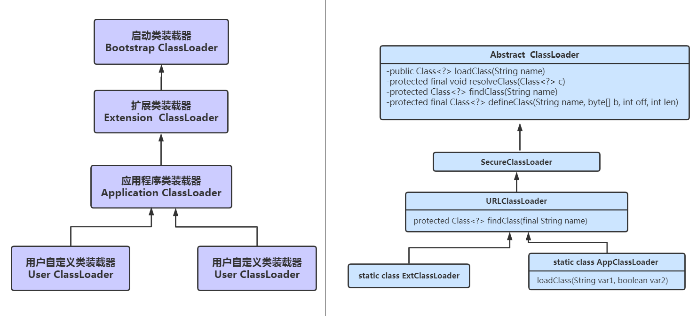
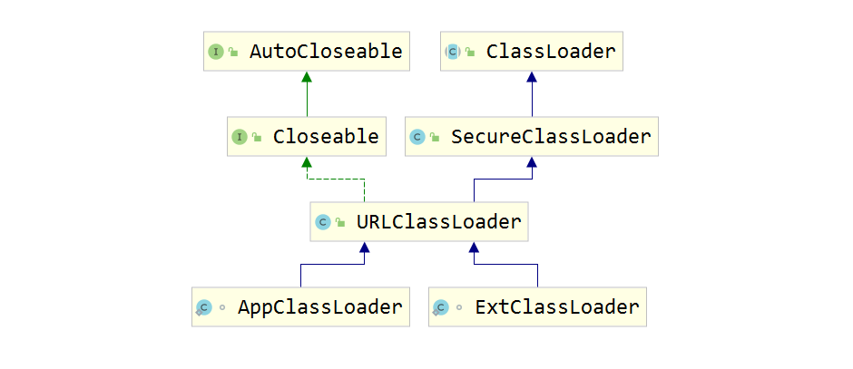
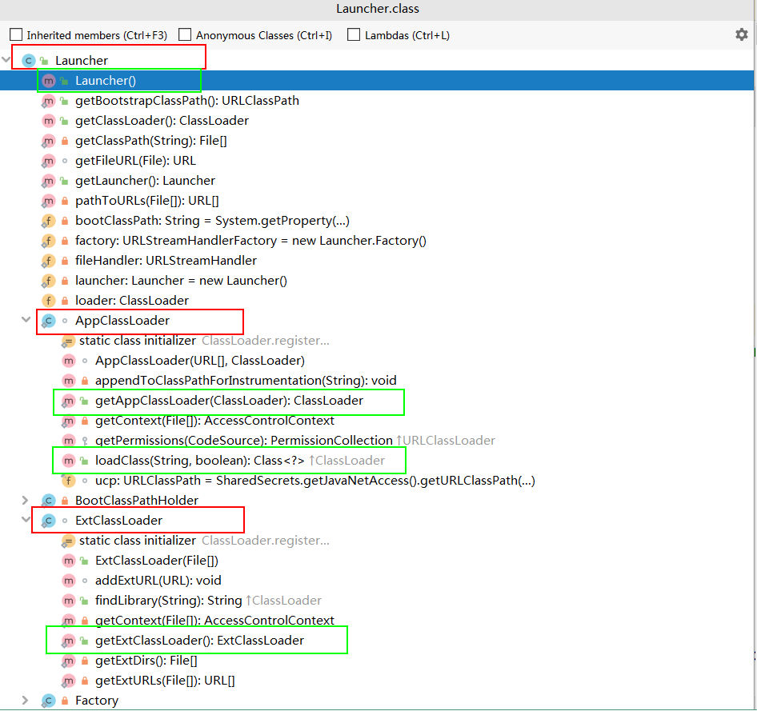
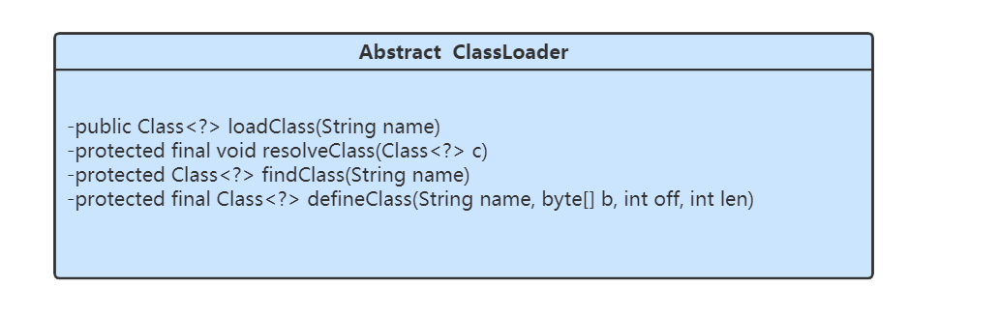

# ClassLoader源码分析


> 作者: 潘深练
>
> 更新: 2022-03-08

## 类的关系图



关系类图如下:



## Launcher核心类的源码分析



我们先从启动类说起 ,有一个 `Launcher` 类  `sun.misc.Launcher`;

```java
public class Launcher {
  private static URLStreamHandlerFactory factory = new Launcher.Factory();
  //静态变量,初始化,会执行构造方法
  private static Launcher launcher = new Launcher();
  private static String bootClassPath = System.getProperty("sun.boot.class.path");
  private ClassLoader loader;
  private static URLStreamHandler fileHandler;
  public static Launcher getLauncher() {
    return launcher;
 }
//构造方法执行
  public Launcher() {
    Launcher.ExtClassLoader var1;
    try {
      //初始化扩展类加载器
      var1 = Launcher.ExtClassLoader.getExtClassLoader();
   } catch (IOException var10) {
      throw new InternalError("Could not create extension class loader", var10);
   }
    try {
      //初始化应用类加载器
      this.loader = Launcher.AppClassLoader.getAppClassLoader(var1);
   } catch (IOException var9) {
      throw new InternalError("Could not create application class loader", var9);
   }
//设置ContextClassLoader ,设置为扩展类加载器
    Thread.currentThread().setContextClassLoader(this.loader);
    String var2 = System.getProperty("java.security.manager");
    if (var2 != null) {
      SecurityManager var3 = null;
      if (!"".equals(var2) && !"default".equals(var2)) {
        try {
          var3 = (SecurityManager)this.loader.loadClass(var2).newInstance();
       } catch (IllegalAccessException var5) {
       } catch (InstantiationException var6) {
       } catch (ClassNotFoundException var7) {
       } catch (ClassCastException var8) {
       }
     } else {
        var3 = new SecurityManager();
     }
      if (var3 == null) {
        throw new InternalError("Could not create SecurityManager: " + var2);
     }
      System.setSecurityManager(var3);
   }
 }
```

> 构造方法 `Launcher()` 中做了四件事情

1. 创建扩展类加载器 (`ExtClassLoader`)
2. 创建应用程序类加载器 (`AppClassLoader`)
3. 设置`ContextClassLoader`
4. 如果需要安装安全管理器 `security manager`

其中 `launcher` 是`staitc`的,所以初始化的时候就会创建对象,也就是触发了构造方法,所以初始化的时候就会执行上面四个步骤。

看下 `ExtClassLoader` 的创建中的关键几步

```java
static class ExtClassLoader extends URLClassLoader {
    public static Launcher.ExtClassLoader getExtClassLoader() throws IOException {
      final File[] var0 = getExtDirs();
      try {
        return (Launcher.ExtClassLoader)AccessController.doPrivileged(new
PrivilegedExceptionAction<Launcher.ExtClassLoader>() {
          public Launcher.ExtClassLoader run() throws IOException {
            int var1 = var0.length;
            for(int var2 = 0; var2 < var1; ++var2) {
              MetaIndex.registerDirectory(var0[var2]);
           }
            return new Launcher.ExtClassLoader(var0);
         }
       });
     } catch (PrivilegedActionException var2) {
        throw (IOException)var2.getException();
     }
   }
    void addExtURL(URL var1) {
      super.addURL(var1);
   }
    public ExtClassLoader(File[] var1) throws IOException {
      super(getExtURLs(var1), (ClassLoader)null, Launcher.factory);
      SharedSecrets.getJavaNetAccess().getURLClassPath(this).initLookupCache(this);
   }
    private static File[] getExtDirs() {
      String var0 = System.getProperty("java.ext.dirs");
      File[] var1;
      if (var0 != null) {
        StringTokenizer var2 = new StringTokenizer(var0, File.pathSeparator);
        int var3 = var2.countTokens();
        var1 = new File[var3];
        for(int var4 = 0; var4 < var3; ++var4) {
          var1[var4] = new File(var2.nextToken());
       }
     } else {
        var1 = new File[0];
     }
      return var1;
   }
}
```

关键的几步走

```java
extcl = ExtClassLoader.getExtClassLoader();
```

```java
final File[] dirs = getExtDirs();
```

```java
String s = System.getProperty("java.ext.dirs");
```

也在看下 `AppClassLoader` 的创建中的关键几步

```java
/**
* var1 类全名
* var2 是否连接该类
*/
public Class<?> loadClass(String var1, boolean var2) throws ClassNotFoundException {
      int var3 = var1.lastIndexOf(46);
      if(var3 != -1) {
        SecurityManager var4 = System.getSecurityManager();
        if(var4 != null) {
          var4.checkPackageAccess(var1.substring(0, var3));
       }
     }
      if(this.ucp.knownToNotExist(var1)) {
        // 一般都是false，想要返回TRUE可能需要设置启动参数lookupCacheEnabled 为true。
        // 为true时，具体的逻辑也是C++写的，所以做了什么就不大清楚了。
        Class var5 = this.findLoadedClass(var1); //如果这个类已经被这个类加载器加载，则返回这个类，否则返回Null
        if(var5 != null) {
          if(var2) {
            this.resolveClass(var5); //如果该类没有被link（连接），则连接，否则什么都不做
         }
          return var5;
       } else {
          throw new ClassNotFoundException(var1);
       }
     } else {
        return super.loadClass(var1, var2);
     }
}
```

关键的几个步骤:

```java
this.loader = Launcher.AppClassLoader.getAppClassLoader(var1);
```

```java
final String var1 = System.getProperty("java.class.path");
```

`Laucher` 类中的静态变量

```java
private static String bootClassPath = System.getProperty("sun.boot.class.path");
```

## ClassLoader源码分析

`ClassLoader`类，它是一个抽象类，其后所有的类加载器都继承自`ClassLoader`（不包括启动类加载器），这里我们主要介绍`ClassLoader`中几个比较重要的方法。



> **loadClass(String)**

该方法加载指定名称（包括包名）的二进制类型，该方法在`JDK1.2`之后不再建议用户重写但用户可以直接调用该方法，`loadClass()`方法是`ClassLoader`类自己实现的，该方法中的逻辑就是双亲委派模式的实现，其源码如下，`loadClass(String name, boolean resolve)`是一个重载方法，`resolve`参数代表是否生成class对象的同时进行解析相关操作。：

```java
protected Class<?> loadClass(String name, boolean resolve)
   throws ClassNotFoundException
{
   synchronized (getClassLoadingLock(name)) {
     // 先从缓存查找该class对象，找到就不用重新加载
     Class<?> c = findLoadedClass(name);
     if (c == null) {
       long t0 = System.nanoTime();
       try {
         if (parent != null) {
           //如果找不到，则委托给父类加载器去加载
           c = parent.loadClass(name, false);
        } else {
           //如果没有父类，则委托给启动加载器去加载
           c = findBootstrapClassOrNull(name);
        }
      } catch (ClassNotFoundException e) {
         // ClassNotFoundException thrown if class not found
         // from the non-null parent class loader
      }
       if (c == null) {
         // If still not found, then invoke findClass in order
         // 如果都没有找到，则通过自定义实现的findClass去查找并加载
         c = findClass(name);
         // this is the defining class loader; record the stats
         sun.misc.PerfCounter.getParentDelegationTime().addTime(t1 - t0);
         sun.misc.PerfCounter.getFindClassTime().addElapsedTimeFrom(t1);
         sun.misc.PerfCounter.getFindClasses().increment();
      }
    }
     if (resolve) {//是否需要在加载时进行解析
       resolveClass(c);
    }
     return c;
  }
}

```

使用指定的二进制名称来加载类，这个方法的默认实现按照以下顺序查找类： 调用`findLoadedClass(String)`方法检查这个类是否被加载过 使用父加载器调用`loadClass(String)`方法，如果父加载器为`Null`，类加载器装载虚拟机内置的加载器调用`findClass(String)`方法装载类， 如果，按照以上的步骤成功的找到对应的类，并且该方法接收的`resolve`参数的值为`true`,那么就调用`resolveClass(Class)`方法来处理类。` ClassLoader`的子类最好覆盖`findClass(String)`而不是这个方法。 除非被重写，这个方法默认在整个装载过程中都是同步的（`线程安全的`）。

> **findClass(String)**

在`JDK1.2`之前，在自定义类加载时，总会去继承`ClassLoader`类并重写`loadClass`方法，从而实现自定义的类加载类，但是在`JDK1.2`之后已不再建议用户去覆盖`loadClass()`方法，而是建议把自定义的类加载逻辑写在`findClass()`方法中，从前面的分析可知，`findClass()`方法是在`loadClass()`方法中被调用的，当`loadClass()`方法中父加载器加载失败后，则会调用自己的`findClass()`方法来完成类加载，这样就可以保证自定义的类加载器也符合双亲委托模式。需要注意的是`ClassLoader`类中并没有实现`findClass()`方法的具体代码逻辑，取而代之的是抛出`ClassNotFoundException`异常，同时应该知道的是`findClass`方法通常是和`defineClass`方法一起使用的`ClassLoader`类中`findClass()`方法源码如下：

```java
//直接抛出异常
protected Class<?> findClass(String name) throws ClassNotFoundException {
    throw new ClassNotFoundException(name);
}
```

> **defineClass(byte[] b, int o?, int len)**

`defineClass(byte[] b, int o?, int len)`方法是用来将`byte`字节流解析成`JVM`能够识别的`Class`对象(`defineClass`中已实现该方法逻辑)，通过这个方法不仅能够通过`class`文件实例化`class`对象，也可以通过其他方式实例化`class`对象，如通过网络接收一个类的字节码，然后转换为`byte`字节流创建对应的`Class`对象，`defineClass()`方法通常与`findClass()`方法一起使用，一般情况下，在自定义类加载器时，会直接覆盖`ClassLoader`的`findClass()`方法并编写加载规则，取得要加载类的字节码后转换成流，然后调用`defineClass()`方法生成类的`Class`对象，简单例子如下：

```java
protected Class<?> findClass(String name) throws ClassNotFoundException {
 // 获取类的字节数组
   byte[] classData = getClassData(name); 
   if (classData == null) {
     throw new ClassNotFoundException();
  } else {
   //使用defineClass生成class对象
     return defineClass(name, classData, 0, classData.length);
  }
}
```

需要注意的是，如果直接调用`defineClass()`方法生成类的`Class`对象，这个类的`Class`对象并没有解析(也可以理解为链接阶段，毕竟解析是链接的最后一步)，其解析操作需要等待初始化阶段进行。

> **resolveClass(Class≺?≻ c)**

使用该方法可以使用类的`Class`对象创建完成也同时被解析。前面我们说链接阶段主要是对字节码进行验证，为类变量分配内存并设置初始值同时将字节码文件中的符号引用转换为直接引用。

**注意**，`resolveClass(Class≺?≻ c)`的实现是直接调用了一个本地方法 `native resolveClass0(Class≺?≻ c)` ，所以基本就是交给 `c` 或者 `c++` 去解析了。

（本篇完）

?> ❤️ 您也可以参与梳理，快来提交 [issue](https://github.com/senlypan/jvm-docs/issues) 或投稿参与吧~