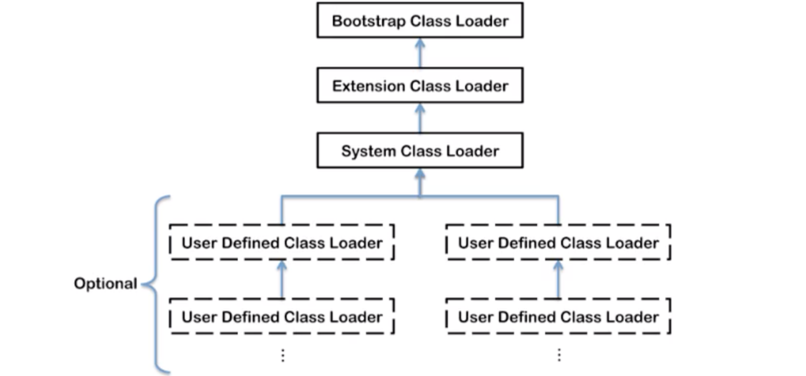
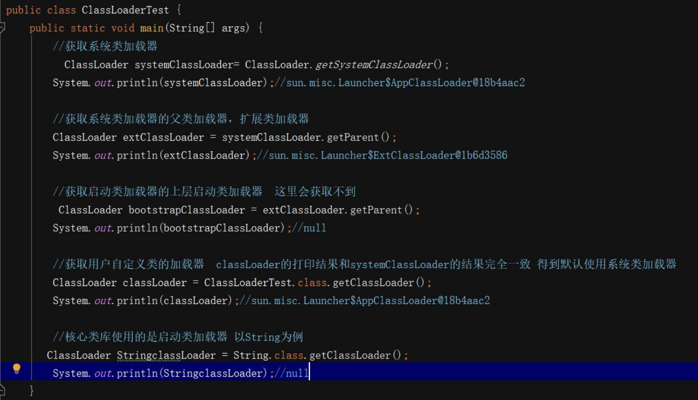

# 类加载器

> 作者: 潘深练
>
> 更新: 2022-03-07

## 类加载器的作用

类的加载指的是将类的.class文件中的二进制数据读入到内存中，将其放在运行时数据区的方法区内，然后在创建一个`java.lang.Class`对象，用来封装类在方法区内的数据结构。

> 注意：JVM主要在程序第一次主动使用类的时候，才会去加载该类，也就是说，JVM并不是在一开始就把一个程序就所有的类都加载到内存中，而是到不得不用的时候才把它加载进来，而且只加载一次。

## 类加载器分类

1. jvm支持两种类型的加载器，分别是引导类加载器和 自定义加载器 
2. 引导类加载器是由c/c++实现的，自定义加载器是由java实现的。 
3. jvm规范定义自定义加载器是指派生于抽象类`ClassLoder`的类加载器。
4. 按照这样的加载器的类型划分，在程序中我们最常见的类加载器是：引导类加载器`BootStrapClassLoader`、自定义类加载器(`Extension Class Loader`、`System Class Loader`、`User-Defined ClassLoader`）

 

**上图中的加载器划分为包含关系而并非继承关系**

> 启动类加载器

1. 这个类加载器使用`c/c++`实现，嵌套再`jvm`内部 
2. 它用来加载Java的核心类库（`JAVA_HOME/jre/lib/rt.jar`、`resource.jar`或`sun.boot.class.path`路径下的内容），用于提供JVM自身需要的类。 
3. 并不继承自`java.lang.ClassLoader`，没有父加载器

> 扩展类加载器

1. `java语言`编写，由`sun.misc.Launcher$ExtClassLoader`实现 
2. 从`java.ext.dirs`系统属性所指定的目录中加载类库，或从JDK的安装目录的`jre/lib/ext` 子目录（扩展目录）下加载类库。如果用户创建的JAR放在此目录下，也会自动由扩展类加载器加载；派生于 `ClassLoader` 。 
3. 父类加载器为启动类加载器

> 系统类加载器

1. java语言编写，由 `sun.misc.Lanucher$AppClassLoader` 实现 
2. 该类加载是程序中默认的类加载器，一般来说，Java应用的类都是由它来完成加载的，它负责加载环境变量`classpath`或系统属性`java.class.path` 指定路径下的类库；派生于 `ClassLoader` 
3. 父类加载器为扩展类加载器 
4. 通过 `ClassLoader#getSystemClassLoader()` 方法可以获取到该类加载器。

 

> 用户自定义类加载器

在日常的Java开发中，类加载几乎是由三种加载器配合执行的，在必要时我们还可以 [自定义类加载器](/zh-cn/06-define-class-loader.md)，来定制类的加载方式。

（本篇完）

?> ❤️ 您也可以参与梳理，快来提交 [issue](https://github.com/senlypan/jvm-docs/issues) 或投稿参与吧~