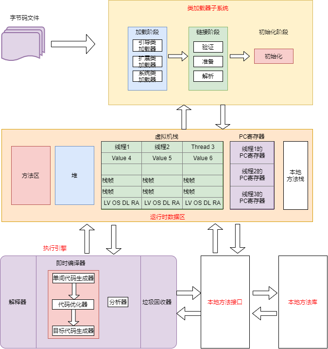
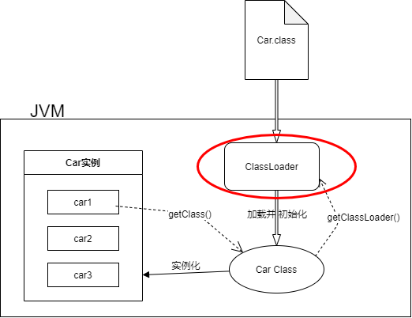
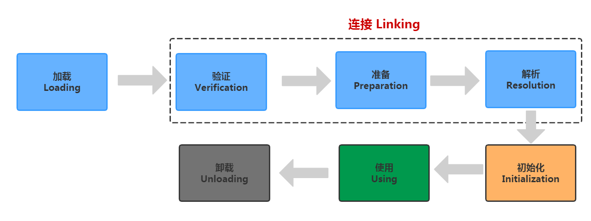
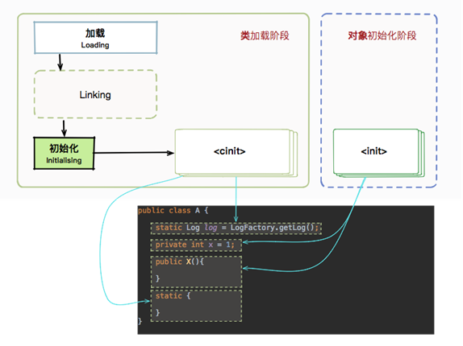

# 类加载子系统


> 作者: 潘深练
>
> 更新: 2022-03-07

## 类加载子系统介绍

1. 类加载子系统负责从文件系统或是网络中加载.class文件，class文件在文件开头有特定的文件标识。 
2. 把加载后的class类信息存放于方法区，除了类信息之外，方法区还会存放运行时常量池信息，可能还包括字符串字面量和数字常量（这部分常量信息是Class文件中常量池部分的内存映射）； 
3. ClassLoader只负责class文件的加载，至于它是否可以运行，则由Execution Engine决定； 
4. 如果调用构造器实例化对象，则该对象存放在堆区；

 

## 类加载器ClassLoader角色

1. class file 存在于本地硬盘上，可以理解为设计师画在纸上的模板，而最终这个模板在执行的时候是要加载到JVM当中来根据这个文件实例化出n个一模一样的实例。
2. class file 加载到JVM中，被称为DNA元数据模板。
3. 在 .class文件 --> JVM --> 最终成为元数据模板，此过程就要一个运输工具（类装载器Class Loader），扮演一个快递员的角色。

 


## 类加载的执行过程

我们知道我们写的程序经过编译后成为了.class文件，.class文件中描述了类的各种信息，最终都需要加载到虚拟机之后才能运行和使用。而虚拟机如何加载这些.class文件？.class文件的信息进入到虚拟机后会发生什么变化。

**类使用的7个阶段**

类从被加载到虚拟机内存中开始，到卸载出内存，它的整个生命周期包括：加载（Loading）、验证（Verification）、准备（Preparation）、解析（Resolution）、初始化（Initiallization）、使用（Using）和卸载（Unloading）这7个阶段。

其中验证、准备、解析3个部分统称为连接（Linking），这七个阶段的发生顺序如下图：

 

图中，加载、验证、准备、初始化、卸载这5个阶段的顺序是确定的，类的加载过程必须按照这种顺序按部就班地开始，而解析阶段不一定：它在某些情况下可以初始化阶段之后在开始，这是为了支持Java语言的运行时绑定（也称为动态绑定）。接下来讲解加载、验证、准备、解析、初始化五个步骤，这五个步骤组成了一个完整的类加载过程。使用没什么好说的，卸载属于GC的工作 。

### 加载

加载是类加载的第一个阶段。有两种时机会触发类加载：

> 1. 预加载

虚拟机启动时加载，加载的是`JAVA_HOME/lib/`下的`rt.jar`下的`.class`文件，这个jar包里面的内容是程序运行时非常常常用到的，像`java.lang.*`、`java.util.`、` java.io.` 等等，因此随着虚拟机一起加载。要证明这一点很简单，写一个空的 main 函数，设置虚拟机参数为"`-XX:+TraceClassLoading`"来获取类加载信息，运行一下：

```java
[Opened E:\developer\JDK8\JDK\jre\lib\rt.jar]
[Loaded java.lang.Object from E:\developer\JDK8\JDK\jre\lib\rt.jar]
[Loaded java.io.Serializable from E:\developer\JDK8\JDK\jre\lib\rt.jar]
[Loaded java.lang.Comparable from E:\developer\JDK8\JDK\jre\lib\rt.jar]
[Loaded java.lang.CharSequence from E:\developer\JDK8\JDK\jre\lib\rt.jar]
[Loaded java.lang.String from E:\developer\JDK8\JDK\jre\lib\rt.jar]
[Loaded java.lang.reflect.AnnotatedElement from E:\developer\JDK8\JDK\jre\lib\rt.jar]
......
```

> 2. 运行时加载

虚拟机在用到一个.class文件的时候，会`先去内存中查看`一下这个.class文件有没有被加载，如果没有就会按照类的`全限定名`来加载这个类。

那么，加载阶段做了什么，其实加载阶段做了有三件事情：

- 获取.class文件的二进制流
- 将类信息、静态变量、字节码、常量这些.class文件中的内容放入方法区中
- 在内存中生成一个代表这个.class文件的java.lang.Class对象，作为方法区这个类的各种数据的访问入口。一般这个Class是在堆里的，不过HotSpot虚拟机比较特殊，这个Class对象是放在方法区中的

虚拟机规范对这三点的要求并不具体，因此虚拟机实现与具体应用的灵活度都是相当大的。例如第一条，根本没有指明二进制字节流要从哪里来、怎么来，因此单单就这一条，就能变出许多花样来：

- 从zip包中获取，这就是以后jar、ear、war格式的基础
- 从网络中获取，典型应用就是Applet
- 运行时计算生成，典型应用就是动态代理技术
- 由其他文件生成，典型应用就是JSP，即由JSP生成对应的.class文件
- 从数据库中读取，这种场景比较少见

总而言之，在类加载整个过程中，这部分是对于开发者来说可控性最强的一个阶段。

### 链接

链接包含三个步骤： 分别是 `验证Verification` , `准备Preparation` , `解析Resolution` 三个过程

> 1. 验证Verification

连接阶段的第一步，这一阶段的目的是为了确保.class文件的字节流中包含的信息符合当前虚拟机的要求，并且不会危害虚拟机自身的安全。

Java语言本身是相对安全的语言（相对C/C++来说），但是前面说过，.class文件未必要从Java源码编译而来，可以使用任何途径产生，甚至包括用十六进制编辑器直接编写来产生.class文件。在字节码语言层面上，Java代码至少从语义上是可以表达出来的。虚拟机如果不检查输入的字节流，对其完全信任的话，很可能会因为载入了有害的字节流而导致系统崩溃，所以验证是虚拟机对自身保护的一项重要工作。

验证阶段将做一下几个工作，具体就不细讲了，这是虚拟机实现层面的问题：

- 文件格式验证
- 元数据验证
- 字节码验证
- 符号引用验证

> 2. 准备Preparation

**准备阶段是正式为类变量分配内存并设置其初始值的阶段**，这些变量所使用的内存都将在方法区中分配。关于这点，有两个地方注意一下：

- 这时候进行内存分配的仅仅是类变量（被static修饰的变量），而不是实例变量，实例变量将会在对象实例化的时候随着对象一起分配在Java堆中

- 这个阶段赋初始值的变量指的是那些不被`final`修饰的`static`变量，比如"`public static int value = 123`"，value在准备阶段过后是0而不是123，给value赋值为123的动作将在初始化阶段才进行；比如"`public static final int value =123;`"就不一样了，在准备阶段，虚拟机就会给value赋值为123。

各个数据类型的零值如下表：

| 数据类型 |  零值 | 
|---------|-------|
|int| 0|
|long| 0L|
|short| (short)0|
|chart| '\u0000'|
|byte| (byte)0|
|boolean| false|
|float| 0.0f|
|double| 0.0d|
|reference| null|

我们顺便看一道面试题。下面两段代码，code-snippet 1 将会输出 0，而 code-snippet 2 将无法通过编译。
复制code-snippet 1：

```java
public class A {
    static int a ;
    public static void main(String[] args) {
      System.out.println(a);
   }
  }
```

code-snippet 2：

```java
public class B {
  public static void main(String[] args) {
    int a ;
    System.out.println(a);
  }
}
```

**注意:**
这是因为局部变量不像类变量那样存在准备阶段。类变量有两次赋初始值的过程，一次在准备阶段，赋予初始值（也可以是指定值）；另外一次在初始化阶段，赋予程序员定义的值。因此，即使程序员没有为类变量赋值也没有关系，它仍然有一个默认的初始值。但局部变量就不一样了，如果没有给它赋初始值，是不能使用的。

> 3. 解析Resolution

**解析阶段是虚拟机将常量池内的符号引用替换为直接引用的过程**。来了解一下符号引用和直接引用有什么区别：

**1、符号引用**

符号引用是一种定义，可以是任何字面上的含义，而直接引用就是直接指向目标的指针、相对偏移量。

这个其实是属于编译原理方面的概念，符号引用包括了下面三类常量：

- 类和接口的全限定名
- 字段的名称和描述符
- 方法的名称和描述符

这么说可能不太好理解，结合实际看一下，写一段很简单的代码：

```java
public class TestMain
{
  private static int i;
  private double d;
  public static void print() {
 }
  private boolean trueOrFalse(){
    return false;
 }
}
```

用javap把这段代码的.class反编译一下

```.class
Constant pool:
 #1 = Class        #2       // com/xrq/test6/TestMain
 #2 = Utf8        com/xrq/test6/TestMain
 #3 = Class        #4       // java/lang/Object
 #4 = Utf8        java/lang/Object
 #5 = Utf8        i
 #6 = Utf8        I
 #7 = Utf8        d
 #8 = Utf8        D
 #9 = Utf8        <init>
 #10 = Utf8        ()V
 #11 = Utf8        Code
 #12 = Methodref      #3.#13     // java/lang/Object."<init>":()V
 #13 = NameAndType     #9:#10     // "<init>":()V
 #14 = Utf8        LineNumberTable
 #15 = Utf8        LocalVariableTable
 #16 = Utf8        this
 #17 = Utf8        Lcom/xrq/test6/TestMain;
 #18 = Utf8        print
 #19 = Utf8        trueOrFalse
 #20 = Utf8        ()Z
 #21 = Utf8        SourceFile
 #22 = Utf8        TestMain.java
```

看到`Constant Pool`也就是常量池中有22项内容，其中带"Utf8"的就是符号引用。比如#2，它的值是"`com/xrq/test6/TestMain`"，表示的是这个类的全限定名；又比如#5为i，#6为I，它们是一对的，表示变量时I`nteger（int）`类型的，名字叫做i；#6为D、#7为d也是一样，表示一个`Double（double）`类型的变量，名字为d；#18、#19表示的都是方法的名字。

那其实总而言之，符号引用和我们上面讲的是一样的，是对于类、变量、方法的描述。符号引用和虚拟机的内存布局是没有关系的，引用的目标未必已经加载到内存中了。

**2、直接引用**

直接引用可以是直接指向目标的指针、相对偏移量或是一个能间接定位到目标的句柄。直接引用是和虚拟机实现的内存布局相关的，同一个符号引用在不同的虚拟机示例上翻译出来的直接引用一般不会相同。如果有了直接引用，那引用的目标必定已经存在在内存中了。

解析阶段负责把整个类激活，串成一个可以找到彼此的网，过程不可谓不重要。那这个阶段都做了哪些工作呢？

大体可以分为：

- 类或接口的解析
- 类方法解析
- 接口方法解析
- 字段解析

### 初始化

类的初始化阶段是类加载过程的最后一个步骤，之前介绍的几个类加载的动作里， 除了在加载阶段用户应用程序可以通过自定义类加载器的方式局部参与外， 其余动作都完全由`Java虚拟机`来主导控制。直到初始化阶段， Java虚拟机才真正开始执行类中编写的Java程序代码，将主导权移交给应用程序。

初始化阶段就是`执行类构造器()方法`的过程。 ()并不是程序员在Java代码中直接编写的方法， 它是Javac编译器的自动生成物，()方法是由编译器自动收集类中的所有类变量的赋值动作和静态语句块（`static{}`块） 中的语句合并产生的， 编译器收集的顺序是由语句在源文件中出现的顺序决定的， 静态语句块中只能访问到定义在静态语句块之前的变量， 定义在它之后的变量， 在前面的静态语句块可以赋值， 但是不能访问， 如代码清单所示：

```java
public class TestClinit {
    static {
        i = 0; // 给变量复制可以正常编译通过
        System.out.print(i); // 这句编译器会提示“非法向前引用”
    }
    static int i = 1;
}
```

()方法与类的构造函数（即在虚拟机视角中的`实例构造器()方法`） 不同， 它不需要显式地调用`父类构造器`， `Java虚拟机`会保证在子类的()方法执行前， 父类的()方法已经执行完毕。因此在Java虚拟机中第一个被执行的()方法的类型肯定是`java.lang.Object`。

由于父类的()方法先执行， 也就意味着父类中定义的静态语句块要优先于子类的变量赋值 操作， 如代码清单中， 字段B的值将会是2而不是1。方法执行顺序

```java 
class TestClinit02 {
    
    static class Parent {
        public static int A = 1;
        static {
            A = 2;
        }
    }
    
    static class Sub extends Parent {
        public static int B = A;
    }
    
    public static void main(String[] args) {
        System.out.println(Sub.B);
    }
}

```

()方法对于类或接口来说并不是必需的， 如果一个类中没有静态语句块， 也没有对变量的 赋值操作， 那么编译器可以不为这个类生成()方法。 接口中不能使用静态语句块， 但仍然有变量初始化的赋值操作， 因此接口与类一样都会生成 ()方法。

但接口与类不同的是， 执行接口的()方法不需要先执行父接口的()方法， 因为只有当父接口中定义的变量被使用时， 父接口才会被初始化。 此外， 接口的实现类在初始化时也 一样不会执行接口的()方法。

Java虚拟机必须保证一个类的()方法在多线程环境中被正确地`加锁同步`， 如果多个线程`同时`去初始化一个类， 那么只会有其中一个线程去执行这个类的()方法， 其他线程都需要`阻塞等待`， 直到活动线程执行完毕()方法。 如果在一个类的()方法中有耗时很长的操作， 那就可能造成多个`进程阻塞`， 在实际应用中这种`阻塞`往往是很隐蔽的。

```java
class TestDeadLoop {
  static class DeadLoopClass {
    static {
      // 如果不加上这个if语句， 编译器将提示“Initializer does not complete normally”并拒绝编译
      if (true) {
        System.out.println(Thread.currentThread() + "init DeadLoopClass");
        while (true) {
       }
     }
   }
 }
  public static void main(String[] args) {
    Runnable script = new Runnable() {
      public void run() {
        System.out.println(Thread.currentThread() + "start");
        DeadLoopClass dlc = new DeadLoopClass();
        System.out.println(Thread.currentThread() + " run over");
     }
   };
    Thread thread1 = new Thread(script);
    Thread thread2 = new Thread(script);
    thread1.start();
    thread2.start();
 }
}
```


## `<cinit>`与 `<init>`

> `<cinit> `方法和 `<init>` 方法有什么区别？

主要是为了让你弄明白类的初始化和对象的初始化之间的差别。

```java
public class ParentA {
  static {
    System.out.println("1");
 }
  public ParentA() {
    System.out.println("2");
 }
}
class SonB extends ParentA {
  static {
    System.out.println("a");
 }
  public SonB() {
    System.out.println("b");
 }
  public static void main(String[] args) {
    ParentA ab = new SonB();
    ab = new SonB();
 }
}
```

答案：

```text
1
a
2
b
2
b
```

其中 `static` 字段和 `static` 代码块，是属于`类`的，在类的`加载`的`初始化`阶段就已经被执行。类信息会被存放在`方法区`，在同一个类加载器下，这些信息有`一份`就够了，所以上面的 static 代码块只会`执行一次`，它对应的是方法。

 

所以，上面代码的 static 代码块只会执行一次，对象的构造方法执行两次。再加上继承关系的先后原则，不难分析出正确结果。

**结论:**

`<cinit>`方法的执行时期: 类初始化阶段(该方法只能被jvm调用, 专门承担类变量的初始化工作) ,只执行一次

`<init>`方法的执行时期: 对象的初始化阶段

（本篇完）

?> ❤️ 您也可以参与梳理，快来提交 [issue](https://github.com/senlypan/jvm-docs/issues) 或投稿参与吧~