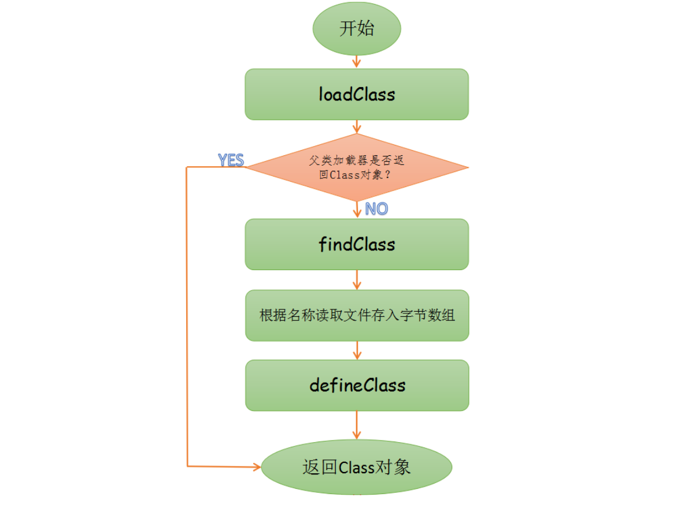

# 自定义类加载器

> 作者: 潘深练
>
> 更新: 2022-03-08

## 为什么要自定义类加载器

- 隔离加载类

模块隔离,把类加载到不同的应用选中。比如`tomcat`这类`web`应用服务器，内部自定义了好几中类加载器，用于隔离`web`应用服务器上的不同应用程序。

- 修改类加载方式

除了`Bootstrap`加载器外，其他的加载并非一定要引入。根据实际情况在某个时间点按需进行动态加载。

- 扩展加载源

比如还可以从数据库、网络、或其他终端上加载

- 防止源码泄漏

`java`代码容易被编译和篡改，可以进行编译加密，类加载需要自定义还原加密字节码。

## 自定义函数调用过程

 

## 自定义类加载器实现

> 实现方式

所有用户自定义类加载器都应该继承ClassLoader类，在自定义ClassLoader的子类，我们通常有两种做法:

1. 重写 `loadClass` 方法 ( **是实现父级委派逻辑的地方,修改他会破坏父级委派机制,不推荐** )
2. 重写 `findClass` 方法 ( **推荐** )

首先，我们定义一个类加载器和一个测试类：

```java
public class MyClassLoader extends ClassLoader{
    private String codePath;
    public MyClassLoader(ClassLoader parent, String codePath) {
        super(parent);
        this.codePath = codePath;
    }
    public MyClassLoader(String codePath) {
        this.codePath = codePath;
    }
    
    @Override
    protected Class<?> findClass(String name) throws ClassNotFoundException {
        BufferedInputStream bis = null;
        ByteArrayOutputStream baos = null;
        try { 
            //1.字节码路径
            String fileName = codePath+name+".class";
            //2.获取输入流
            bis = new BufferedInputStream(new FileInputStream(fileName));
            //3.获取输出流
            baos =  new ByteArrayOutputStream();
            //4.io读写
            int len;
            byte[] data = new byte[1024];
            while ((len = bis.read(data)) != -1){
               baos.write(data , 0 , len);
            }
            //5.获取内存中字节数组
            byte[] byteCode = baos.toByteArray();
            //6.调用defineClass 将字节数组转成Class对象
            Class<?> defineClass = defineClass(null, byteCode, 0, byteCode.length);
            return defineClass;
        } catch (Exception e) {
            e.printStackTrace();
        }finally {
            try {
                bis.close();
            } catch (IOException e) {
                e.printStackTrace();
            }
            try {
                baos.close();
            } catch (IOException e) {
                e.printStackTrace();
            }
        }
        return  null;
    }
}
```

```java
public class ClassLoaderTest {
    public static void main(String[] args) {
        MyClassLoader classLoader = new MyClassLoader("d:/");
        try {
            Class<?> clazz = classLoader.loadClass("TestMain");
            System.out.println(
                "我是由"
                +clazz.getClassLoader().getClass().getName()
                +"加载进来的");

        } catch (ClassNotFoundException e) {
            e.printStackTrace();
        }
    }
}
```

最后运行结果如下：

```text
我是由 class Main$MyClassLoader 加载进来的
```

（本篇完）

?> ❤️ 您也可以参与梳理，快来提交 [issue](https://github.com/senlypan/jvm-docs/issues) 或投稿参与吧~