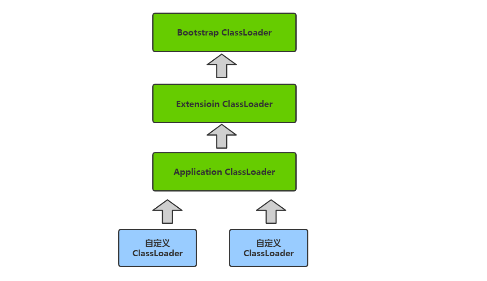

# 双亲委派模型


> 作者: 潘深练
>
> 更新: 2022-03-08

## 什么是双亲委派

双亲委派模型工作过程是：如果一个类加载器收到类加载的请求，它首先不会自己去尝试加载这个类，而是把这个请求`委派给父类加载器`完成。每个类加载器都是如此，只有当父加载器在自己的搜索范围内找不到指定的类时（即 `ClassNotFoundException` ），子加载器才会尝试自己去加载。

 

## 为什么需要双亲委派模型？

为什么需要双亲委派模型呢？假设没有双亲委派模型，试想一个场景：

> 黑客自定义一个 `java.lang.String` 类，该 `String` 类具有系统的 `String` 类一样的功能，只是在某个函数稍作修改。比如 `equals` 函数，这个函数经常使用，如果在这这个函数中，黑客加入一些“病毒代码”。并且通过自定义类加载器加入到 `JVM` 中。此时，如果没有双亲委派模型，那么 `JVM` 就可能误以为黑客自定义的`java.lang.String` 类是系统的 `String` 类，导致“病毒代码”被执行。

而有了双亲委派模型，黑客自定义的 `java.lang.String` 类永远都不会被加载进内存。因为首先是最顶端的类加载器加载系统的 `java.lang.String` 类，最终自定义的类加载器无法加载 `java.lang.String` 类。

或许你会想，我在自定义的类加载器里面强制加载自定义的 `java.lang.String` 类，不去通过调用父加载器不就好了吗?确实，这样是可行。但是，在 `JVM` 中，判断一个对象是否是某个类型时，如果该对象的实际类型与待比较的类型的类加载器不同，那么会返回`false`。

举个简单例子：

> `ClassLoader1` 、 `ClassLoader2` 都加载 `java.lang.String` 类，对应`Class1`、`Class2`对象。那么 `Class1`对象不属于 `ClassLoad2` 对象加载的 `java.lang.String` 类型。

## 如何实现双亲委派模型

双亲委派模型的原理很简单，实现也简单。每次通过先委托父类加载器加载，当父类加载器无法加载时，再自己加载。其实 `ClassLoader` 类默认的 `loadClass` 方法已经帮我们写好了，我们无需去写。

**几个重要函数**

`loadClass` 默认实现如下：

```java
public Class<?> loadClass(String name) throws ClassNotFoundException {
    return loadClass(name, false);
}
```

再看看 `loadClass(String name, boolean resolve) `函数：

```java
protected Class<?> loadClass(String name, boolean resolve)
  throws ClassNotFoundException
{
  synchronized (getClassLoadingLock(name)) {
    // First, check if the class has already been loaded
    Class c = findLoadedClass(name);
    if (c == null) {
      long t0 = System.nanoTime();
      try {
        if (parent != null) {
          c = parent.loadClass(name, false);
       } else {
          c = findBootstrapClassOrNull(name);
       }
     } catch (ClassNotFoundException e) {
        // ClassNotFoundException thrown if class not found
        // from the non-null parent class loader
     }
      if (c == null) {
        // If still not found, then invoke findClass in order
        // to find the class.
        long t1 = System.nanoTime();
        c = findClass(name);
        // this is the defining class loader; record the stats
        sun.misc.PerfCounter.getParentDelegationTime().addTime(t1 - t0);
        sun.misc.PerfCounter.getFindClassTime().addElapsedTimeFrom(t1);
        sun.misc.PerfCounter.getFindClasses().increment();
     }
   }
    if (resolve) {
      resolveClass(c);
   }
    return c;
 }
}
```

从上面代码可以明显看出，` loadClass(String, boolean)` 函数即实现了双亲委派模型！整个大致过程如下：

1. 首先，检查一下指定名称的类是否已经加载过，如果加载过了，就不需要再加载，直接返回。
2. 如果此类没有加载过，那么，再判断一下是否有父加载器；如果有父加载器，则由父加载器加载（即调用` parent.loadClass(name, false);` ）.或者是调用 `bootstrap` 类加载器来加载。
3. 如果父加载器及 `bootstrap` 类加载器都没有找到指定的类，那么调用当前类加载器的 `findClass` 方法来完成类加载。

话句话说，如果自定义类加载器，就必须重写 `findClass` 方法！

`findClass` 的默认实现如下：

```java
protected Class<?> findClass(String name) throws ClassNotFoundException {
    throw new ClassNotFoundException(name);
}
```

可以看出，抽象类 `ClassLoader` 的 `findClass` 函数默认是抛出异常的。而前面我们知道， `loadClass` 在父加载器无法加载类的时候，就会调用我们自定义的类加载器中的 `findeClass` 函数，因此我们必须要在 `loadClass` 这个函数里面实现将一个指定类名称转换为 `Class` 对象.

如果是读取一个指定的名称的类为字节数组的话，这很好办。但是如何将字节数组转为 `Class` 对象呢？很简单，`Java `提供了 `defineClass` 方法，通过这个方法，就可以把一个字节数组转为`Class`对象。

`defineClass` 主要的功能是：

> 将一个字节数组转为 `Class` 对象，这个字节数组是 `class` 文件读取后最终的字节数组。如，假设 `class` 文件是加密过的，则需要解密后作为形参传入 `defineClass` 函数。

`defineClass` 默认实现如下：

```java
protected final Class<?> defineClass(String name, byte[] b, int off, int len)
    throws ClassFormatError {
    return defineClass(name, b, off, len, null);
}
```

（本篇完）

?> ❤️ 您也可以参与梳理，快来提交 [issue](https://github.com/senlypan/jvm-docs/issues) 或投稿参与吧~