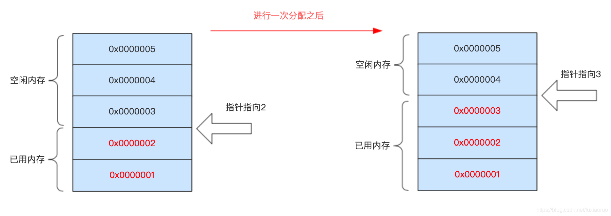
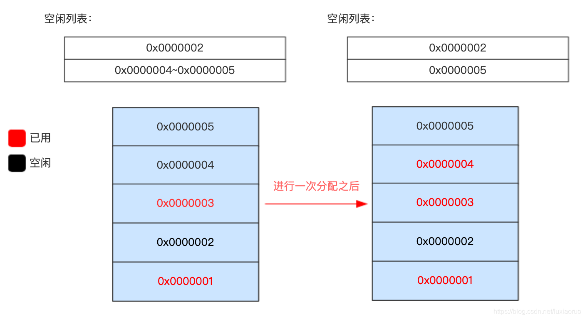

# JVM QA


## 1、简单说一下JVM的内存模型？jvm内存区域划分是怎样的？

- 预读
    - [走进 JVM](/zh-cn/02-jvm)
    - [JVM 整体架构](/zh-cn/02-jvm-framework)
    - [JVM 运行时内存](/zh-cn/02-jvm-runtime-memory) （本篇涉及多个问题域，可深读）
    - 1、首先，整个 JVM 分为 [五大模块](/zh-cn/02-jvm-framework)： 
        - [类装载器子系统](/zh-cn/06-class-loading-subsystem) 
        - 运行时数据区 
        - 执行引擎 
        - 本地方法接口
        - 垃圾收集
    - 2、根据 JVM 规范，[JVM 内存结构（运行时数据区）](/zh-cn/02-jvm-runtime-memory) 共分为五个部分：
        - （线程私有）虚拟机栈
        - （线程私有）本地方法栈
        - （线程私有）程序计数器
        - （共享）堆
        - （共享）方法区
- 回答
    - chatGPT:
        - 简单说一下JVM的内存模型？
            - Java虚拟机（JVM）的内存模型是一种用于管理Java应用程序的内存的抽象模型。JVM的内存模型由多个内存区域组成，如堆，方法区，程序计数器等。
            - 堆是JVM中最大的内存区域，所有的Java对象实例和数组都将分配在堆内存中。堆内存是由Java垃圾回收器（GC）管理的，它负责监控对象的生命周期并回收不再使用的对象。
            - 方法区是存储类信息，常量，静态变量和即时编译器编译后的代码的内存区域。
            - 程序计数器是一个小的内存区域，用于跟踪正在执行的Java字节码的位置。
            - 此外，JVM还具有本地方法栈和栈帧，它们主要用于维护Java方法的执行状态。
            - 总之，JVM内存模型为Java应用程序提供了一种管理内存的机制，以确保程序的正常运行。
        - jvm内存区域划分是怎样的？
            - JVM内存区域通常分为以下几个部分：
                - 堆：是Java应用程序的主要内存区域，所有的Java对象实例和数组都将分配在堆内存中。它是由Java垃圾回收器（GC）管理的，确保内存中不再使用的对象被回收。
                - 方法区：存储类信息，常量，静态变量和即时编译器编译后的代码。它也是由GC管理的，但因为它存储的是类信息，因此不会产生内存泄漏。
                - 程序计数器：是一个小的内存区域，用于跟踪当前执行的Java字节码的位置。
                - 本地方法栈：主要用于维护Java方法的执行状态，其中包含了Java方法的调用和返回地址。
                - 栈帧：是本地方法栈的一个子部分，主要用于存储方法调用时的局部变量，操作数栈，动态链接和方法返回值。
                - 总的来说，JVM内存划分是一个复杂的系统，但它以抽象的方式管理Java应用程序的内存，以确保程序的正常运行。

## 2、常见的垃圾回收器，和他们的区别说说？

- 预读
    - [走近 GC](/zh-cn/03-gc)（含介绍 10 种常见收集器）
    - [美团 | Java中9种常见的CMS GC问题分析与解决](https://tech.meituan.com/2020/11/12/java-9-cms-gc.html)
    - [经典垃圾回收器](/zh-cn/03-classic-gc)（含多种常见收集器对比）
    - **GC 垃圾回收 - 360 网盘 PDF 电子版**
    - 以往项目 JVM 参数配置与 GC 指定情况：
    ```shell

        MICRO_PROFILES_ACTIVE=dev,devall
        MICRO_SERVER_NAME=micro-jyjia-manage-community-online;
        MICRO_NAME=flower;
        nohup java -jar -server 

        -Xmx256m -Xms256m -Xmn128m -Xss256K 
        -XX:LargePageSizeInBytes=128M -XX:+DisableExplicitGC -XX:SurvivorRatio=1 
        -XX:+UseConcMarkSweepGC -XX:+UseParNewGC 
        -XX:+CMSParallelRemarkEnabled -XX:+UseCMSCompactAtFullCollection 
        -XX:CMSFullGCsBeforeCompaction=0 -XX:+CMSClassUnloadingEnabled 
        -XX:+UseFastAccessorMethods -XX:+UseCMSInitiatingOccupancyOnly 
        -XX:CMSInitiatingOccupancyFraction=80 -XX:SoftRefLRUPolicyMSPerMB=0 
        -XX:+PrintClassHistogram -XX:+PrintGCDetails -XX:+PrintGCTimeStamps 
        -XX:+PrintHeapAtGC -XX:+HeapDumpOnOutOfMemoryError 
        -XX:HeapDumpPath=/var/log/java/heap.$MICRO_SERVER_NAME.bin 

        -javaagent:/mnt/local/agent/skywalking-agent.jar 
        -Dskywalking.agent.service_name=$MICRO_SERVER_NAME 
        -Dskywalking.trace.ignore_path=/$MICRO_NAME/actuator/**,/instances 
        -Dapollo.meta.ip=http://10.66.99.180:8080/,http://10.31.15.48:8080 
        
        ./$MICRO_SERVER_NAME.jar 2> /dev/null &
    ```
- 回答
    - chatGPT:
        - 常见的垃圾回收器，和他们的区别说说？
            - JVM内置了多种垃圾回收器，常见的垃圾回收器包括：
                - 1、Serial GC: 这是最简单的垃圾回收器，单线程进行垃圾回收。它适用于单核处理器环境，速度较快，但可能不够适用于多核处理器环境。
                - 2、Parallel GC (also known as Throughput GC): 这是Serial GC的多线程版本，适用于多核处理器环境。它使用多个线程并行执行垃圾回收，以提高性能。
                - 3、CMS (Concurrent Mark Sweep) GC: 这是一种并发的垃圾回收器，可以在不停止应用程序的情况下执行垃圾回收。它适用于服务器环境，因为它可以保证服务器的连续运行。
                - 4、G1 GC (Garbage-First GC): 这是一种全新的垃圾回收器，具有并行，并发，分代的特点。它与CMS GC类似，但更加先进，能够更好地适应大型Java应用程序的内存需求。
                - 以上是JVM内置的常见垃圾回收器，每种垃圾回收器都有各自的优点和缺点。选择哪种垃圾回收器需要根据应用程序的需求和硬件环境来进行决策。

## 3、为什么要划分成年轻代和老年代？说说G1垃圾回收器？老年代，年轻代如何分配？

- 堆区为什么要分为新生代和老年代？
    - JVM将堆内存分为新生代和老年代是 **为了提高垃圾回收的效率**。
    - 大部分Java对象都很短命，在创建后不久就被回收，因此将新创建的对象存储在新生代内存区域中，可以快速回收这些对象。同时，新生代的内存容量较小，因此垃圾回收的代价也比较低。
    - 而长期存活的对象将被移动到老年代内存区域中，因为老年代的内存容量比较大，所以采用不同的垃圾回收算法，以提高效率。
    - 通过将堆内存分为新生代和老年代，**JVM可以快速回收短命的对象，并高效管理长期存活的对象，从而提高内存利用率，减少内存碎片**。

- 说说G1垃圾回收器？
    - G1 (Garbage First)是Java HotSpot虚拟机（JVM）中的一种垃圾回收器，**它是一种分代收集器，同时它也是一种多区域收集器**。
    - G1回收器的目标是通过平衡内存使用和垃圾回收时间来提高系统的吞吐量。它将内存堆分为若干个不同的区域（region），并对不同的区域使用不同的回收策略，以提高回收效率。
    - G1通过不断监测堆中的内存使用情况，并利用“懒惰分配”策略来减少停顿时间。在回收时，G1只回收那些空间利用率较低的区域，这样可以最大限度地减少停顿时间。
    - 总的来说，G1垃圾回收器是一种 **高效，低停顿** 的垃圾回收器，特别适合大型的内存分配应用程序。

- G1老年代，年轻代如何分配？
    - G1垃圾回收器将Java堆分为多个不同的区域，这些区域可以被分为两个主要的部分：年轻代和老年代。
    - 年轻代包括Eden区和两个Survivor区。Eden区是用于存储新创建的对象的区域，Survivor区则是用于存储在Eden区中存活下来的对象的区域。在年轻代中，G1回收器会使用复制算法，将存活的对象从一个Survivor区移动到另一个Survivor区。
    - 老年代是用于存储在年轻代中经过多次回收后仍然存活的对象的区域。G1回收器通过不断监测堆中的内存使用情况，以确定哪些区域应该被认为是老年代。
    - 总的来说，G1垃圾回收器通过不断监测内存使用情况，以决定哪些区域应该归入年轻代，哪些应该归入老年代。这种灵活的方法可以有效地利用内存，同时也有助于减少停顿时间。
    - **GC 垃圾回收 - 360 网盘 PDF 电子版 / 4.8 G1收集器**

## 4、年轻代为什么被划分成 eden、survivor 区域？

- 年轻代为什么被划分成 eden、survivor 区域？ 
    - 年轻代之所以被划分为Eden和Survivor区域，是为了实现内存回收的效率和管理对象生命周期的需要。
    - Eden区是存储新创建的对象的区域，也是最常用的内存区域。因为大多数对象在创建后很快就被回收，因此Eden区的内存利用率比较高。
    - Survivor区是存储在Eden区中存活下来的对象的区域。当Eden区内存使用量达到一定程度时，垃圾回收器就会执行回收。在回收过程中，所有存活的对象会被复制到Survivor区，而不再使用的对象会被回收。
    - 两个Survivor区可以互相轮流使用，以确保复制过程的连续性。当一个Survivor区内存使用量达到一定程度时，存活的对象会被移动到另一个Survivor区。
    - 因此，将年轻代划分为Eden和Survivor区域，可以更好地管理对象的生命周期，提高内存回收的效率，从而提高系统性能。

- 为什么要有 Survivor 区 ？
    - 如果没有 Survivor 区，那么 Eden 每次满了清理垃圾，存活的对象被迁移到老年区，老年区满了，就会触发非常耗时的Full GC，解决办法：
        - 1、增加老年代内存，那么老年代清理频次减少，但清理一次花费时间更长。
        - 2、减少老年代内存，老年代一次 Full GC 时间更少，频率增加。
    - 都不行，只有再加一层 Survivor。将 Eden 区满了的对象，添加到 Survivor 区，等对象反复清理几遍之后都没清理掉，再放到老年区，这样老年区的压力就会小很多。即 Survivor 相当于一个筛子，筛掉生命周期短的，将生命周期长的放到老年代区，减少老年代被清理的次数。

- 为什么要加两个 Survivor ？
    - 避免产生内存碎片。为了不产生内存碎片，才用复制算法，将 Eden 区和 Survivor 区存活的对象整齐的放到一个空的内存。因为生命周期一般都比较短，所以在存活对象不多的情况下，复制算法效率还是比较高的。
    - 并且设计多一个空内存区，即有三个区，就总可以保持一个是空的，这样清理垃圾的时候，就可以将存活对象全部都整齐的放到一个空的内存中，不产生内存碎片了。

## 5、年轻代为什么采用的是复制算法？

JVM的年轻代采用复制算法的原因有以下几点：

- 效率高：复制算法不需要维护内存间的引用关系，直接把存活的对象复制到另一个内存区域中，因此它的执行速度很快。

- 分配连续的内存空间：在复制算法中，年轻代的内存分配连续，可以方便地管理堆内存。

- 保证垃圾回收的正确性：复制算法简单易行，易于实现，可以保证垃圾回收的正确性。

因此，JVM采用复制算法来管理年轻代内存是一个明智的决策。

## 6、老年代为什么采用的是标记清除、标记整理算法？

Java虚拟机(JVM)采用标记清除和标记整理算法是因为它们具有一定的优点：

- 标记清除：简单且实现灵活。它在垃圾收集时只回收未标记对象，并不需要进行内存整理。

- 标记整理：更高效，因为它避免了内存碎片的产生。它标记所有存活的对象，并移动它们到内存的一端，以避免空间碎片的产生。

JVM的堆内存被设计为用于存储大量的对象实例，并且在垃圾收集时需要扫描大量的对象。因此，标记整理算法在这种情况下可能更适合，但它需要更多的计算资源，以消除内存碎片。因此，JVM通常使用标记清除和标记整理的混合算法，以在垃圾收集时获得最佳的性能。

## 7、什么情况下使用堆外内存？要注意些什么？

Java虚拟机(JVM)在以下情况下使用堆外内存：

1、对象数据较大：当对象数据较大，并且不需要频繁访问，JVM可以选择将这些数据存储在堆外内存中，以节约堆内存的空间。

2、数组大小超过阈值：JVM在配置中有一个数组大小阈值，当数组大小超过此阈值时，JVM可以将数组存储在堆外内存中。

3、高速缓存：堆外内存可用于存储缓存数据，例如图像、视频等多媒体文件，以便在需要时快速访问。

4、本机内存不足：当系统的物理内存不足以支持JVM的工作时，JVM可以使用堆外内存。**但是，在这种情况下，需要小心内存泄漏和其他问题，因为堆外内存不受JVM的垃圾回收机制管理。**

需要注意的是，使用堆外内存需要更多的编码工作（Unsafe/ByteBUffer-netty），并且需要更多的编码经验，以确保程序的正确性和可靠性。因此，在使用堆外内存前，应该仔细评估是否有必要使用，以及是否有更简单的解决方案。

- [java堆外内存详解（又名直接内存）和 ByteBuffer](https://it.cha138.com/nginx/show-314049.html)


## 8、堆外内存如何被回收？

JVM 堆外内存不在 JVM 管辖范围内，因此不会被 JVM 自动回收。需要显式地调用相关 API 进行回收。

在 Java 中，堆外内存通常是通过直接内存（Direct Memory）实现的，它是通过 `sun.misc.Unsafe` 类来操作的。如果直接内存用完了，程序会抛出 OutOfMemoryError 异常。因此，在使用堆外内存时需要特别小心，以避免内存泄露和内存溢出。

为了解决堆外内存的回收问题，可以使用相关的管理工具，例如 

- **Java Native Interface (JNI)**
- **Java Native Access (JNA)** 等。

这些工具允许你在 Java 应用程序中调用本地代码，并通过本地代码管理堆外内存的生命周期。

## 9、对 java 多态、封装、继承的理解？

Java 多态、封装、继承是面向对象编程（OOP）的三大特性。

- 多态：多态性是指一个对象可以在不同情况下具有不同的形态。它是通过同一方法名称调用不同的方法实现的，比如说有一个方法makeSound，不同的对象实现了不同的makeSound，在调用这个方法时，会根据对象的类型来调用不同的实现。

- 封装：封装是指将对象的实现细节隐藏在对象内部，只向外界提供公共的访问接口。封装的好处是隔离了实现细节，可以有效地防止对象状态的混乱和对象的实现细节的改变对外部的影响。

- 继承：继承是指在已有的类的基础上定义新的类，新的类称为子类，已有的类称为父类。子类继承父类的属性和方法，可以重写父类的方法，也可以定义新的方法。继承的好处是可以大大减少代码的重复，提高代码的复用性。

通过这三个特性的结合，可以实现面向对象编程的思想，有效地封装了程序的细节，使程序更易于维护和扩展。

## 10、什么情况下栈会溢出？

Java虚拟机栈（JVM Stack）是线程私有的，它存储了方法的局部变量、方法调用信息以及返回值。JVM栈可以理解为是线程内存，它在线程创建时创建，在线程结束时销毁。

JVM栈的溢出发生在以下情况：

- 递归调用：如果一个方法调用自身，并且调用次数太多，会导致栈溢出。

- 方法调用深度过深：当方法调用嵌套层数过深，栈的空间可能不够用，导致栈溢出。

- 数组大小过大：当定义数组时，如果数组大小过大，可能会导致栈溢出。（java默认栈大小是1M，例如 1024*1024 二维数组，大概在 4 M 左右）

在遇到栈溢出的情况时，JVM会抛出StackOverflowError异常。为了避免栈溢出，我们需要避免递归调用的过多，减少方法调用的深度，并且要尽量避免定义过大的数组。

## 11、说一下类加载过程，双亲委派模型源码看过吗？介绍一下？为什么要设计双亲委派模型？

- java 类加载过程？
    - Java类的加载过程涉及到Java虚拟机的类加载子系统。类加载子系统是Java虚拟机的一个重要组成部分，负责从Java字节码文件中加载类，并将其转换为Java虚拟机可以执行的形式。下面是Java类加载过程的大致步骤：
        - 1、类加载请求：当程序需要使用某个类时，类加载子系统会收到一个类加载请求。
        - 2、检查缓存：类加载子系统首先检查该类是否已经被加载过，如果是，则直接使用缓存中的类对象，不再重复加载。
        - 3、加载二进制字节码：如果该类没有被加载过，类加载器会从硬盘或网络中加载该类的二进制字节码文件。
        - 4、验证字节码：加载的字节码文件必须经过验证，以确保该类的正确性和安全性。
        - 5、转换字节码：经过验证的字节码文件需要被转换成Java虚拟机可以执行的形式。
        - 6、创建类对象：最后，类加载子系统会创建一个类对象，并将其缓存在内存。

- 什么是java双亲委派模型？
    - Java双亲委派模型是Java类加载机制的一种设计模式。它的核心思想是：在加载一个类时，优先由上层的类加载器加载，如果上层类加载器无法加载该类，则由下层类加载器加载，直到最后一层类加载器都无法加载该类为止。这种设计模式有几个优点：
        - 1、保证Java核心类库的安全性：由根类加载器加载的核心类库，是不能被用户自定义的类加载器加载的，从而保证了Java核心类库的安全性。
        - 2、保证一个类只被加载一次：如果多个类加载器都试图加载一个类，那么双亲委派模型保证了该类只被加载一次，避免了类的重复加载。
        - 3、提高类加载的效率：由父类加载器先加载，如果父类加载器加载不了，再由子类加载器加载，这样可以大大提高类加载的效率。
    - 因此，Java双亲委派模型是一种很好的类加载机制，能够保证Java类库的安全性和一致性，并且提高了类加载的效率。

- 根类加载器为什么不能加载自定义类？
    - 根类加载器（Bootstrap ClassLoader）是 Java 虚拟机最顶层的类加载器，负责加载jdk中的核心类库。由 C++ 实现，不是 classLoader 的子类，例如 java.lang 包中的类。因为根类加载器是用本地代码实现的，所以它不能加载自定义类。
    - 而自定义类通常由用户定义的类加载器（例如，应用程序类加载器）加载，这些类加载器通常是由 Java 代码实现的，并从类路径中加载类。因此，根类加载器不能加载自定义类，但其他类加载器可以。
    - 总的来说，Java 类加载器体系是用于管理类加载过程的，并确保 Java 虚拟机可以安全地加载类。每个类加载器都有其职责和限制，根类加载器的限制就是不能加载自定义类。


- 参考：
  * [类加载子系统](/zh-cn/06-class-loading-subsystem.md)
  * [类加载器](/zh-cn/06-class-loader.md)
  * [类文件结构](/zh-cn/00-404.md)
  * [类加载机制](/zh-cn/00-404.md)
  * [双亲委派模型](/zh-cn/06-parents-delegation-model.md)
  * [自定义类加载器](/zh-cn/06-define-class-loader.md)
  * [ClassLoader源码分析](/zh-cn/06-class-loader-source-analy.md)

## 12、Java 常用指令与可视化调优有哪些？

- [常用指令与可视化调优](/zh-cn/05-gc-command-and-visual-tuning)

## 13、有做过哪些GC调优？

压测 - 分析

- JVM 运行监控工具
    - Jconsole
    - VisualVM
- 程序压测工具
    - JMeter
- GC 日志分析工具
    - GCeasy
        - https://gceasy.io/
    - GCviewer

- 我的基本思路
    - 切换垃圾回收器
    - 调整堆大小
    - 调整新老代的比例
    - 调整幸存者区比例    
    - 调整最大停顿时间
- chatGPT 回答
    - 1、调整堆大小：调整堆的大小可以影响 GC 的频率和执行时间。通常情况下，设置较大的堆可以减少 GC 频率，但也可能增加 GC 时间。
    - 2、选择合适的 GC 算法：不同的 GC 算法适用于不同的场景，因此需要根据应用的特点选择合适的 GC 算法。例如，如果应用需要最小停顿时间，则可以使用 CMS 或 G1 算法；如果应用对内存使用效率有更高的要求，则可以使用 Shenandoah 算法。
    - 3、调整 GC 参数：GC 算法通常具有很多可配置的参数，可以根据应用的特点来调整这些参数，以提高 GC 的效率。
    - 4、分析 GC 日志：通过分析 GC 日志可以了解 GC 的情况，从而找到优化的空间。
    - 5、使用内存数据结构：对于数据量较大的应用，使用高效的内存数据结构可以有效减少内存分配和回收的次数，从而提高 GC 的效率。


## 14、遇到 OOM 常见的排查方式和解决方案？

- 预读
    - [常见内存溢出异常](/zh-cn/02-jvm-out-of-memory-error)
- chatGPT
    - 在 Java 程序中遇到 OOM 错误时，常见的排查方式和解决方案如下：
        - 1、检查内存泄漏：Java 程序中的内存泄漏是造成 OOM 的一个常见原因。可以使用内存分析工具（如 Java VisualVM）来检测内存泄漏。
        - 2、调整 JVM 参数：JVM 参数决定了 Java 程序的内存使用情况。可以调整以下参数以解决 OOM 问题：
            - -Xmx：最大可用内存
            - -Xms：初始可用内存
            - -XX:+HeapDumpOnOutOfMemoryError：当发生 OOM 时生成 heap dump 文件，以便进一步分析。
        - 3、检查数组和集合大小：如果程序中的数组和集合太大，则可能导致 OOM。检查数组和集合的大小，并在必要时减小它们的大小。
        - 4、调整缓存策略：如果程序中使用了大量的缓存，则可能导致 OOM。调整缓存策略，以便在必要时丢弃旧缓存。
        - 5、优化代码：如果程序代码不够高效，则可能导致 OOM。对代码进行优化，以减小内存使用。
    - 这些是 Java 程序中遇到 OOM 常见的排查方式和解决方案。更详细的信息可以在官方文档和技术博客中找到。

## 15、字节码增强有哪些方式？

- 预读
    - [Spring 框架学习手册 / 一文读懂Spring本质 / AOP](http://spring.panshenlian.com/#/zh-cn/02-spring-core?id=aop)
- chatGPT
    - Java字节码增强有以下几种常见的方式：
        - ASM：一个高效的、功能强大的字节码操作框架，可以通过读写字节码来实现字节码增强。
        - Javassist：一个简单易用的字节码操作框架，通过类似于 Java 语法的 API 来实现字节码增强。
        - CGLIB：一个高效的字节码生成库，可以通过生成子类的方式实现字节码增强。
        - Byte Buddy：一个简单易用的字节码生成库，可以通过类似于 Java 语法的 API 来实现字节码增强。
        - Retrofit：一个动态代理框架，可以通过动态生成代理类实现字节码增强。
        - Spring AOP：一个基于动态代理的面向切面编程框架，可以通过动态生成代理类实现字节码增强。
    - 这些方式都是通过读写字节码或动态生成字节码来实现字节码增强，并且各有特点和适用场景，具体选择哪种方式需要根据实际需求来决定。

## 16、JVM 调优手段有哪些？举个生产上的例子

- chatGPT
    - JVM 调优手段包括：
        - 1、调整堆内存大小：通过调整 -Xms 和 -Xmx 参数来限制堆内存的大小。例如：`java -Xmx512m -Xms512m `
        - 2、调整新生代和老年代大小：通过调整 -XX:NewSize 和 -XX:MaxNewSize 参数来调整新生代大小，通过调整 -XX:SurvivorRatio 参数来调整新生代中 Eden 区和 survivor 区的比例。
        - 3、调整 GC 策略：通过调整 -XX:+UseParallelGC 或 -XX:+UseConcMarkSweepGC 等参数来选择不同的 GC 策略。
        - 4、调整 GC 时间：通过调整 -XX:MaxGCPauseMillis 参数来限制 GC 的最大暂停时间,调整垃圾回收的频率和持续时间。
        - 5、调整线程池大小：通过调整线程池的大小来减少线程创建和销毁的次数，从而减少 GC 的次数，设置 JVM 参数 -Xss 可以调整线程栈的大小。例如: `java -Xss512k`
        - 6、设置代码缓存：通过设置 JVM 参数 -XX:ReservedCodeCacheSize 可以调整代码缓存的大小。例如：`java -XX:ReservedCodeCacheSize=256m`
        - 7、启用 JIT 编译器：通过设置 JVM 参数 -XX:+UseCompressedOops 可以启用 JIT 编译器。例如：`java -XX:+UseCompressedOops`
        - 8、设置文件句柄限制：通过设置 JVM 参数 -XX:MaxFileDescriptorCount 可以调整文件句柄限制。例如：`java -XX:MaxFileDescriptorCount=65536`
        - 9、设置并行 GC 线程数：通过设置 JVM 参数 -XX:ParallelGCThreads 可以调整并行 GC 线程数。例如：`java -XX:ParallelGCThreads=4`
    - 以下是一个生产环境中的例子：
        - 假设一个服务在生产环境中出现了 GC 频繁的问题，导致了服务的暂停和响应时间变长。为了解决这个问题，我们可以对 JVM 进行如下调优：例如我们使用 jstat 命令来检查堆内存的使用情况，发现新生代的大小较小，导致了新生代的 GC 频繁，因此我们通过调整 -XX:NewSize 和 -XX:MaxNewSize 参数来增加新生代的大小。
    - JVM 调优是一项复杂的工作，因为它涉及到多个参数和因素，例如堆大小、垃圾回收策略、JIT 编译器等。下面是一个典型的 JVM 调优案例：
        - 假设我们有一个 Java 应用程序，它正在运行在生产环境中，但是出现了性能问题，例如频繁的停顿和堆溢出。
        - 首先，我们需要收集 JVM 参数，例如：堆大小、新生代大小、老年代大小等。我们可以使用 jcmd 或 jinfo 等工具来查看当前的 JVM 参数。
        - 其次，我们需要收集 JVM 日志，例如 GC 日志、内存分配日志等。这些日志可以帮助我们了解内存分配和回收的情况，以及确定哪些代码片段导致了频繁的 GC。
        - 接下来，我们可以根据收集到的数据，进行 JVM 调优。例如，如果我们发现堆大小过小，我们可以通过增加堆大小来解决堆溢出的问题。如果我们发现频繁的 GC 是由于老年代空间不足，我们可以通过增加老年代大小或更改垃圾回收策略来解决这个问题。
        - 最后，我们需要定期监测 JVM 的性能，以确保调优后的效果。如果性能仍然不理想，我们可以再次收集 JVM 参数和日志，并继续进行调优。
        - 此外，我们还可以使用工具，如 jprofiler 或 visualvm 等，来帮助我们进行 JVM 调优。这些工具可以帮助我们了解内存分配情况、线程情况、方法调用情况等，并帮助我们确定问题的根源。
        - 总的来说，JVM 调优需要对 JVM 和应用程序进行详细的分析，并需要通过不断的试验和监测来实现。因此，JVM 调优是一个复杂但非常有价值的工作。


## 17、JVM 堆说一下？触发 Full GC 的场景有哪些？

- JVM 堆说一下？
    - 堆是JVM中最大的内存区域，所有的Java对象实例和数组都将分配在堆内存中。堆内存是由Java垃圾回收器（GC）管理的，它负责监控对象的生命周期并回收不再使用的对象。
- 触发 Full GC 的场景有哪些？
    - Java 虚拟机（JVM）在特定场景下会触发 Full GC，包括以下情况：
        - 1、Old Generation 空间不足：当 Young Generation 空间不足时，JVM 会进行一次 Young GC，如果在 Young GC 后，Old Generation 仍然空间不足，JVM 就会触发一次 Full GC。
        - 2、显式的 System.gc() 调用：程序员可以通过调用 System.gc() 方法来显式地触发 Full GC，不过一般不建议这么做。
        - 3、设置的回收阈值：JVM 默认设置了 Old Generation 内存回收的阈值，如果 Old Generation 内存超过阈值，JVM 就会触发 Full GC。
        - 4、虚拟机终止前：当 JVM 即将终止前，JVM 会触发一次 Full GC 来回收尽可能多的内存。
    - 以上是 JVM 触发 Full GC 的常见场景。不过，每个 JVM 实现都有其自己的垃圾回收算法，因此这些场景可能因 JVM 实现而异。

## 18、java 为什么入口是 main 方法？有什么用？

在 Java 语言中，入口是 `main` 方法的历史原因是为了与 C/C++ 一致。在 C/C++ 语言中，`main` 函数是程序的入口，因此，Java 的设计者也决定使用 `main` 方法作为 Java 程序的入口。

在 Java 中，`main` 方法是一个特殊的方法，在程序启动时由 Java 虚拟机（JVM）调用。它是一个程序的入口点，提供了程序的开始执行的位置。在 Java 中，所有的应用程序必须拥有一个 `main` 方法，因此，我们可以创建和运行 Java 应用程序。


### 19、JVM 日志错误一般核查办法？

- 直接获取答案：百度、谷歌、咨询系统原有维护人员
- 观察监控异常：从机器维度，jvm 维度，接口流量、程序日志维度。对比近期出现的波动
- 对比正常应用机器：拿异常机器和正常机器做对比，差异点就有可能导致问题的原因
- 分析最近的出现的各类变更，包括代码、配置、上线记录、人工操作等


### 20、Java堆常用的分配方法（Java内存管理机制）？

 Java堆是被所有线程共享的一块内存区域，主要用于存放对象实例，在堆上为对象分配内存就是把一块大小确定的内存从堆内存中划分出来，将对象放进去。常用的分配方法有指针碰撞和空闲列表两种实现方式。

 - **指针碰撞**
    - 适用于 **堆内存完整** 的情况，已分配的内存和空闲内存分表在不同的一侧，通过一个指针指向分界点，当需要分配内存时，把指针往空闲的一端移动与对象大小相等的距离即可，用于 **Serial** 和 **ParNew** 等不会产生内存碎片的垃圾回收器。
    - 
- **空闲列表**
    - 适用于 **堆内存不完整** 的情况，已分配的内存和空闲内存相互交错，JVM 通过维护一张内存列表记录可用的内存块信息，当分配内存时，从列表中找到一个足够大的内存块分配给对象实例，并更新列表上的记录，最常见的使用此方案的垃圾回收器就是 **CMS**。
    - 

### 21、jvm常见的生产问题？

JVM（Java Virtual Machine）是Java平台的核心组件之一，它负责将Java字节码转换为机器代码并执行。在生产环境中，JVM可能会出现各种问题。以下是几个常见的JVM生产问题：

1. 内存溢出：JVM使用垃圾回收来管理内存。如果应用程序创建了太多对象，而JVM无法及时回收它们，就会导致内存溢出问题。可以通过调整JVM的堆内存大小或减少对象创建来解决该问题。

2. 死锁：JVM在多线程环境下运行，如果应用程序中存在死锁情况，就会导致线程无法继续执行，最终导致应用程序挂起或崩溃。可以通过使用线程Dump分析工具查找死锁情况并解决它们。

3. CPU占用过高：JVM的运行会消耗大量的CPU资源，如果应用程序的代码或配置有问题，就会导致JVM的CPU占用过高。可以通过调整JVM参数或优化应用程序代码来解决该问题。

4. 长时间的GC停顿：JVM在执行垃圾回收时，可能会导致应用程序的线程停顿，从而导致性能下降或请求超时。可以通过调整GC算法、优化代码或增加堆内存等方式来减少GC停顿时间。

5. 类加载问题：JVM在运行时会动态加载类文件，如果类文件不存在或者无法加载，就会导致应用程序出现ClassNotFoundException或NoClassDefFoundError等异常。可以通过检查应用程序中的类路径或增加必要的依赖项来解决该问题。

6. 线程安全问题：JVM在多线程环境下运行，如果应用程序中存在线程安全问题，就会导致数据竞争、死锁等问题。可以通过使用同步机制、并发包等方式来解决线程安全问题。

7. 慢日志：JVM中的日志可能会记录大量的信息，如果日志输出过于频繁，就会导致应用程序性能下降。可以通过调整日志级别、使用异步日志等方式来解决慢日志问题。

8. 网络连接问题：应用程序中使用的网络连接可能会出现连接超时、连接重置等问题，导致应用程序无法正常工作。可以通过调整连接超时时间、增加连接池等方式来解决网络连接问题。

9. 垃圾回收问题：JVM的垃圾回收是一个非常重要的功能，但是如果应用程序中存在内存泄漏或对象存活时间过长等问题，就会导致垃圾回收效率低下或导致内存溢出等问题。可以通过使用内存分析工具来查找和解决内存泄漏问题。

10. 应用程序配置问题：应用程序的配置可能会导致性能下降、错误发生等问题。可以通过仔细检查配置文件、增加缓存等方式来优化应用程序的配置。

这些是常见的JVM生产问题，解决这些问题需要深入了解JVM的工作原理和优化方法，以及对应用程序的代码和配置进行仔细的调试和优化。

### 22、如何解决jvm死锁问题？

解决JVM死锁问题需要通过识别和定位死锁，然后采取相应的措施解决。以下是一些常见的解决JVM死锁问题的方法：

1. 使用JVM工具：JVM提供了一些工具来帮助识别和定位死锁问题。例如，jstack命令可以生成线程Dump，用于查找死锁情况。jvisualvm是一个GUI工具，可以帮助分析应用程序的线程和内存状态。

2. 分析死锁原因：死锁的主要原因是资源竞争，当多个线程同时竞争同一个资源时，就可能出现死锁问题。分析死锁原因可以帮助找到哪些资源被哪些线程占用，并且找到导致死锁的代码位置。

3. 减少锁的持有时间：如果线程持有锁的时间太长，就会增加死锁的概率。可以通过减少锁的持有时间来减少死锁的发生概率。

4. 避免嵌套锁：嵌套锁也是死锁的一个常见原因。如果一个线程在持有一个锁的同时，尝试获取另一个锁，就会导致死锁问题。避免嵌套锁可以减少死锁的发生概率。

5. 按顺序获取锁：当多个线程需要获取多个锁时，可以按照固定的顺序获取锁，这样可以避免死锁问题。

6. 使用超时机制：在获取锁时，可以使用超时机制来避免死锁。如果一个线程在指定的时间内无法获取到锁，就会释放已经占用的锁，避免死锁的发生。

7. 减少锁的粒度：锁的粒度越小，死锁的发生概率就越小。因此，可以尝试减少锁的粒度，将锁的范围缩小到最小范围，从而减少死锁的发生。

8. 使用非阻塞算法：非阻塞算法是一种不使用锁的算法，通过无锁的方式来解决并发问题。使用非阻塞算法可以避免死锁问题，但是需要注意实现的复杂性。

9. 使用并发包：Java提供了一些并发包，如java.util.concurrent包和java.util.concurrent.locks包，可以用来实现更高效的并发控制，从而减少死锁的发生。

10. 重构代码：如果发现死锁问题是由于代码实现的问题导致的，可以尝试重构代码，从根本上解决问题。

总之，解决JVM死锁问题需要结合具体的应用场景和具体的死锁情况，采取相应的调试和优化措施。


